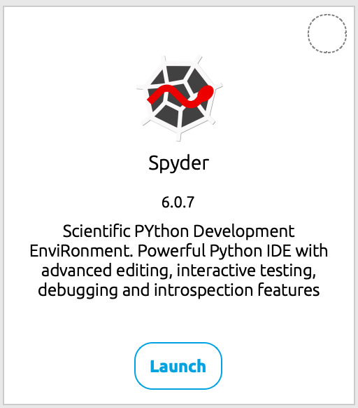
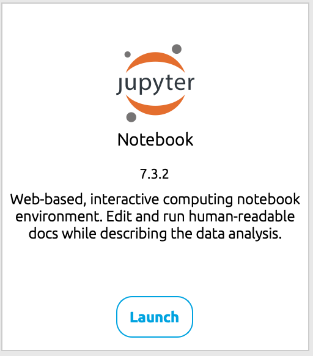

# Housekeeping

## Dates

June 22, 2025; June 18, 2025

## About

This note contains instructions on installing Python through Anaconda for EET 100D at PCC.
Anaconda Navigator is automatically installed when you install Anaconda Distribution, making it a straightforward process for both Windows and Mac users[1](https://www.anaconda.com/docs/tools/anaconda-navigator/install). Here are comprehensive installation tutorials for both operating systems.

# Windows Installation

## **Step 1: Download the Installer**

Visit [anaconda.com/download](https://anaconda.com/download) and click the **Download** button, which will automatically detect your Windows operating system[2](https://www.anaconda.com/docs/getting-started/anaconda/install)[3](https://researchguides.uoregon.edu/library_workshops/install_anaconda). The installer file is approximately 742 MB and may take some time to download[3](https://researchguides.uoregon.edu/library_workshops/install_anaconda).

## **Step 2: Run the Installation**

Double-click the downloaded installer file to begin the installation process[3](https://researchguides.uoregon.edu/library_workshops/install_anaconda)4\. You may need to wait a moment for the installer to boot up[3](https://researchguides.uoregon.edu/library_workshops/install_anaconda).

## **Step 3: Installation Process**

* Click **Next** on the welcome screen54
* Read and accept the license agreement by clicking **I Agree**[3](https://researchguides.uoregon.edu/library_workshops/install_anaconda)4
* Choose installation type: Select **"Just Me (recommended)"** unless you need it available for all users[3](https://researchguides.uoregon.edu/library_workshops/install_anaconda)4
* Keep the default installation location (typically in your user directory)[3](https://researchguides.uoregon.edu/library_workshops/install_anaconda)4
* **Important**: For advanced options, check **"Create start menu shortcuts"** and **"Register Anaconda3 as my default Python 3.x"**[3](https://researchguides.uoregon.edu/library_workshops/install_anaconda). However, do **not** add Anaconda to your PATH environment variable on Windows, as this is not recommended[3](https://researchguides.uoregon.edu/library_workshops/install_anaconda)5

## **Step 4: Complete Installation**

The installation process will begin and may take several minutes[3](https://researchguides.uoregon.edu/library_workshops/install_anaconda)4\. Once complete, click **Next**, then **Finish** to launch Anaconda Navigator[3](https://researchguides.uoregon.edu/library_workshops/install_anaconda).

# Mac Installation

## **Step 1: Download the Correct Version**

Go to [anaconda.com/download](https://anaconda.com/download) and select the appropriate installer for your Mac[6](https://macpaw.com/how-to/install-anaconda-mac)7:

* **Intel Macs**: Choose the standard Mac installer
* **Apple Silicon Macs (M1, M2, M3)**: Select the "Download for Mac M1 M2 M3" option7

## Step 2 Method 1: Graphical Installation (Recommended)

* Double-click the downloaded .pkg file to open the installer[6](https://macpaw.com/how-to/install-anaconda-mac)[8](https://www.datacamp.com/tutorial/installing-anaconda-mac-os-x)
* Click **Continue** through the Introduction and Read Me screens[6](https://macpaw.com/how-to/install-anaconda-mac)[8](https://www.datacamp.com/tutorial/installing-anaconda-mac-os-x)
* Read and agree to the license agreement[6](https://macpaw.com/how-to/install-anaconda-mac)[8](https://www.datacamp.com/tutorial/installing-anaconda-mac-os-x)
* In the Destination Select section, choose **"Install for me only"**[6](https://macpaw.com/how-to/install-anaconda-mac)[8](https://www.datacamp.com/tutorial/installing-anaconda-mac-os-x)
* Click **Continue** then **Install**[6](https://macpaw.com/how-to/install-anaconda-mac)[8](https://www.datacamp.com/tutorial/installing-anaconda-mac-os-x)
* Enter your Mac password when prompted[8](https://www.datacamp.com/tutorial/installing-anaconda-mac-os-x)
* Click **Continue** when installation completes[6](https://macpaw.com/how-to/install-anaconda-mac)

## Step 2 Method 2: Command Line Installation

Open Terminal from Applications > Utilities > Terminal) and follow these steps[6](https://macpaw.com/how-to/install-anaconda-mac):

```
bash
bash

```
Drag the installer file from Downloads into the Terminal window to add its path, then press Return[6](https://macpaw.com/how-to/install-anaconda-mac).
Follow the prompts:

* Press Return to review the license agreement
* Scroll through the agreement and type **yes** to accept
* Press Return to accept the default installation location
* Type **yes** when asked to initialize Anaconda[6](https://macpaw.com/how-to/install-anaconda-mac)

**For macOS Catalina or later**, also run these commands[6](https://macpaw.com/how-to/install-anaconda-mac):

```
bash
source

~/anaconda3/bin/activate

conda init zsh

```
Quit and relaunch Terminal, then verify installation with[6](https://macpaw.com/how-to/install-anaconda-mac):

```
bash

conda list

```

# Launching Anaconda Navigator

After installation on either platform, you can launch Anaconda Navigator by[1](https://www.anaconda.com/docs/tools/anaconda-navigator/install):

* **Windows**: Search for "Anaconda Navigator" in the Start menu
* **Mac**: Open from Applications or type anaconda-navigator in Terminal[6](https://macpaw.com/how-to/install-anaconda-mac)

# System Requirements

Anaconda Navigator supports[1](https://www.anaconda.com/docs/tools/anaconda-navigator/install):

* **Windows**: Windows 10 x86\_64 or later
* **macOS**: macOS 10.14 or later, 64-bit
* **Python**: Versions 3.9 or later

The installation requires approximately 5 GB of free disk space4 and includes over 250 packages automatically, with access to over 7,500 additional packages9.

1. <https://www.anaconda.com/docs/tools/anaconda-navigator/install>
2. <https://www.anaconda.com/docs/getting-started/anaconda/install>
3. <https://researchguides.uoregon.edu/library_workshops/install_anaconda>
4. <https://www.youtube.com/watch?v=s49fbb1qlE8>
5. <https://www.youtube.com/watch?v=4DQGBQMvwZo>
6. <https://macpaw.com/how-to/install-anaconda-mac>
7. <https://www.youtube.com/watch?v=drbaFALFKDg>
8. <https://www.datacamp.com/tutorial/installing-anaconda-mac-os-x>
9. <https://www.youtube.com/watch?v=_5DLXiFLEB0>
10. <https://www.youtube.com/watch?v=V4riykgUS94>
11. <https://s4.ad.brown.edu/python2020/software.html>
12. <https://www.reddit.com/r/learnpython/comments/vquzn0/cant_find_anaconda_navigator_apple_silicon_mac/>
13. <https://stackoverflow.com/questions/75968081/i-cant-install-anaconda-on-a-macbook-pro-m1-with-ventura-13-3-1>
14. <https://stackoverflow.com/questions/44841470/anaconda-installed-but-cannot-launch-navigator>
15. <https://www.anaconda.com/docs/tools/ai-navigator/install-ai-navigator>
16. <https://www.lancaster.ac.uk/staff/drummonn/PHYS281/demo-anaconda/>
17. <https://discussions.apple.com/thread/254786965>
18. <https://stackoverflow.com/questions/73573040/installed-anaconda-on-an-m1-macbook-pro-but-i-cant-find-the-navigator-in-applic>

# Used in Class

We will be making use of two Python IDE: Spyder and Jupyter Notebook. Make sure your Anaconda Navigator contains these two IDEs (they should). Feel free to explore other Python IDEs from within the Anaconda Navigator such as PyCharm and VS Code.



