# Housekeeping

## Dates

November 14, 2025; November 7, 2025; October 10, 2025; October 3, 2025; September 26, 2025; August 19, 2025; August 9, 2025; August 3, 2025; August 2, 2025; July 23, 2025; July 15, 2025; July 1, 2025; June 30, 2025; June 25, 2025; June 19, 2025; June 17, 2025; May 27, 2025; May 22, 2025; May 21, 2025; May 20, 2025; May 13, 2025; April 30, 2025; April 29, 2025; April 28, 2025; April 23, 2025; April 21, 2025; April 20, 2025; April 18, 2025; April 16, 2025; April 15, 2025; April 14, 2025; April 13, 2025; April 12, 2025; April 11, 2025; April 9, 2025; March 31, 2025; March 27, 2025

## Note

### Starting Point

* Between March 27 and May 27, 2025: this note was developed based on Meyers for EET 178 at PCC;

### Evolution

* Starting June 17, 2025: adopt this for EET 100D Networking part as context and background;
* Starting August 3, 2025: form a more general framework of computer networking based on a first principle/modern technology hybrid approach

# Foundational Understanding of Computer: How Computers Work

[How Do Computers Work](https://wlara.github.io/pcc/eet100d/resources/Networking_Context_and_Background.resources/How%20Do%20Computers%20Work.pdf)


# Starting Concepts

## Basic Concepts

Some basic concepts that allow us to talk about computer networking both the technology and as a subject of study.

### Host

In the context of a computer network, every computing device is a _host_:

* A host that you're using at your site is a _local host_;
* A host that you may use located off your site is a _remote host_.

With these we can say:

* Computer network (hardware) = local host + remote hosts + connections (wired or wireless) thereof;
* Computer network in general = local host + remote hosts + connections (wired or wireless) thereof + all the software + protocols/standards.

### Resource, Service Requested and Provided, Server and Client

A computer network transmits _resources_ from one host to another. The transmitted resources include without limitation:

* Files;
* Videos;
* ...

A host requests resources from another host and receives the resources requested. The host granting the request and providing the resources is providing a _service_ as a _server_, to the requesting host who receives the service as a _client_.
With these concepts we can state:

* A computer network is made up of:
	* Local and remote hosts providing and receiving services as servers and clients by sending, transmitting and receiving resources through connections;
	* Protocols and standards for the services and resources; and
	* Software that drives them all.

Zybook 17.2 talks about a third role: peer, which is really a host that both provides and requests services.

### Data Encapsulation and Decapsulation

Resources (data) alone cannot be sent over a network "naked". Information must be added to it to show for example:

* Where the data comes from;
* Where it is going;
* Error correction coding in case the errors occur during transmission.

This process is called data encapsulation:

* A header is an information field added before the data;
* A trailer is an information field added after data before transmission.

Encapsulated data being sent and received is called a payload. At the receiving end, payload must be stripped off the headers and trailers for the resource to be recovered. This is called data decapsulation.
What really happens in a network is that encapsulation and decapsulation take place at different places (in stages) in the resource's journey from the server to the host, each adding/stripping its own header and trailer, following a protocol. A protocol data unit (PDU) is the payload at a specific stage with an associated protocol.

### Network Topology

Topology is a fancy word for "shape". When network components (hosts and their intermediate devices) are arranged and connected with wire or through wireless, they form a "physical" topology. When data travels through different network components, it sees a "logic" topology:

* The primary topology of of a local area network (a LAN), the lowest-hierarchy network, is the _star-bus_ topology, wherein computing devices are all connected to a central hub or switch, which is a relay of network traffic;
* At the veery top of the network hierarchy, the internet, has a _mesh_ topology, wherein every component is connected to every other component:
	* This topology ensures that the damage to any part of the network does not cause the entire network to go down, one of the original goals of the origin of the internet (DARPANET).

### Overall Network Configuration

Conceptually, the "entire network" is made up of a group of connected LANs, each having several connected computing devices, all through a connecting medium wired or wireless. Central to a LAN is a switch or hub. At the edge of the LAN is a router that connects the LAN to WAN, which also has a hierarchy.

### Standards

Standards define how you make (part of) things. All products and services in compliance with a standard have inter-operability. In networking context, standards usually pertains to hardware.
You don't have to manufacture your products in compliance with certain standards. If you don't, however, you lose interoperability with similar products and may be at a market disadvantage.
An actual section from IEEE 802.3, the Ethernet standard, which defines specifications for wired local area networks:
```
3.2.1 MAC frame format

The MAC frame format shall be as specified in Figure 3-2 and described below:

Preamble: The Preamble field is 7 octets in length and has the binary value:
10101010 10101010 10101010 10101010 10101010 10101010 10101010

Start Frame Delimiter (SFD): The SFD field is 1 octet in length and has the
binary value: 10101011

Destination Address: The Destination Address field is 6 octets in length and
specifies the station(s) for which the frame is intended. It may be an
individual address or a group address.

Source Address: The Source Address field is 6 octets in length and specifies
the station that transmitted the frame.

Length/Type: The Length/Type field is 2 octets in length. If the value of
this field is less than or equal to 1500 decimal (05DC hexadecimal), then
the Length/Type field indicates the number of MAC client data octets contained
in the subsequent MAC Client Data field of the basic frame.

MAC Client Data: The MAC Client Data field contains a sequence of n octets,
where n is less than or equal to 1500. When the Length/Type field contains
a length value, n equals that length value.

Pad: The Pad field contains a sequence of octets, each equal to 00000000
(hexadecimal 00), that is transmitted to ensure that the frame meets the
minimum frame size requirement.

Frame Check Sequence (FCS): The Frame Check Sequence field is 4 octets in
length and contains a 32-bit cyclic redundancy check (CRC) value.

3.2.2 Frame size requirements

Valid frame: A valid frame has the following characteristics:
a) Destination Address, Source Address, Length/Type, MAC Client Data,
  and FCS fields are present and in that order.
b) The frame is an integral number of octets in length.
c) The frame is at least 64 octets in length from the Destination Address
  field through the FCS field, inclusive.
d) The frame is no more than 1518 octets in length from the Destination
  Address field through the FCS field, inclusive.
```

### Protocols

Protocols are like standards but is more strict. It is a set of rules. In networking context, it usually pertains to how the data is formatted and transmitted, which is more on the software side but hardware must allow or "support" them.
You do have to follow protocols when attempting to transmit data over a "public" network, or you won't be able to transmit because the network won't understand you thus don't transmit for you.
Part of HTTP protocol defining HTTP/1.1 semantics:
```
2. Resources

The target of an HTTP request is called a "resource". HTTP does not limit
the nature of a resource; it merely defines an interface that might be used
to interact with resources. Each resource is identified by a Uniform Resource
Identifier (URI), as described in Section 2.7 of [RFC7230].

When a client constructs an HTTP/1.1 request message, it sends the target
URI in one of various forms, as defined in (Section 5.3 of [RFC7230]).
When a request is received, the server reconstructs an effective request
URI for the target resource (Section 5.5 of [RFC7230]).

One design goal of HTTP is to separate resource identification from request
semantics, which is made possible by vesting the request semantics in the
request method (Section 4) and a few request-modifying header fields
(Section 5). If there is a conflict between the method semantics and any
semantic implied by the URI itself, as described in Section 4.2.1, the
method semantics take precedence.
...

OCTET = <any 8-bit sequence of data>
CHAR = <any US-ASCII character (octets 0 - 127)>
UPALPHA = <any US-ASCII uppercase letter "A".."Z">
LOALPHA = <any US-ASCII lowercase letter "a".."z">
ALPHA = UPALPHA | LOALPHA
DIGIT = <any US-ASCII digit "0".."9">
CTL = <any US-ASCII control character (octets 0 - 31) and DEL (127)>
CR = <US-ASCII CR, carriage return (13)>
LF = <US-ASCII LF, linefeed (10)>
SP = <US-ASCII SP, space (32)>
HT = <US-ASCII HT, horizontal-tab (9)>
<"> = <US-ASCII double-quote mark (34)>

HTTP/1.1 defines the sequence CR LF as the end-of-line marker for all
protocol elements except the entity-body.

CRLF = CR LF
```

## Networking as a Subject

### Fundamental vs. Framework

The fundamental issue that networking deals with is how to get any two computing devices to "talk to" each other requesting, sending and receiving resources to and from each other.
The technologies and products involved are diverse and constantly evolving. To understand them, you can look at them from different angles, categorize them in different ways and form different "frameworks" or "models".
But the technologies do not fit "neatly" into any angle, category, framework or model, and none of the frameworks or models captures all of networking. So we have to look at more than one of them to gain a more complete understanding, but when we talk about these frameworks and models, we're not talking in "absolute" sense.

### How to Understand Networking as a Subject

* Pay attention to all the angles, categories, frameworks and models;
* Don't treat them as orthodoxy rigid constraints;
* Keep the fundamental issues of networking in mind.

### The Package Delivery Analogy

Think about the situation where you need to deliver a (physical) package from one household to another some distance away. There are two "frameworks" to understand how the delivery is achieved:

* The "infrastructure framework": in order for the delivery to take place successfully, there need to be established:
	* An address system that allows the delivery company to know where to deliver to and from;
	* A "road" system consisting of roads, routes and the corresponding delivery vehicles (trucks, trains, airplanes).
* The "handling framework": what the package goes through from its origin to its destination:
	* Packaging it at the origin, label it, prepare for shipment;
	* Pickup, transfer, schedule, etc.;
	* Delivery, sign off, etc.

We will be looking at networking mainly from these two framework.

# Elements of A Simple Network

Imagine the simplest network, between just two computers, two hosts that need to share resources, provide or receive services, or "talk to each other". Networking even in this simplest situation still amounts to delivering resources from one computer to the other and vice versa through a medium:

* Even in this simplest situation, you have a server and a client providing and receiving services.

In order for this "2-computer network" to work, we need:

1. The sending computer's CPU must "effectuate" the transmission and data must come out of the server's storage and/or memory and be placed at the medium;
2. The resource, originally stored as files in binary form in the server computer, must be turned into electronic (or optical) signal (e.g., voltages, electromagnetic propagation) suitable for transmission through a medium;
3. The electronic or optical signal must go through a medium to arrive at the client computer;
4. The client computer must "listen" to transmissions from the "outside" and receive the "whole package" of the transmitted signals;
5. The client computer must know how to "recover" the received signal back into the resource in binary form to be used and/or stored, all under the control of the client CPU.

If this "1-to-1" network gets slightly more complex to more than two computers, then the following are also needed:

6. A server needs to know which computer to send the resource to;
7. A client needs to know from which host to request service and where a resource comes from.

## Networking Capable Computer

What part of the above requirements are functions of the computer so it becomes "networking capable"?

### Network Interface Controller (NIC)

On each computer an interface device, called a _Network Interface Controller (NIC)_ that:

* Identifies or labels the computer on the network, through MAC address (Requirements 6 and 7);
* Communicates with CPU and the rest of the computer to:
	* Prepare or "package" the resource to be transmitted into "transmittable" signals (Requirements 1, 2); and
	* Reassemble or "recover" the transmitted signals into resource that was meant to be sent (Requirements 4, 5).
* NIC can be for wired and wireless networking:
	* A wired/wireless NIC turns the binary resources into signals suitable for transmission through wires/air and turns wired/wireless signals back into binary resources;
	* There are adaptor cards that turns or expands NIC for wired networking to wireless;
	* There are adaptor card that do the opposite. For example, if you want to do wired networking with an Apple laptops, you need an adaptor;
	* The original plus whatever adaptors together functions as the NIC for a computing device.

### Networking Capable Operating System

Requirements 1, 2, 4, 5 imply a networking-capable operating system that is able to deal with the requirements.

### MAC

There are more than one identifications of a computer on the network. The most fundamental of them is the Media Access Control (MAC) address:

* Mac is the unique identifier of an NIC;
* When an NIC is installed on a computer, the MAC identifies the computer on a network;
* MAC is world- and time- unique.

### Frames

If we think more about Requirements 2 and 5, these can be broken down into at least two "stages":

* Data need to be broken into "logic pieces";
* These pieces need to be turned into transmittable signal.

The first one is done by breaking a resource to be transmitted into frames:

* Frame = Identity of the sender + identity of recipient + data to transmit + error detection/correction (CRC)

The actual situation as one can imagine is much more involved, but the concept of frames is fundamental. Data are transmitted by frames.

* When you think about "frames of data", they are really, just, already, digital signals, so "turning the pieces into transmittable signals" really only happens in our head.

## Medium

The transmission medium moves the resources by transmitting signal. In terms of the medium:

* Medium can be wired or wireless (air).

In terms of the signals carrying resources:

* Electrical signal: voltages;
* Electromagnetic wave:
	* Guided propagation within a wire;
	* Guided propagation within a fiber for light band;
	* "Free" propagation through the air.

### Wired Medium

Meyers Chapter 18 talks about three types of media:

* Twisted pair of copper wires transmitting voltages: shielded and unshielded:
	* Shield here refers to metal shield around a wire to reduce electromagnetic interference, not the plastic casing for insulation.
* Fiber transmitting optical waves;
* Coaxial cable transmitting electromagnetic waves.

For each type, Meyers Chapter 18 talks about:

* The medium itself; and
* The connector.

Zybook calls wired medium "bounded media" and dedicates Chapter 19 to the various standards and generations thereof.

### Wireless Medium

The medium for wireless transmission is air. Instead of using wires to transmit electrical, optical or electromagnetic signals, wireless uses radio wave, a specific frequency/wavelength spectrum band of electromagnetic wave, through air. There are two main standards of wireless transmission:

* Wireless LANs (WLANs) standard and protocol family based on the IEEE 802.11 wireless Ethernet standard: marketed as Wi-Fi;
* Bluetooth technology.

With the exception of some wireless-specific issues such as broadcast and security, wireless networking works the same way as wired networking:

* With one more type of medium added, thing will get slightly more complicated. For example, in addition to considering wired and wireless separately, we'll also have to consider situations where one converts to the other;
* Unless otherwise noted, the notes below do not distinguish between wired or wireless transmission.

## Standard and Protocol

Requirements 2 and 5 imply standard and protocol, which enables the computers involved in networking to "speak the same language":

* In the current discussion of two computers connected to each other directly, the two computers must speak the same language for them to communicate;
* You can imagine that, when we get to more complex networks involving more computers, intermediary devices and layers/components/stages within these devices, all involved must speak the same language. This is why there are so many different protocols in networking.

### Ethernet for Wired Network

All of the above are captured by the Ethernet Standard and the Ethernet Protocol, which is both a **technology standard** and a **protocol family** for wired networking.
Breakdown of what Ethernet is and how it works:
**Ethernet as a Standard**

* Ethernet was first standardized in 1983 as IEEE 802.3, which defines the technical specifications for its operation at the physical (Layer 1) and data link (Layer 2) layers of the OSI model;
* The standard includes details on wiring, signaling, frame formats, and error detection mechanisms;
* Over time, Ethernet has evolved to support higher speeds, different media types and advanced features like VLAN tagging and Quality of Service (QoS).

**Ethernet as a Protocol**
Ethernet also includes a set of communication rules or protocols that govern how devices on a local area network (LAN) or wide area network (WAN) communicate. These protocols define how data is formatted into frames, transmitted over the network, and verified for errors. For example:

* Ethernet uses **Carrier Sense Multiple Access with Collision Detection (CSMA/CD)** to manage data transmission and avoid packet collisions in shared networks.
* It specifies addressing through **MAC addresses**, which uniquely identify devices on the network.

### Wi-Fi for Wireless Network

The direct counterpart to **Ethernet** (IEEE 802.3) for wireless networking is **Wi-Fi**, which is based on the **IEEE 802.11** family of standards:

* **IEEE 802.11** defines the set of protocols and standards for wireless local area networking (WLAN), covering both the physical and data link layers, much like Ethernet does for wired LANs;
* Wi-Fi allows devices such as laptops, smartphones, and printers to communicate and access the network without physical cables, using radio waves instead;
* The 802.11 standards have evolved over time (e.g., 802.11a, 802.11b, 802.11g, 802.11n, 802.11ac, 802.11ax), supporting higher speeds, new frequency bands, and advanced features;
* Like Ethernet, Wi-Fi specifies how data is formatted, transmitted, and received, but it uses the air as the transmission medium rather than copper or fiber cables.

### **BlueTooth**

BlueTooth is another set of standard and protocol most frequently used for Personal Area Network (PAN):

* Also uses radio frequency, but with frequent (thousands of times per minute) "frequency hopping" rather than fixed "channel" frequency for Wi-Fi, for enhanced anti-interference capabilities;
* Allows networking of devices within "personal proximity" (~10 meters);
* Almost always used in direct device-to-device connection (hence the "paring" you see when trying to connect your phone to your car radio through bluetooth).

### Comment

Is it plausible to use other electromagnetic spectra, other wiring and interface and other protocols to achieve wired or wireless networking? Absolutely. The issue, however, is to allow computing devices to talk to one another with minimum effort from the user standpoint, hence the standards and protocols in use.

# Local Area Network (LAN)

The above [[PCC Spring 2025/between two computers described above]] describes direct connection and communication between two computers. What if we have more than two computers that we want to connect to form a real network? Let's keep our ambitions in check for now and consider a "modest" network of group of computers located physically close by. We have essentially two options:

* We can do a simple extension of the two-computer direct-connection arrangement and have every computer connect to every other computer. Needless to say, this setup will quickly get out of hand as we add more computers to the network;
* Alternatively, we can have a device sitting at the center of these computers and acting as an "intermediary" of the computers.

Such an intermediary device is called a switch or a hub, and such a network is called a local area network or LAN. The most common examples of a LAN is a home WiFi network or an office network.
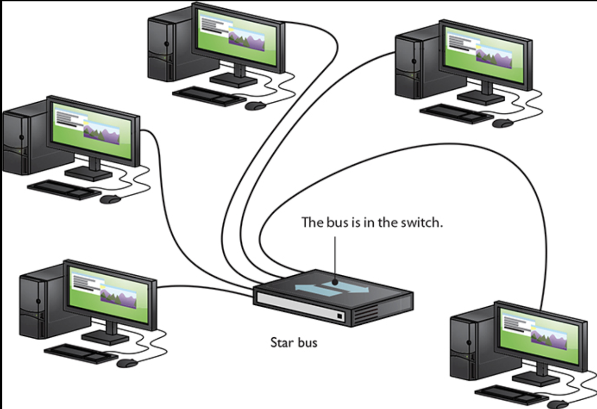
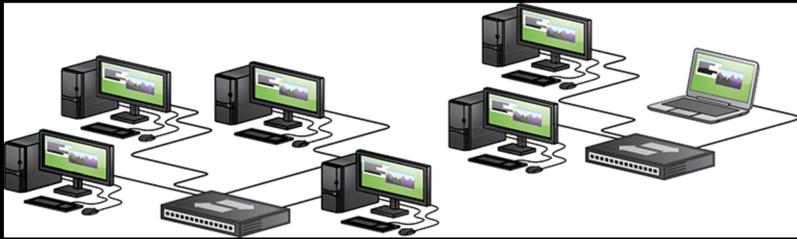

## LAN Components

LANs typically consist of:

### Networked Devices

Computers, printers, servers, and other "endpoints".

### Networking Devices

Switches, hubs, and/or routers (that act as switches).

### Connection Media

Ethernet cables, wireless signals, etc., wired or wireless.

### Edge Router

At the "edge" of a LAN sits a router, responsible for connecting the LAN to the "outside world", collectively called the Wide Area Network or [[PCC Spring 2025/WAN]]:

* If the LAN is isolated from the rest of the outside network, then there is no need for a router.

## LAN Topology

All LANs have a start-shape network topology, with the switch/hub siting at the center of the star.

## Communication within LAN

All communications among devices are conducted in ways similar to those [[PCC Spring 2025/between two computers described above]]:

* Requests and resources are turned into frames by NIC of the originating device under the control of CPU with the support of memory;
* Frame = sender ID + recipient ID + payload + error detection/correction (CRC);
* In a LAN, sender and recipient IDs are their respective MAC addresses;
* Frames are transmitted via medium, wired or wireless, to a switch or hub;
* Switch or hub forwards the frames to recipient devices NIC;
* Frames are received by the recipient devices NIC which translates to requests and resources under the control of CPU and for the CPU to process.

With one difference: almost all communications take place with the hub or switch as intermediary:

* Direct device connections are possible but rare (bluetooth is usually used for specific functions).

### Hub

A hub is a simple networking device that:

* Connects multiple devices in a LAN and allows them to communicate:
	* Each device is connected to one of the hub's "ports".
* Broadcasts all received data to every connected device, making the LAN a broadcast domain;
* Uses "half-duplex" communication, meaning only one device can send information at a time;
* Creates a shared "collision domain" where data packets can collide when multiple devices transmit simultaneously:
	* A "collision domain" is a lane of the road. One lane can accommodate one vehicle at a time.
	

In short, a hub receives a frame from a sender and broadcast the frame to all devices it is connected to. Meyers mentions a broadcast domain, which refers to a LAN with a hub.

### Switch

A switch is a more intelligent networking device that:

* Connects devices on a LAN to ensure data arrives at its intended destination:
	* Each device is connected to one of the ports on the switch.
* Directs data packets only to the specific device they’re intended for;
* Uses MAC addresses to identify devices (both sending and receiving devices) and forward data appropriately;
* Supports full-duplex communication, allowing simultaneous bidirectional data transfer.

In short, a switch receives a frame from a sender and forwards the frame to the intended recipient only.

### Wireless Access Point (WAP)

In a wireless network, a Wireless Access Point (WAP) acts like a switch in a wired network:

* There are products called wireless switch or even wireless hub or wireless router, but these are simply just WAP integrated with some other capabilities.

Being wireless introduces some complexities:

* When transmitting data between two devices within a LAN, a WAP acts like a switch, sending data to the receiving device based on its MAC address:
	* But here since all traffic share a single channel of RF frequency, there is only "one port" that all devices share;
	* This one-port limitation means that the WAP cannot send the data directly to the intended recipient, it must "broadcast" such data to all devices within its reach and allow the intended recipient device (not any other devices) pick up the transmission. From this standpoint, WAP is similar to a hub.
* When some devices on the network are connected through wire, or when communication with the outside world needs to happen through an edge router, WAP also converts the 802.11 based Wi-Fi signal into 802.3 based Ethernet signal.

With both wired and wireless media, you can imagine some more scenarios:

* You can have a WAP that just converts WiFi to wired signal and have a switch (or some other routing setup) handle the LAN routing.

## LAN Standards

* Wired LAN uses the Ethernet, which is a set of standards as well as protocol, specified in IEEE 802.3;
* Wireless LAN uses either Wi-Fi (802.11) or bluetooth.

## Hardware "Idea" of Hub/Switch

What would a hub/switch look like?

From EET 121 Tocci textbook:

* The transmitter part could be part of the sender NIC;
* The receiver part could be part of a hub or a switch on the receiving side;
* The transmitter part could be the forwarding side of the hub or switch:
	* If hub, simply make the transmitter output available to all ports;
	* If switch, simply add a multiplexer in between to select the MAC address to transmit the frames to the intended recipient.

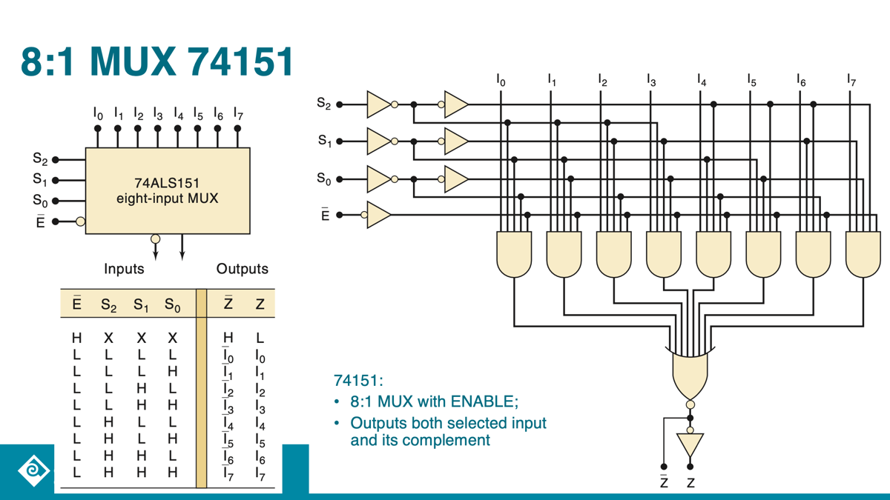

# Wide Area Network (WAN)

If the need is only for a group of physically close devices to be able to share resources, then a MAC address-based LAN is sufficient. However, we want to communicate with billions of computers outside of our LAN, so we need WAN.
From surface, WAN is a widespread group of computers connected using (maybe) long-distance connections technologies. But WAN is much more than that.

## WAN: Network of LANs

WANs connect multiple LANs that may be geographically separated, for example in different buildings, cities, or even countries.
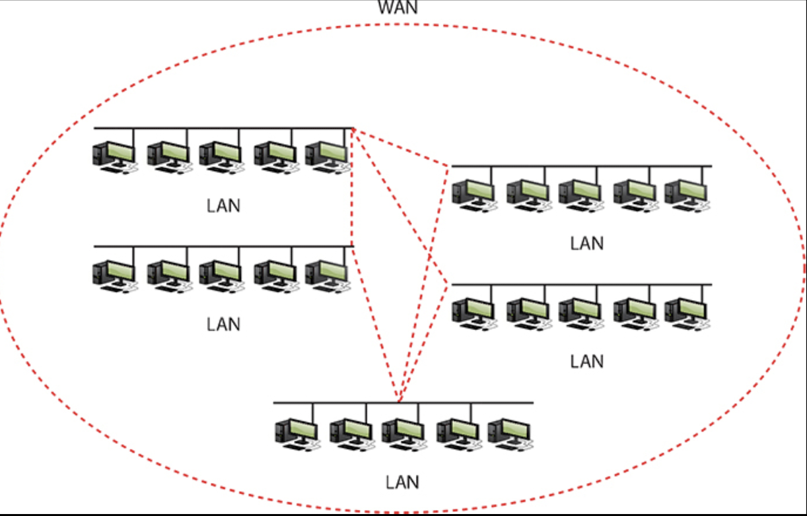

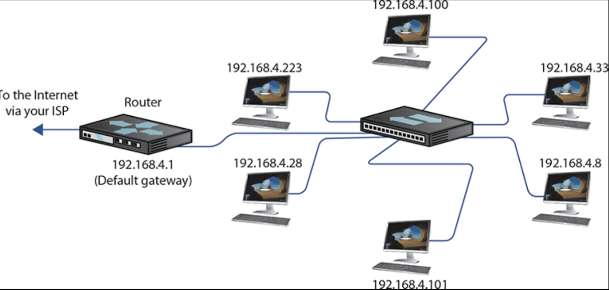

### Router as LAN's Gateway to WAN

At the "edge" of each LAN, there is a device called a router that acts as the "default gateway" to communicate with other LANs. Together they form WAN:

* Routers are the devices that typically connect a LAN to a WAN;
* Each LAN usually has one or more routers that manage traffic entering and leaving the LAN;
* The router acts as the gateway between the local (usually private) LAN and the broader WAN.

A router is a "two-faced" device, just like any other gateway door that separates "inside" and "outside":

* On the internal-facing side, a router is connected to all the networked devices within a LAN, by either connected to a switch or directly connected to the devices (i.e., an integrated router/switch device);
* On the external-facing side, a router connects to other routers within the WAN it belongs to.

## WAN Hierarchy

A "lowest level" WAN connects multiple LANs. Multiple "low-level" WANs are also connected to a "higher-level" WAN which could itself be part of an even higher level WAN. At the edge of each of these WANs also sit one or more routers, forming a hierarchy of LANs, WANs and their respective routers. For example:

* Your home network is a LAN with a router at its edge;
* Multiple home LANs through their routers are connected to (part of) your ISP's WAN;
* Your ISP's WAN connects with other WANs (of other ISPs, corporations etc) to form a higher-level WAN;
* At the edge of each of these WANs sit one or more routers that connects a lower level WAN to a higher level WAN:
	* Each router is still a two-faced device.

### WAN Connection Media

Routers for WANs at different levels of the WAN hierarchy are connected using different media:

* LANs use twisted pair, WiFi;
* Higher level WANs connect using media suitable for long-distance, high-bandwidth data transmission:
	* Telecommunication infrastructure: cables, phone lines;
	* Fibers;
	* Satellites.

### Backbone and Backbone Routers

Sitting at the top of the hierarchy are the "backbones" WAN connected by "backbone routers":

* The network topology is no longer a star, but a mesh where every node is connected to every other node;
* For highest degree of redundancy and reliability. For example, in case a route is down, an alternative route is found and used:

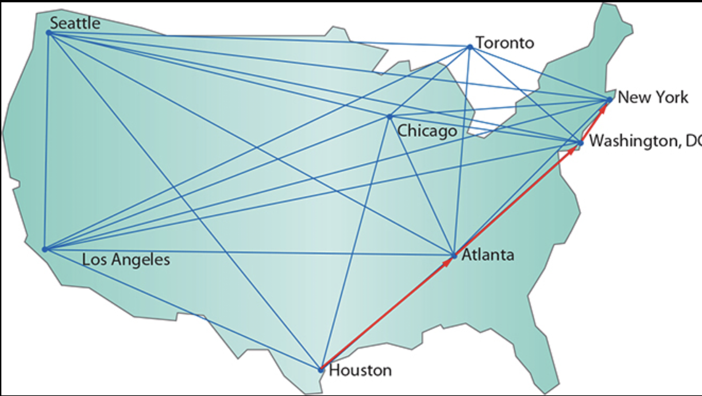

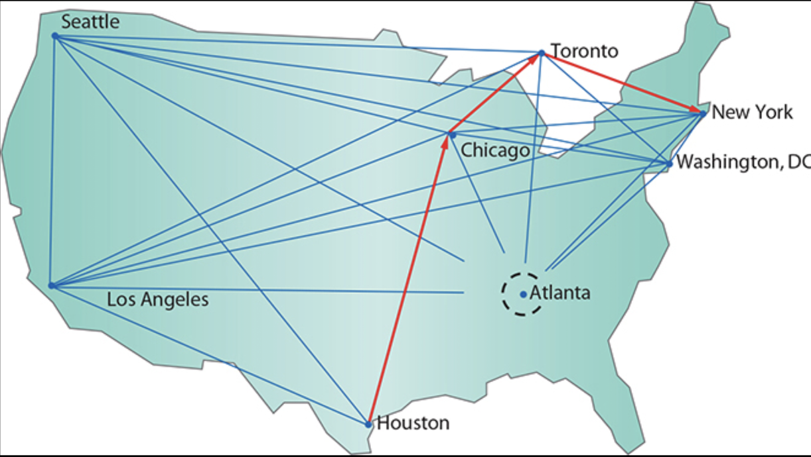
The very top hierarchy WAN is the internet.

## IP Address

Sending and receiving resources within a LAN involve only a switch, hub or WAP at the LAN's center, where the IDs of the sending and receiving devices are their MAC addresses tied to their respective NICs. These MAC address are known to the switch, hub or WAP. This is analogous to giving or taking something to or from someone through a mutual friend who knows both of you personally.
If you want to send and receive resources to and from a computer far far away that belongs to a different LAN within a different WAN within a different WAN, you no longer have a device (a switch or hub) that knows both of your MAC addresses. You need the IP address of the sender or recipient, just like you need a mailing address.

### IP Address

An IP address is a logic address that uniquely identifies a "node" on the internet, the widest/highest-level WAN:

* An IP address is not associated with hardware;
* The IP address of a host can be dynamically generated, assigned and "leased to" a host for only a limited period of time.

The "node" could be a host computer or a router. Their IP address uniquely identifies it on the internet, at the time of the transmission:

* The IP address of a router who is the default gateway of a LAN is shared among devices within the LAN ([[PCC Spring 2025/more later]]).

There are two standards for IP addresses: IPv4 and IPv6.

### IPv4 Address

32 binary bits that:

* For readability, are divided by "." into four 8-bit binaries, each called an octet;
* For further readability, each octet is frequently written in decimal.

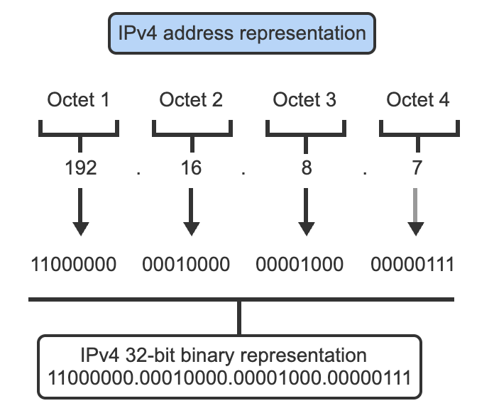

### IPv6 Address

128 binary bits that:

* Are separated into 8 16-bit "segments" separated by ":" for readability;
* The 16 binary bits in each segment is written in hexadecimal to further improve readability:
	* Since each hex number represents 4 binary numbers, a human-facing (needing readability) IPv6 address is made up of 8 segments of 4 hex numbers each separated by ":";
	* But there are further readability conventions that further improves readability. You could read about in Meyers.

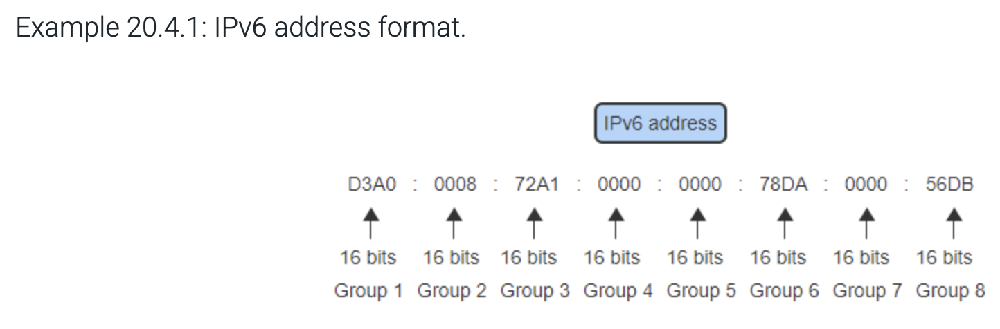

### Network and Host Identification

IP addresses uniquely identify a host on the internet, but they're not "randomly assigned" unique identifiers. Instead, they have the WAN hierarchy "built into" them. The first portion of an IP address, be it IPv4 or IPv6, identifies the network, and the second portion identifies the "subnet" or host. This is analogous to a physical address where the first portion identifies the state, city and street address. Since the "." and ":" are just for human readability, any portion of an IP address can be the subnet portion or the host portion.
For an IPv4 IP address 100.101.102.103:

* The entire IP address 100.101.102.103 identifies a host:
	* The first portion of the address represents the network that the host is in;
	* Such network is part of a higher-level network and is generally refer to as the subnet.
* If the first three octets 100.101.102 represent the subnet, then the last octet represents a host:
	* Since the last octet is 8 bits of binary, which could be any number between 0-254, the subnet can host up to 254 hosts (all zero's are usually not used to identify a host);
	* This used to be called a Class C subnet, a small subnet, that is usually a LAN.
* If the first two octets 100.101 represent the subnet, then the last two octets represent hosts in a subnet capable of hosting from 001.001 through 254.254 hosts. This used to be called a Class B subnet;
* There is really no reason to dedicate entire octets to represent subnet or host. We can pick from the middle:
	* For example, for an IPv4 address 100.101.102.103 = 01100100.01100101.01100110.01100111, we can pick the "red" binary digits to represent the hosts. Then the rest represents the subnet;
	* Since the "break" is not at a ".", this is called "classless" subnet.

The IPv6 situation is similar.

### Subnet Mask and Prefix Notations

How do we specify which part of an IP address is a subnet and a host? Two ways:

* Subnet mask;
* Prefix notation.

Subnet mask:

* Only used in IPv4;
* Another set of 64-bit binary bits that can be written in decimal separated into 8 segments;
* A subnet mask of 255.255.255.0 = 11111111.11111111.11111111.00000000;
* A bitwise logic AND between the subnet mask and the IPv4 address 100.101.102.103 produces the subnet ID 100.101.102.

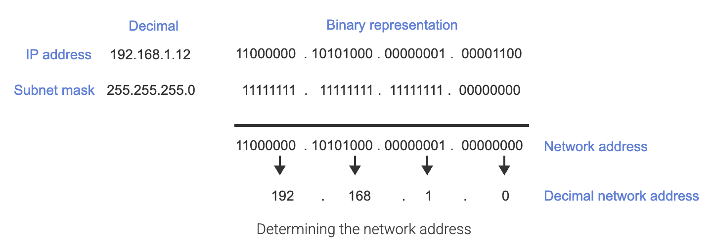
Prefix notation:

* Since the first 24 bits are the subnet ID, we could have just written: 100.101.102.103 /24;
* Needless to say, the prefix notation is just for human and won't be recognized by dumb digital circuits;
* How do digital circuits distinguish between host and subnet? subnet masks;
* In IPv6, we only use the prefix notation, but let software compute a subnet mask.

## Reserved IP Addresses, Private IP vs. Public IP

Have you ever noticed or wondered why the IP address of your home computer and router always start with 196.168.x.x, and so are mine? That seems to run counter to our narrative that an IP address represents a unique node on the entire internet?
The answer is: these are _private_ IP addresses assigned to you by your home router, and it is not an IP address on the internet. What is your internet-facing IP address? It is your router's IP address that is shared by all computing devices on your home network.
Certain segments of IP addresses are specifically reserved for private use, meaning they are intended for use within private networks and are not routable on the public Internet. These reserved private IP address ranges are defined by the Internet Engineering Task Force (IETF) in RFC 1918 for IPv4 and by RFC 4193 for IPv6.

### Reserved Private IP Addresses

The following IPv4 address blocks are reserved for private networks:

* **10.0.0.0 to 10.255.255.255** ([10.0.0.0/8](https://10.0.0.0/8)): a large range providing over 16 million addresses, typically used by large organizations or enterprises;
* **172.16.0.0 to 172.31.255.255** ([172.16.0.0/12](https://172.16.0.0/12)): offers about 1 million addresses, often used by medium-sized networks.
* **192.168.0.0 to 192.168.255.255** ([192.168.0.0/16](https://192.168.0.0/16)): a smaller range is common in home and small office networks, providing around 65,000 addresses.

These private IP addresses allow devices within the same local network to communicate without using public IP addresses, which are limited in number and globally unique.
In IPv6, private addresses are called Unique Local Addresses (ULAs) and fall within the:

* **fc00::/7** prefix: Specifically, the fd00::/8 block is used for locally assigned ULAs.
* The **fec0::/10** block was previously reserved for site-local addresses but is now deprecated.

IPv6 private addresses serve a similar purpose as IPv4 private addresses but with a vastly larger address space.

### Other Reserved IPv4 Addresses

Beyond private IP addresses, there are several other reserved IP address ranges in IPv4 for special purposes:

* **Loopback Addresses:**
	* Range: 127.0.0.0 to 127.255.255.255 (commonly [127.0.0.1](https://127.0.0.1));
	* Used by a device to communicate with itself for testing and diagnostics.
* **Link-Local Addresses:**
	* Range: 169.254.0.0 to [169.254.255.255](https://169.254.255.255);
	* Automatically assigned when a device cannot obtain an IP address via DHCP;
	* Used for local communication within a subnet.
* **Multicast Addresses:**
	* Range: 224.0.0.0 to [239.255.255.255](https://239.255.255.255);
	* Used to send data to multiple devices simultaneously, such as streaming or routing protocols.
* **Experimental Addresses:**
	* Range: 240.0.0.0 to [255.255.255.254](https://255.255.255.254);
	* Reserved for experimental use and not used publicly.

These reserved ranges serve distinct network functions and are not assigned to ordinary devices on the public Internet.

### Summary Table of Key Reserved IPv4 Ranges

|     |     |     |
| --- | --- | --- |
| Range | Purpose | Notes |
| 10.0.0.0 – 10.255.255.255 | Private networks (Class A) | Large private networks |
| 172.16.0.0 – 172.31.255.255 | Private networks (Class B) | Medium-sized networks |
| 192.168.0.0 – 192.168.255.255 | Private networks (Class C) | Small/home networks |
| 127.0.0.0 – 127.255.255.255 | Loopback | Device self-communication |
| 169.254.0.0 – 169.254.255.255 | Link-local | Automatic private addressing |
| 224.0.0.0 – 239.255.255.255 | Multicast | Group communication |
| 240.0.0.0 – 255.255.255.254 | Experimental | Reserved for future use |

### Reserved IPv6 Addresses

IPv6, with its vast 128-bit address space (providing 340 undecillion unique addresses), has several reserved address ranges for specific purposes, similar to IPv4 but with much larger allocations. As of April 2025, these reserved IPv6 address ranges serve various network functions and help maintain the structure of the IPv6 internet.
Read more about it [here](https://www.perplexity.ai/search/cc34e612-9a8f-490e-98d8-3e9c8da978a5#1).

### Uses and Benefits of Private IP Addresses

* **Security:** Devices with private IPs are not directly reachable from the Internet, reducing exposure to external attacks.
* **Address Conservation:** They help conserve the limited IPv4 address space by allowing reuse of the same private ranges in different networks.
* **Network Management:** Facilitate internal communication within homes, offices, and enterprises without requiring globally unique IPs.
* **Network Address Translation (NAT):** Enables multiple devices on a private network to share a single public IP address for Internet access.

In conclusion, private IP address ranges are a critical part of network design, enabling secure and efficient internal communication while preserving public IP address space. Additionally, several other reserved IP address blocks serve specialized network roles such as loopback, link-local, multicast, and experimental functions.

## IP Address Assignment

With the constraints of the above reserved IP address ranges:

### IPv4 Address Assignment

* Devices in a LAN sitting behind an edge router each use private IP addresses and share a public IP address that is their edge router's IP address;
* Within the LAN, their private IP address can either be "self-claimed" by typing in a "static" IP address in a setup utility or "dynamically-assigned" by the router;
* Within a WAN, the routers public IP address can also be "self-claimed" by typing in (more likely "negotiating") a "static" IP address in a setup utility (of a higher-level router) or "dynamically-assigned" by a higher-level router.

### IPv6 Address Assignment

* Devices in LAN can also only have private IP addresses and share their router's public address just like IPv4 (albeit with different address formats and notations);
* Each device in a LAN sitting behind an edge router can also have their own public, unique IP address, called a "global unicast address". This is one of the key features of IPv6;
* IP address assignment works in a similar fashion (either self-claim or dynamic assignment) to IPv4, but through different algorithms (creation of MAC-address derived last part, router solicitation, router advertisement messages, etc. as described in some details in Meyers).

### DHCP

DHCP stands for **Dynamic Host Configuration Protocol**. It is a network management protocol used on IP networks to **dynamically assign IP addresses and other network configuration parameters** (such as subnet mask, default gateway, and DNS servers) to devices on a network, enabling them to communicate efficiently and automatically.[wikipedia+3](https://en.wikipedia.org/wiki/Dynamic_Host_Configuration_Protocol)
**How DHCP Works**
DHCP follows a client-server model and typically automates four key steps, often remembered as DORA:

1. **Discover:** The client device sends out a broadcast message (DHCP Discover) searching for a DHCP server.
2. **Offer:** DHCP servers on the network reply with a DHCP Offer, proposing configuration parameters including an available IP address.
3. **Request:** The client replies with a DHCP Request, indicating which server's offer it accepts.
4. **Acknowledge:** The selected server responds with a DHCP Acknowledge (ACK), confirming the allocation and configuration. [jumpcloud+1](https://jumpcloud.com/it-index/what-is-dhcp-dynamic-host-configuration-protocol)

**Key Features**

* **Automatic IP Assignment:** Removes the need for manual address configuration, reducing errors and administrative workload.
* **Centralized Management:** Allows network administrators to manage all IP addresses and network options from a single point.
* **Lease System:** IP addresses are assigned for a limited "lease" duration—after which the device can renew or release the address. [comptia+1](https://www.comptia.org/en-us/blog/what-is-dhcp-dynamic-host-configuration-protocol/)
* **Additional Configurations:** DHCP can also assign other network details like DNS servers and default gateway settings.[fortinet+1](https://www.fortinet.com/resources/cyberglossary/dynamic-host-configuration-protocol-dhcp)

**Importance and Use Cases**

* **Home Networks:** Your home router usually acts as a DHCP server, assigning IPs to devices on the network. [bluecatnetworks](https://bluecatnetworks.com/glossary/what-is-dhcp/)
* **Enterprise Networks:** Used to manage thousands of devices efficiently in large organizations. [comptia+1](https://www.comptia.org/en-us/blog/what-is-dhcp-dynamic-host-configuration-protocol/)

Overall, DHCP is essential for scalable, flexible, and error-reduced network management in both small and large network environments. [geeksforgeeks+2](https://www.geeksforgeeks.org/computer-networks/dynamic-host-configuration-protocol-dhcp/)

## Routers

Routers are crucial networking devices that enable communication between different networks by directing traffic between these networks. Here's an explanation of what they do and how they do it:

### Edge Routers

Edge routers sit at the edge of LANs and face computing devices within LAN on the inside, other edge routers at same or higher levels:

* On the "internal-facing" side, router has a private IP address, for typical home network, it is [192.168.1.1](https://192.168.1.1) or something similar:
	* Receives data packets (frames) from devices within the LAN;
	* Inspects packets, extracting information such as source and destination IP addresses and "remembering" the source IP of the packet;
	* If the destination IP is outside of LAN, "translates" the private IP of the source into the public IP of the router, through a process called Network Address Translation (NAT), and sends it out.
* On the "external-facing" side, router has a public IP address. All packets sent out of your home LAN will appear to the "outside world" to carry the router's public IP address:
	* For packets from within its LAN, the router decides the "best next stop" router to send it to and sends it:
		* By matching the longest portion of the destination IP to its routing table;
		* Why? because the "longest portion matching algorithm" represents the "shortest route" to the destination;
		* Why? because of [[PCC Spring 2025/the way host and its subnet are represented]].
	* For packets from the outside to devices within the LAN, router only forwards those in response to requests from the LAN device and blocks the rest (unsolicited contacts):
		* By remembering the outward request packets by "opening a port" for the outgoing packet;
		* When forwarding outside packets, the router uses the port opened for the requesting device.

### Higher Level Routers

Routers located at higher levels of WAN hierarchy see other lower-level routers "internally", "peer routers" and higher-level routers "externally":

* They perform similar to the "internal-" and "external-" facing tasks;
* They also act as intermediaries that forward data packets between source and destination _networks_ by examining the destination address of incoming packets and determine where to send them, thereby facilitating communication between devices on different networks;
* They translate between different protocols or address formats if necessary:
	* Routers choose the best path for data transmission based on criteria like traffic load, bandwidth, and latency. This is done using routing protocols that maintain up-to-date network maps.

### Other Router Functions

* **Security and Firewalls**: Many routers include firewall capabilities to block unauthorized access to networks and protect against malicious traffic;
* Today's home routers have many different functions and features.

## Internetwork/WAN Transmission

Unicast, broadcast, and multicast are three fundamental types of network communication that define how data is transmitted between devices on a network. Each serves a specific purpose and operates differently under IPv4 and IPv6 protocols.

### Unicast Communication

For inter-LAN transmissions, especially among two or more devices that are far away and may not know each other's location, the transmission mechanism makes use of the WAN hierarchy:

* The sending device sends the resource to the router of its LAN;
* The router having realized the traffic is meant for outside of the LAN, sends the traffic to the router controlling the receiving device's LAN;
* If the two routers are not directly connected to each other, then the sending router will send the traffic one layer "up the hierarchy" to a higher-level router that may have access to a router that eventually have access to the router in direct connection to the receiving device.

This is analogous to a modern package delivery system. For this to take place, we first must be able identify the sending and receiving hosts. Such identification is not the MAC address associated with each device's hardware NIC, as it's impossible for any single router to maintain a complete record of billions of hosts that are changing every second, but through the identity system of IP address.
This is unicast, a one-to-one communication method where data is sent from a single sender to a single recipient.
**In IPv4:**

* Uses Class A, B, and C addresses for communication;
* The most common form of data transfer over networks;
* Each packet contains the source's unicast address and the destination's unicast address;
* Examples include email, file transfers, browsing websites, and SSH connections.

**In IPv6:**

* Functions similarly to IPv4 unicast, maintaining the one-to-one communication model;
* Different data streams are generated for each unicast connection;
* Ideal when different clients need different data from a network server;
* The concept remains the same as in IPv4, though the addressing format differs.

Unicast is bandwidth-efficient for individual communications but becomes less efficient when identical data needs to be sent to multiple receivers, as separate packets must be created for each destination.

### Broadcast Communication

Broadcast is a one-to-all communication method where data is sent from one sender to all devices on a network segment.
**In IPv4:**

* Two types: Limited Broadcasting and Directed Broadcasting;
* Limited Broadcasting: Sends packets to all devices on the local network by sending the packets to IP address of 255.255.255.255:
	* When this "target IP address" of "all 1's" is ANDed with the IP address of a local host, the result is the local host IP address (1 AND x is x), making the local host think that the packet is for it;
	* This won't work for hosts in a different LAN as that LAN's edge router ignores this target IP.
* Directed Broadcasting: Sends packets from one network to all hosts on a different network;
* Used for network management protocols like ARP and RIP;
* Generates the most network traffic among the three communication types;
* Less secure as data is sent to all devices on the network.

**In IPv6:**

* Broadcast does not exist in IPv6;
* Broadcast functionality is replaced by multicast in IPv6;
* Instead of broadcasts, IPv6 uses specific multicast addresses to reach groups of devices.

### Multicast Communication

Multicast is a one-to-many communication method where data is sent from one sender to a specific group of recipients who have expressed interest in receiving that data.
**In IPv4:**

* Uses Class D addresses (224.0.0.0 to [239.255.255.255](https://239.255.255.255)) as target address;
* Devices must subscribe to a multicast group to receive the traffic;
* More efficient than unicast when different groups need to see the same data;
* Examples include video streaming, audio teleconferencing, and online gaming;
* Layer 2 multicast MAC addresses start with "01:00:5e".

**In IPv6:**

* Multicast is a required feature in IPv6 (optional in IPv4);
* Functions similarly to IPv4 multicast but with different addressing;
* Used to replace broadcast functionality from IPv4;
* Specific multicast addresses like FF02::1 (all nodes) and FF02::2 (all routers) serve important network functions;
* More structured address scoping than in IPv4.

### Anycast Communication

Anycast is a fourth type of communication that's particularly important in IPv6.
**In IPv6:**

* One-to-nearest communication model;
* Same anycast address is assigned to multiple interfaces on different nodes;
* Packets are delivered to the "closest" interface (in terms of routing distance) with that address;
* Useful for distributed services where the nearest server should respond.

### Implementation Differences Between IPv4 and IPv6

**Network Hardware Handling:**

* Switches may implement "IGMP snooping" (IPv4) or "MLD snooping" (IPv6) to efficiently handle multicast traffic;
* Without such features, multicast packets might be treated like broadcasts at the hardware level.

**Address Resolution:**

* IPv4 uses ARP broadcasts to resolve MAC addresses;
* IPv6 uses Neighbor Discovery Protocol with solicited-node multicast addresses instead of broadcasts;
* Only the targeted node "listens" to its solicited-node multicast address, reducing unnecessary traffic.

**Traffic Management:**

* IPv6 eliminates broadcast storms by relying on targeted multicast groups;
* Multicast in both protocols can save bandwidth compared to multiple unicast transmissions;
* IPv6's structured multicast addressing provides better traffic control than IPv4 broadcast.

In summary, while unicast and multicast concepts remain similar between IPv4 and IPv6, the significant change is the elimination of broadcast in IPv6, with its functionality being handled through more efficient multicast mechanisms. This change, along with the introduction of anycast as a standard feature, makes IPv6 more scalable and efficient for modern networks.

## URL, DNS

### Universal Resource Locator

An IP address specifies a networked device's identity on the network. A Universal Resource Locator specifies a resource:

* If the resource happens to locate on a remote host in the network, then url needs to specify where that host is, and that is the host's IP address;
* URL is specified in (somewhat cryptic but still meaningful) words, while IP address is made up of (actually binary, expressed in decimal for human) groups of numbers.

A URL: <https://www.cnn.com/?refresh=1> contains:

* Protocol: https;
* Domain hierarchy: [www.cnn.com](https://www.cnn.com): specifies location of the server;
* A path or query ?refresh=1: when a connection is established with the server through https protocol, then run the query or otherwise communicate between the server and client.

### URL Hierarchy

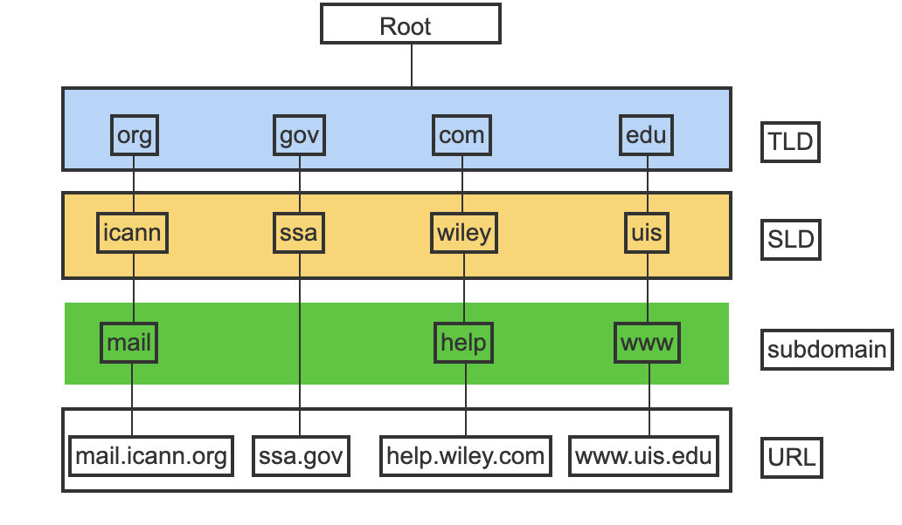

### Domain Name Service

How do we turn the words in url into and from IP address? Through DNS (Domain Name Server/Service);
DNS is a database that:

* Exists on multiple servers in a hierarchy;
* Maps the network address portion of the url to the destination device's IP address.

When you type <https://www.cnn.com/?refresh=1> into your browser, here's how DNS resolves the domain to an IP address through its hierarchical levels:

1. Local/Browser Cache: Your browser first checks if it already knows the IP address from a recent lookup. If it does, use it. If not, it proceeds to the next steps.
2. Recursive Resolver: Your computer reaches out to a _recursive DNS resolver_ (often operated by your ISP or set in your network settings). This recursive resolver works as your "agent" in the DNS system. [cloudflare+1](https://www.cloudflare.com/learning/dns/what-is-dns/)
3. Root DNS Servers: If the resolver doesn't have the answer cached, it sends an _iterative query_ to a root DNS server (one of the 13 sets globally distributed). The root server doesn't know the IP directly, but it points the resolver to the correct _Top-Level Domain_ (TLD) name server for `.com`.[eitca+1](https://eitca.org/cybersecurity/eitc-is-cnf-computer-networking-fundamentals/domain-name-system/introduction-to-dns/examination-review-introduction-to-dns/how-does-the-dns-resolution-process-work-when-a-dns-server-needs-to-resolve-a-domain-name-but-is-not-authoritative-for-the-domain-and-what-mechanisms-are-involved-in-this-scenario/)
4. TLD DNS Servers: The TLD server responsible for `.com` provides the resolver with a referral to the authoritative DNS servers for `cnn.com`.[bytebytego+2](https://blog.bytebytego.com/p/a-crash-course-in-dns-domain-name)
5. Authoritative DNS Server: The resolver queries the authoritative DNS server for [cnn.com](https://cnn.com), which contains the actual DNS records specifying the IP address for `www.cnn.com`.[cloudflare+2](https://www.cloudflare.com/learning/dns/what-is-dns/)
6. Return to Browser: The IP address returned by the authoritative server travels back up the chain to your computer. The resolver may cache the result for future requests.

|     |     |
| --- | --- |
| Level | What it Does |
| Local cache | Checks recent lookups (skips network if present) |
| Recursive resolver | Handles the DNS search on your behalf |
| Root server | Directs resolver to correct TLD server |
| TLD server | Points to authoritative servers for domain |
| Authoritative server | Provides final answer (IP for [cnn.com](https://cnn.com)) |

# Wireless Networking

When thinking about wireless networking, the easiest way to start is to realize that it merely amounts to a change of the transmission medium:

* The same networking topologies, structures, infrastructure, IP addressing schemes, etc, remain;
* The same TCP/IP protocols remain;
* Networking devices for wired networking, such as NIC, hub, switch and router, can all be implemented wirelessly:
	* The most you need to pay attention to is the added complexity involving wired/wireless conversions and interfaces.

In this framework, we only need to understand unique characteristics and challenges for wireless networks due to their wireless nature. But this framework has a big assumption:

* We're only thinking about a wireless network that handles the internet infrastructure.

However, wireless transmission and networks have other context:

* The mobile phone application that started before "data" transmission to transmit voice through "voice" or "text" networks;
* Satellite communication that predates the mobile phone application;
* TV broadcast networks for motion pictures and voice.

All of the above networks have been used for "computer networking" purposes of transmitting data. Thinking more broadly, this picture is also true for wired networking:

* Landline phone;
* Cable broadcast networks.

## Introduction to Wireless Transmission

### Radio Frequency Electromagnetic Waves

* Wireless networking utilizes the electromagnetic waves, which is time-and space-varying electromagnetic field;
* Visible light, infrared, ultraviolet, alpha waves are all electromagnetic waves but with different frequencies;
* Radio wave frequency (RF) is the frequency of electromagnetic wave in frequency ranges that are used by radio transmissions.

### Frequency, Wavelength and Speed

Electromagnetic waves (signals) are periodic signals of electric and magnetic fields, a sinusoidal function of both position and time. Frequency of such is the number of changes in these field strengths per unit time. Period is the time per change. Wavelength is the distance the wave travels per period:

c = f\\cdot \\lambda

where:
c  is the speed of light (in a vacuum, approximately  3 \\times 10^8  m/s),
f  is the frequency (oscillations per second),
lambda is the wavelength (distance over which the wave repeats).

### Modulation and Demodulation (MODEM)

A sinusoidal signal does not in and of itself carry any information (or carries minimal amount of information). In order to transmit information, signals representing information must be "superimposed" to a sinusoidal signal at the transmitting end, and "de-superimposed" at the receiving end. The former is called modulation and the latter is called demodulation. The sinusoidal wave is said to "carry" the information signal and is therefore called the carrier signal.

* Your modem at home does exactly that.

Example of MODEM:
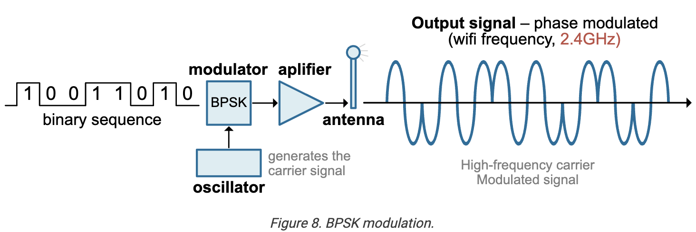

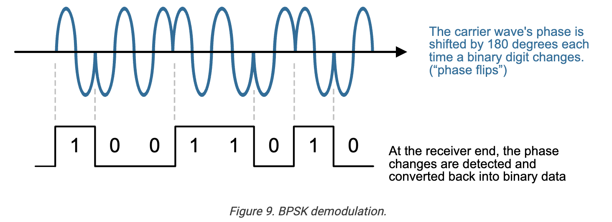

### Attenuation

As the electromagnetic radiation travels through the air:

* It encounters particles in space and loses strengths due to reflection and refraction, etc.;
* It gets mixed with signals of similar (interference) and dissimilar (noise) frequencies so when attempts to distinguish are made, the recovered signal becomes smaller in amplitude;
* When it encounters obstacles, it interacts with the particles within an obstacle and loses strengths (absorption).

All these cause losses in signal strength.

### Loss and Gain

When signal is received and re-transmitted by a radio tower, it gains strengths. Both loss and gain are measured by the ratio of the after loss (gain) to the before loss (gain) strengths. The **decibel (dB)** is a logarithmic unit used to express the ratio of two quantities, often power or intensity. It is defined as:

\\mathrm{dB} = 10\\cdot \\log\_{10} \\left(\\frac{P\_2}{P\_1}\\right)

where P2 and P1 are the power levels being compared.

### Antennas

Antennas are devices that turn (transmit, radiate) local electrical signals into traveling electromagnetic waves and turn (receive) EM waves into local signals.

## Wireless Network Unique Characteristics

### Basic Service and Extended Service Sets, Mesh

* Somewhat unique topologies;
* SSID (Service Set Identification).

### Half-Duplex Communication

Unlike modern wired networks that operate in full-duplex mode (allowing simultaneous bidirectional data transmission), wireless networks operate in half-duplex mode, meaning they cannot transmit and receive data simultaneously.

### Shared Medium

In wireless networks, all devices share the same radio frequency spectrum, requiring them to take turns communicating. This shared medium approach differs from wired networks where each device typically has a dedicated connection.

### Signal Characteristics

Wireless networks have unique transmission properties including:

* **Coverage and reach**: The ability to cover large areas without physical cables, from small spaces to entire urban areas;
* **Signal attenuation**: Wireless signals can be weakened by physical obstacles like walls, floors, and large metal structures;
* **Interference vulnerability**: Wireless networks are susceptible to electromagnetic interference from other electronic devices and nearby wireless networks.

### Association and Authentication

Wireless networks have unique connection processes where client devices must detect beacons from access points, then go through association and authentication procedures before being able to transmit data:

* RTS/CTS/ACK protocol.

## Wireless Medium

The medium for wireless transmission is air. Instead of using wires to transmit electrical, optical or electromagnetic signals, wireless uses radio wave, a specific frequency/wavelength spectrum band of electromagnetic wave, through air. There are two main standards of wireless transmission:

* Wireless LANs (WLANs) standard and protocol family based on the IEEE 802.11 wireless Ethernet standard: marketed as Wi-Fi;
* Bluetooth technology.

With the exception of some wireless-specific issues such as broadcast and security, wireless networking works the same way as wired networking:

* With one more type of medium added, things will get slightly more complicated. For example, in addition to considering wired and wireless separately, we'll also have to consider situations where one converts to the other;
* Unless otherwise noted, the notes below do not distinguish between wired or wireless transmission.

## Wireless Standard

### Wi-Fi for Wireless Network for Wireless LAN

The direct counterpart to **Ethernet** (IEEE 802.3) for wireless networking is **Wi-Fi**, which is based on the **IEEE 802.11** family of standards:

* **IEEE 802.11** defines the set of protocols and standards for wireless local area networking (WLAN), covering both the physical and data link layers, much like Ethernet does for wired LANs;
* Wi-Fi allows devices such as laptops, smartphones, and printers to communicate and access the network without physical cables, using radio waves instead;
* The 802.11 standards have evolved over time (e.g., 802.11a, 802.11b, 802.11g, 802.11n, 802.11ac, 802.11ax), supporting higher speeds, new frequency bands, and advanced features;
* Like Ethernet, Wi-Fi specifies how data is formatted, transmitted, and received, but it uses the air as the transmission medium rather than copper or fiber cables.

### BlueTooth for Personal Area Networks

BlueTooth is another set of standard and protocol most frequently used for Personal Area Network (PAN):

* Also uses radio frequency, but with frequent (thousands of times per minute) "frequency hopping" rather than fixed "channel" frequency for Wi-Fi, for enhanced anti-interference capabilities;
* Allows networking of devices within "personal proximity" (~10 meters);
* Almost always used in direct device-to-device connection (hence the "paring" you see when trying to connect your phone to your car radio through bluetooth).

### Comment

Is it plausible to use other electromagnetic spectra, other wiring and interface and other protocols to achieve wired or wireless networking? Absolutely. The issue, however, is to allow computing devices to talk to one another with minimum effort from the user standpoint, hence the standards and protocols in use.

## Cellular Networks

### Connections

WiFi connects devices via a wireless router, typically installed in homes, businesses, schools, or public spaces. You access the internet through this local network, usually after connecting to a particular network SSID and entering a password.
Cellular connects devices directly to the internet through the nearest cell tower. Your device uses a SIM card and connects automatically as long as there is cellular coverage, without needing to join specific networks or enter passwords.
Between WiFi and Cellular:

* **WiFi:** limited range—typically up to 150ft indoors and up to 300ft outdoors, depending on the router’s strength and environment. Signals weaken through walls or at distance.
* **Cellular:** Much larger range, potentially covering entire cities, regions, or countries. As you move, your device seamlessly “hands off” between towers, so coverage can follow you almost anywhere there is cellular service.

### Frequencies

WiFi Frequency Ranges (IEEE 802.11 standards) most commonly use (unlicensed):

* 2.4GHz band (2,400–2,483.5MHz).
* 5GHz band (5,150–5,850MHz).
* Newer generations (WiFi 6E and WiFi 7) now also use the 6GHz band (5,925–7,125MHz), and some specialty versions (like 802.11ad) operate at 60GHz.
* Some less common variants can operate in bands near 900MHz and 3.6GHz in specific regions.

Cellular Frequency Ranges (2G/3G/4G/5G) use a wide variety of frequency bands that are all licensed:

* Low band: 600MHz–1GHz (e.g., 600MHz, 700MHz, 850MHz, 900MHz);
* Mid band: 1GHz–4GHz (e.g., 1,700–2,100MHz, 1,900MHz, 2,300MHz, 2,500MHz, 3,500MHz);
* High band (mmWave): 24GHz–39GHz, even up to 60GHz for certain 5G deployments;
* Cellular bands are more fragmented by carrier and country, and each network may use several different frequencies for capacity, coverage, and speed optimization.

Key Differences and Overlap

* WiFi mainly uses unlicensed spectrum (2.4GHz, 5GHz, and 6GHz), while cellular primarily uses licensed spectrum, spanning from 600MHz up to 39GHz or higher.
* Overlap: Some cellular LTE/5G mid-band frequencies (like parts of 2.5GHz, 3.5GHz) are near WiFi or sometimes overlap in regulatory edge cases, but typically, device radios choose either cellular or WiFi within their specific spectrum allocation, not the exact same channels.
* Microwave and mmWave: Both may extend into very high frequencies for specialized applications (WiFi 60GHz, 5G mmWave), but real-world deployments generally use distinct, non-overlapping channels.

### Standards

WiFi uses IEEE 802.11 standards. Cellular networks use a series of evolving international standards, each defining how wireless data and voice signals are handled:

* 2G: GSM (Global System for Mobile Communications), with GPRS and EDGE protocols for data.
* 3G: UMTS (Universal Mobile Telecommunications System) and HSPA, under the ITU’s IMT-2000 specification.
* 4G: LTE (Long-Term Evolution), focused entirely on IP-based packet switching for high-speed internet.
* 5G: 5G NR (New Radio), as specified by 3GPP (Third Generation Partnership Project) and the ITU, supporting even faster speeds and greater reliability for a range of new use cases.

As you move from 2G to 5G, the standards have shifted from primarily voice and low-data-rate connectivity to high-speed, global mobile internet access across a wide range of frequencies.

### Network Topology

WiFi uses star-shaped topology with edge router. For cellular network:

* Devices connect to a cell tower (or base station), which acts as a central communication point for a coverage area (a “cell”);
* Cell tower connects to the cellular network’s core infrastructure;
* Core network manages routing, switching, and internet gateway functions:
	* Analogous to a router’s role but on a much larger and more complex scale.

Therefore, cellular network topology is hierarchical and distributed, with multiple cell towers covering geographic areas and connected to a core network through wired or fiber links. This structure supports wide-area mobile coverage and seamless connectivity as you move across different cells, quite different from WLAN’s localized star topology.

### Speed and Reliability

* **WiFi:** Can often provide faster speeds if connected to a robust router and home internet service, but speed and reliability can decrease as more users connect to the same router, or with poor hardware.
* **Cellular:** Cellular networks like 4G LTE and 5G now offer high speeds comparable to or exceeding some WiFi connections, though speeds can vary with network congestion, location, and signal strength.

### Mobility and Convenience

* **WiFi:** Not mobile—your device must remain within the signal range of the wireless router.
* **Cellular:** Highly mobile—your device remains connected as you travel, as long as you stay within the carrier’s coverage area.

### Hardware Requirements

* **WiFi:** Requires a wireless router or access point, which must be connected to an ISP. No SIM card is necessary.
* **Cellular:** Requires a mobile device with a SIM card compatible with the network, and a data plan provided by a carrier.

### Security

* **WiFi:** Home and business WiFi networks can be secured (with strong passwords and encryption), but public WiFi networks are often open and less secure, making them susceptible to eavesdropping and attacks.
* **Cellular:** Generally considered more secure due to carrier-controlled networks and encryption over the air, though still vulnerable to some types of attacks.

### Use Cases

* **WiFi:** Ideal for stationary locations, home internet, offices, streaming, or high-data tasks where you want unlimited access.
* **Cellular:** Perfect for staying connected on the go, in vehicles, traveling between locations, or anywhere without WiFi access.

## Technical Challenges

### Frequency Management

Wireless networks operate in specific frequency bands (typically 2.4 GHz, 5 GHz, and now 6 GHz in some regions), which must be carefully managed to avoid interference with other technologies using the same frequencies.

### Signal Reliability Issues

Several factors affect wireless signal reliability:

* **Distance from access point**: Signal strength diminishes with distance.
* **Physical obstructions**: Walls, floors, and other barriers can block or weaken signals.
* **Device density**: High concentration of wireless devices can lead to network congestion and reduced throughput.

## Wireless Security

Wireless networks require specific security protocols because data is transmitted through the air where it could potentially be intercepted, making them inherently more vulnerable than wired connections:

### Mac Address Filtering

Only allow named MAC addresses to access:

* Only works if you have a small number of fixed devices on the network;
* Subject to spoofing.

### Authentication

See [[here]] and [[here]].

### Data Encryption

* WPA2 and WPA3

## Operational Considerations

### Mobility and Flexibility

Wireless networks provide freedom of movement and connection flexibility not possible with wired networks.

### Range and Coverage Challenges

Ensuring consistent signal strength throughout a coverage area presents unique deployment challenges.

### Maintenance Requirements

Wireless networks require ongoing monitoring of signal strength, interference levels, and capacity management.

### Cost Structure

While wireless networks typically have lower installation costs, they may require different maintenance approaches compared to wired networks.

### Bandwidth Sharing

As more devices connect to a wireless network, the available bandwidth for each device decreases, potentially affecting performance.

# The OSI Model

## "Bottom-Up", Self-Built Model of Computer Network

Looking back at descriptions of LAN and WAN from the angle of our simple, bottom-up, self-built model for a computer network, all we have described so far are between #3 and #4:

1. The sending computer's CPU must "effectuate" the transmission and data must come out of the server's storage and/or memory and be placed at the medium;
2. The resource, originally stored as files in binary form in the server computer, must be turned into electronic (or optical) signal (e.g., voltages, electromagnetic propagation) suitable for transmission through a medium;
3. A server needs to know which computer to send the resource to;
4. A client needs to know from which host to request service and where a resource comes from;
5. The electronic or optical signal must go through the medium to arrive at the client computer;
6. The client computer must "listen" and receive the "whole package" of the transmitted signal;
7. The client computer must "understand" the signal and "recover" it back into the resource in binary form to be used and/or stored, all under the control of the client CPU.

Now let's take a closer look at the other components of our model. We will not be limited to our own improvised model because we're ready to look at and under the real models.

## The OSI Model

The OSI (Open Systems Interconnection) model is a conceptual framework developed by the International Organization for Standardization (ISO) to standardize and facilitate communication between different computer systems and networks. It divides network communication into seven distinct layers, each with specific functions, to ensure interoperability and efficient data exchange across diverse hardware and software environments:

* One of the most important roles of the OSI model is to allow people to talk to and understand (read: educate) other people when discussing a complex subject like networking.

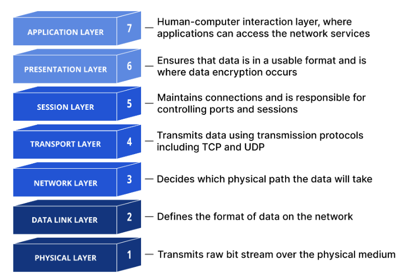

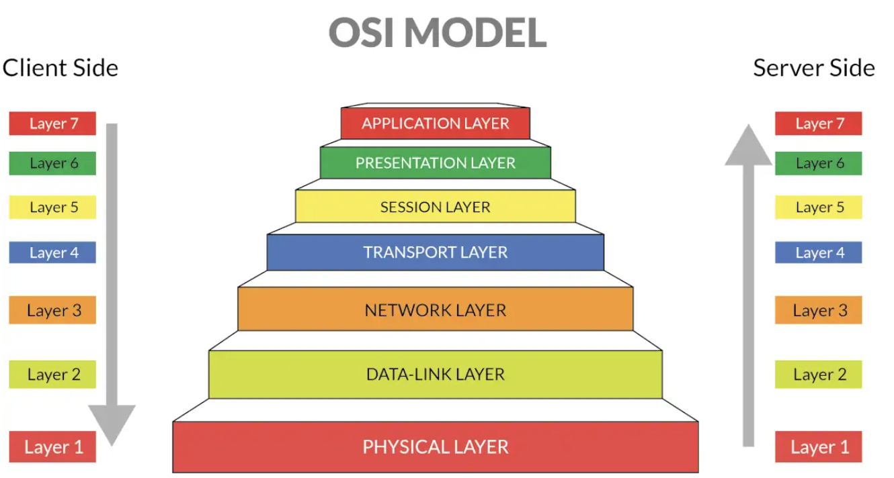

### OSI Model Perspective

The OSI model is much more sophisticated than our own improvised model. It does not use vague conceptual wordings like "for two computer to communicate with each other". Rather, the model:

* Traces a piece of information from its source on one computer to its destination on another through the entire networking process;
* In such tracing the model describes and outlines the entire networking space.

## Layer 7 Application

Layer 7 is about networking needing and capable applications, such as email client and web browser. The primary product at this layer are application-specific communication services that enable an application's networking capabilities.

### **Key Functions**

* Identifying communication partners and determining their availability and readiness to accept data;
* Determining resource availability on the network (before initiating communication);
* Synchronizing communication between applications, managing the dialogue between different systems;
* Facilitating authentication between devices for enhanced security;
* Ensuring agreement on error recovery procedures and data integrity;
* Presenting data (on the receiving end) in a format that user applications can understand.

Layer 7 doesn’t contain the applications themselves (like web browsers or email clients) but provides the necessary services and protocols that allow these applications to communicate over networks. It’s the layer that makes network resources accessible and usable to end users through their applications. In essence, Layer 7 is where the network becomes useful to people, translating technical network capabilities into practical services that applications can leverage to deliver value to users.

### **Network Services and Protocols**

Layer 7 interacts with numerous network services and protocols, including:

* Web Browsing: HTTP/HTTPS for accessing websites;
* File Transfer: FTP, SFTP, FTAM for sending and receiving files;
* Email Communication: SMTP, POP3, IMAP for sending and receiving emails;
* Name Resolution: DNS for translating domain names to IP addresses;
* Network Management: SNMP, CMIP for monitoring and managing network devices;
* Remote Access: SSH, Telnet for accessing remote systems;
* Dynamic Configuration: DHCP for automatic IP address assignment.

## Layer 6 Presentation

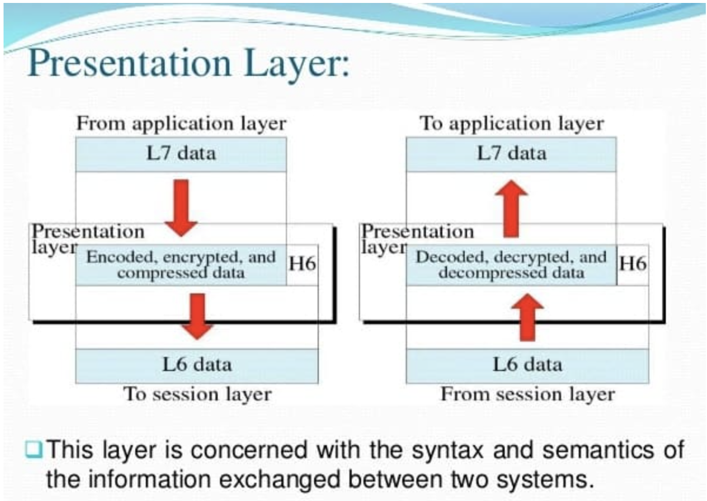
Layer 6 is about encoding, encrypting and compressing application data on the sending side, and the reverse thereof on the receiving side. It is the first step of turning application data into network-transmissible data on the sending side and the last step of turning network data into application data.

### **Key Functions**

* Data encoding/decoding and data translation and formatting;
* Data encryption/decryption for security;
* Data compression/decompression and related processing.

### **Protocols and Standards**

* Character encoding standards: ASCII, EBCDIC;
* Security protocols: SSL, TLS;
* Media formats: JPEG, GIF, PNG, TIFF, MPEG;
* Data representation formats: XML, JSON.

### **Network Equipment**

* Firewalls;
* Gateways;
* Load Balancers;
* End devices (computers, smartphones, servers).

In practical networking, the distinction between the Presentation Layer and the Application Layer is often blurred. Many modern protocols like HTTP incorporate presentation-layer functions directly into the application layer. This layer relieves application programmers from concerns about data representation differences, allowing them to focus on application functionality while the presentation layer handles the translation details.

## Layer 5 Session

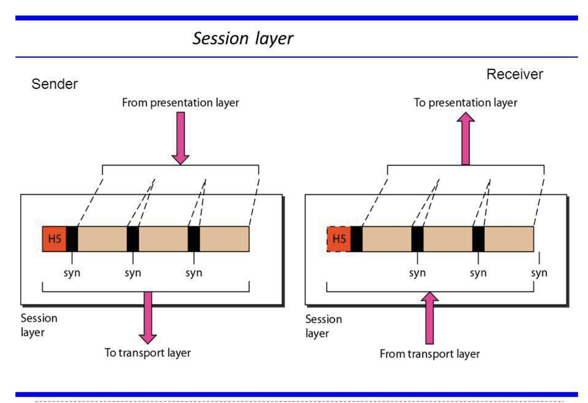
Layer 5 is about communication sessions: the establishment, maintenance and termination of connections.

### **Key Functions**

* Session Management: handles the complete lifecycle of communication sessions between applications;
* Synchronization and Recovery: implement synchronization points in data streams:
	* Checkpointing: Establishes recovery points in the data stream;
	* Resynchronization: Allows transmission to restart from checkpoints after failures;
	* Recovery: Enables sessions to resume from the last checkpoint rather than starting over.
* Dialog Control: controls the communication flow between devices:
	* Full-duplex: Allows simultaneous two-way communication;
	* Half-duplex: Enables alternating communication where one side transmits while the other receives;
	* Simplex: Supports one-way communication.

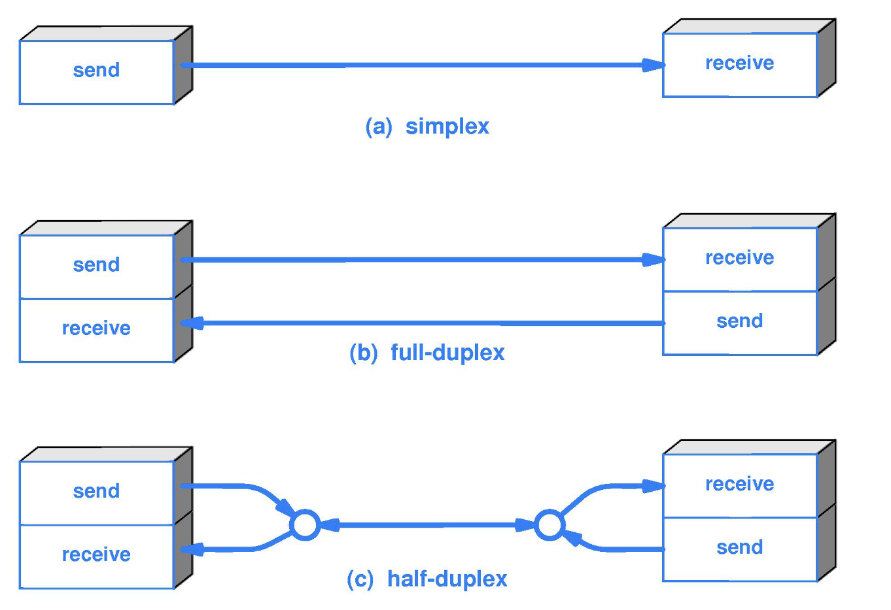

* Authentication and Authorization: security mechanisms to verify users and their permissions;

### **Protocols**

* **SIP** (Session Initiation Protocol): Used for VoIP and multimedia sessions;
* **PPTP/L2TP**: Tunneling protocols for VPNs;
* **H.245**: Call control protocol for multimedia communications;
* **SMB** (Server Message Block): For file sharing;
* **NFS** (Network File System): For remote file access;
* **PAP** (Password Authentication Protocol): For authentication;
* **RPC** (Remote Procedure Call): Enables programs to request services from remote computers.

**Network Equipment**:

* Firewalls;
* Gateways;
* Load balancers;
* End devices (computers, servers).

## Layer 4 Transport

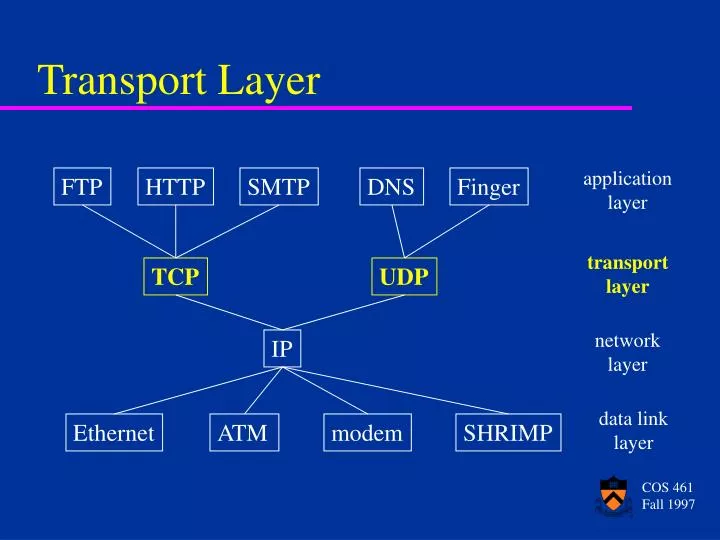
Now that we have data suitable and secure to transmit and we have a session to do so, we need further processing. Layer 4 is about preparing data to be transmitted into transmissible forms on the sending side, and preparing data transmitted on the receiving side into application data.

### **Key Functions**

* Segmentation and Reassembly: breaks down large data streams from upper layers into smaller units called segments before passing them to the Network Layer. Each segment contains:
	* Source port number (to direct data to the correct application);
	* Sequence number (to reassemble data in the correct order).
* Reliability and Error Control: implements mechanisms to ensure data integrity:
	* Error detection using checksums
	* Retransmission of lost or corrupted packets
	* Acknowledgment of successful data transmission.
* Flow Control: prevents sender devices from overwhelming receivers by regulating transmission rates;
* Connection Management: some Transport Layer protocols establish, maintain, and terminate connections:
	* Connection establishment (often using a 3-way handshake);
	* Data transfer with acknowledgments;
	* Graceful connection termination.
* Multiplexing and Demultiplexing: Using port numbers, Layer 4 enables multiple applications on the same host to use network services simultaneously:
	* Multiplexing: Combines data from different applications for transmission;
	* Demultiplexing: Directs incoming data to the appropriate application.

### **Protocols**

* TCP (Transmission Control Protocol):
	* Connection-oriented;
	* Guarantees reliable delivery through acknowledgments;
	* Provides error recovery and retransmission;
	* Ensures data arrives in the correct sequence;
	* Implements flow control and congestion avoidance;
	* Used for applications requiring reliability (web browsing, email, file transfers).
* UDP (User Datagram Protocol)
	* Connectionless protocol;
	* Provides faster transmission with minimal overhead;
	* No guarantee of delivery or sequence ordering;
	* No flow control or congestion avoidance.
	* Ideal for real-time applications like VoIP, streaming, and gaming.
* Others:
	* DCCP (Datagram Congestion Control Protocol)
	* SCTP (Stream Control Transmission Protocol)
	* MPTCP (Multipath TCP)
	* RUDP (Reliable User Datagram Protocol)\[4\]

### **Importance**

* The Transport Layer shields upper layers from the complexities of the network, providing standardized access to communication services. This allows application developers to focus on functionality rather than network details.
* In practical networking applications, Layer 4 is crucial for load balancing. Layer 4 load balancers make routing decisions based on packet-level information without needing to decrypt or inspect network traffic, making them quick and efficient for distributing network traffic.
* By managing the reliability, flow, and organization of data transmission, Layer 4 ensures that applications can communicate effectively across diverse network environments.

At Layer 4, we have transmittable networking data on the sending side, and useable transmitted data on the receiving side.

## Layer 3 Network

Layer 3 is about transfer between different networks and hosts. It handles logical addressing and routing, thereby enabling packets to travel across multiple networks to reach their destination.

### **Key Functions**

* Logical Addressing;
* Routing;
* Packet Forwarding;
* Fragmentation and Reassembly;
* Error Detection and Handling.

### **Protocols**

* Internet Protocol (IP): the primary protocol at Layer 3 is IP:
	* IPv4: The traditional addressing scheme using 32-bit addresses
	* IPv6: The newer addressing scheme using 128-bit addresses to accommodate more devices
* Routing Protocols:
	* Interior Gateway Protocols (IGPs):
		* RIP (Routing Information Protocol): A distance-vector protocol that uses hop count as its metric;
		* OSPF (Open Shortest Path First): A link-state protocol that calculates the shortest path using the Dijkstra algorithm;
		* EIGRP (Enhanced Interior Gateway Routing Protocol): A Cisco-proprietary protocol that offers rapid convergence and efficient bandwidth usage.
	* Exterior Gateway Protocols (EGPs):
		* BGP (Border Gateway Protocol): Used for routing between autonomous systems on the internet.
* Control Protocols
	* ICMP (Internet Control Message Protocol): Used for error reporting and network diagnostics;
	* IGMP (Internet Group Message Protocol): Used for multicast group management.

### **Equipment**

* Routers: Make forwarding decisions based on IP addresses;
* Layer 3 Switches: Combine switching and routing functions;
* Multilayer Switches: Can make decisions based on information from multiple layers.

## Layer 2 Data Link

Layer 2 is interface between the physical transmission signals and networking data. It provides reliable data transfer between directly connected network devices and manages access to the physical medium.

### Key Functions

* Framing: turns packets/datagram to and from frames containing:
	* Header information (including source and destination MAC addresses)
	* Payload (the actual data being transported)
	* Trailer (often containing error-checking information)
* Physical Addressing (MAC Addressing): unlike the logical addressing used at Layer 3, Layer 2 uses physical MAC addresses to identify devices on the local network segment;
* Error Detection and Correction: hardware focused ECC:
	* Cyclic Redundancy Check (CRC)
	* Parity checking
	* Checksum calculations
* Flow Control: manages hardware capability for data transfer;
* Media Access Control: manages how multiple devices access the transmission medium to avoid or handle collisions.

### Layer 2 Sublayers

Logical Link Control (LLC) Sublayer: the upper sublayer:

* Multiplexing of protocols over the MAC layer
* Optional flow control and acknowledgment mechanisms
* Interface to the Network Layer above
* Error notification

Media Access Control (MAC) Sublayer: the lower sublayer:

* Physical addressing
* Channel access control
* Frame delimiting and recognition
* Error checking through frame check sequences
* Managing collisions on shared media

### Protocols and Technologies

* **Ethernet**: The most widely used LAN technology
* **Wi-Fi (IEEE 802.11)**: Wireless networking standard
* **PPP (Point-to-Point Protocol)**: Used for direct connections between two nodes
* **HDLC (High-level Data Link Control)**: Used in synchronous communication
* **Frame Relay**: A WAN protocol
* **ATM (Asynchronous Transfer Mode)**: Cell-based switching technology

### Devices

* **Switches**: Forward frames based on MAC addresses within a local network
* **Bridges**: Connect and filter traffic between network segments
* **Network Interface Cards (NICs)**: Provide the physical interface and MAC addressing

## Layer 1 Physical

Layer 1 the actual physical transmission of data between devices. As the first and lowest layer in the OSI model, it deals with the raw bits that travel across the physical medium.

### Key Functions

* Bit Transmission and Reception:
	* Converts digital data (0s and 1s) into signals that can be transmitted over physical media, and vice versa;
	* Transmits individual bits from one node to the next without regard to their meaning or structure.
* Physical Connections:
	* Cable specifications (copper, fiber optic)
	* Connector types and pin layouts
	* Voltage levels and timing
	* Physical network topologies (bus, star, mesh, etc.)
* Signaling and Encoding:
	* In copper wires, bits might be represented by different voltage levels
	* In fiber optics, they might be represented by light pulses
	* In wireless networks, they might be represented by radio frequencies
* Synchronization and Timing
	* Bit synchronization through clock signals that control both sender and receiver
	* Bit rate control, defining the transmission speed (bits per second)
* Transmission Modes
	* Simplex: one-way transmission
	* Half-duplex: two-way transmission, but not simultaneously
	* Full-duplex: simultaneous two-way transmission\[1\]\[5\]

### Hardware

Devices and components that operate at Layer 1 include:

* Network interface cards (NICs)
* Hubs (which simply repeat signals to all ports)
* Repeaters (which amplify signals)
* Cables (copper, fiber optic)
* Connectors and ports
* Transceivers
* Modems

### Characteristics of Layer 1 Networks

Layer 1 networks have several important characteristics:

* No addressing capability (devices cannot specifically target other devices)
* No collision detection (when multiple devices transmit simultaneously)
* No media access control (no method to control which devices can transmit)
* Broadcasts to all connected devices (when using hubs)

# The TCP/IP Model

The OSI model is very conceptual-focused. An alternative to it is the TCP/IP model, or the Internet Protocol Suite, which is more networking technology-focused. It defines how data should be transmitted, routed, and received across interconnected networks, and is organized into four abstraction layers, each with specific networking functions and protocols:

* Application;
* Transport;
* Internet; and
* Network access.

## Application Layer

### Functions

Provides end-user services and application protocols for tasks like web browsing, email, and file transfer.

### Protocols

HTTP, FTP, SMTP, DNS, SNMP

## Transport Layer

### Functions

Data delivery between hosts, flow control and error handling.

### Protocols

TCP, UDP

## Internet Layer

### Functions

Logical addressing and routing across network.

### Protocols

IP, ICMP

## Network Access

### Functions

Physical transmission over network hardware and local network topology.

### Protocols

Ethernet, ARP

## Differences from the OSI Model

* The TCP/IP model has four layers, while the OSI model has seven. The TCP/IP model combines the OSI's Application, Presentation, and Session layers into a single Application layer, and merges the Physical and Data Link layers into the Network Access layer.
* TCP/IP is the practical standard for real-world networking and the Internet, while the OSI model is more of a theoretical framework.
* The model is protocol-oriented: it was designed around the protocols that power the Internet, such as TCP and IP, rather than as a strict reference model.

# Network Security

## Core Security Principles

### The CIA Triad

* **Confidentiality**: Keeping information secret from unauthorized users;
* **Integrity**: Ensuring data hasn't been tampered with or corrupted;
* **Availability**: Ensuring systems and data are accessible when needed.

### Authentication vs. Authorization

* **Authentication**: "Who are you?" - Proving identity through passwords, biometrics, tokens
* **Authorization**: "What can you do?" - Permissions and access levels after identity is confirmed
* **Principle of least privilege**: Grant minimal access necessary for job functions

## Common Threats and Attack Vectors

### Human-Targeted Attacks

* **Social engineering**: Manipulating people to reveal information or take actions;
* **Phishing**: Fraudulent emails designed to steal credentials or install malware;
* **Physical security breaches**: Unauthorized access to facilities or devices.

### Technical Network Attacks

* **Man-in-the-middle attacks**: Intercepting communications between two parties
* **Denial of Service (DoS)**: Overwhelming systems to make them unavailable
* **Malware**: Viruses, ransomware, spyware that compromise systems
* **SQL injection and web vulnerabilities**: Exploiting poorly coded applications:
	* Today's web apps typically are of the frontend + backend architecture;
	* Frontend: UI, user interaction, user input, user display;
	* Backend: functionalities code;
	* At the fundamental level of the backend is usually a database, usually a SQL database;
	* Functionalities within the database are done with (a sequence of) SQL commands;
	* Instead of injecting data, hide SQL commands in what's supposed to be data input.

## Essential Defense Mechanisms

### Network Perimeter Security

* **Firewalls**: Traffic filtering based on rules (allow/deny specific connections) - **Packet filtering**: Basic traffic inspection; - **Stateful inspection**: Tracking connection states; - **Application-layer gateways**: Deep packet inspection.
* **Network segmentation**: Isolating critical systems from general network access;
* **VPNs**: Secure remote access through encrypted tunnels.

### Endpoint Protection

* **Antivirus/anti-malware**: Detecting and removing malicious software;
* **Endpoint detection and response (EDR)**: Advanced threat hunting on individual devices;
* **Regular patching**: Fixing known security vulnerabilities in software.

### Data Protection

* **Encryption at rest**: Protecting stored data;
* **Encryption in transit**: Securing data during transmission (HTTPS, SSL/TLS);
* **Backup and recovery**: Ensuring data availability after incidents.

## Detection and Response

### Monitoring and Detection

* **Network monitoring**: Tracking traffic patterns for anomalies;
* **Log analysis**: Reviewing system and application logs for suspicious activity;
* **Intrusion Detection Systems (IDS)**: Automated threat identification;
* **Security Information and Event Management (SIEM)**: Centralized log correlation.

### Incident Response Basics

* **Immediate containment**: Isolating affected systems;
* **Investigation**: Understanding scope and impact of the breach;
* **Recovery**: Restoring normal operations;
* **Lessons learned**: Improving defenses based on incident analysis.

## Practical Implementation Focus

### Quick Wins for Organizations

* **Strong password policies**: Complexity requirements and multi-factor authentication
* **Regular security awareness training**: Educating users about common threats
* **Asset inventory**: Knowing what systems and data need protection
* **Regular vulnerability assessments**: Proactive identification of weaknesses

### Framework Introduction

* **NIST Cybersecurity Framework basics**: Identify, Protect, Detect, Respond, Recover as systematic approach;
* **Risk-based thinking**: Prioritizing security efforts based on potential impact.
