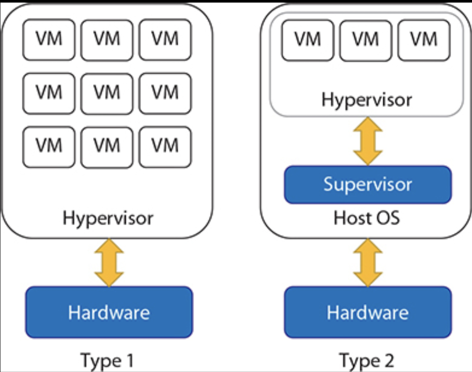

# Housekeeping

## Dates

### Date Entered

May 24, 2025

### Date Updated

June 6, 2025; May 27, 2025; May 26, 2025; May 25, 2025

# Resource Underutilization in Traditional Computing Environment

Ask yourself the following questions:

* How many computers and computing devices do you own?
* How often do you use each of your computing devices: 2 hours, 4 hours, 6 hours per day?
* When you do use a computing device, what do you do with them?
	* How much do you use your storage, networking, computation (CPU) capacities?
	* How much do you own?
	* How many software licenses do you own and how often do you use them?

In answering these questions, you quickly realize that the computing resources (including software) you own are vastly underutilized. While it may not be feasible to solve the underutilization problem with your personally owned computing resources (you can't practically loan your capacities out due to a multitude of considerations), you realize that similar underutilization is prevalent in a server environment.

## Traditional Computing Environment

A traditional computing environment refers to on-premises IT infrastructure where hardware, software, and related services are hosted, managed, and maintained within an organization's physical location. All computing infrastructure: servers, storage devices and networking equipment:

* Purchased (or rented);
* Physically located on the company's premises.

In this model, data is stored and processed in specific physical locations that the organization directly controls.

### Infrastructure and Hardware

Traditional computing environments rely on physical servers and hardware located on-site:

* Organizations purchase, install, and maintain their own data centers, servers, networking hardware, desktop computers, and enterprise application solutions.

This requires significant upfront capital expenditure for both hardware and software.

### Management and Control

In traditional computing, IT departments have complete control over their information and infrastructure:

* IT staff manage and maintain the environment, making changes and updates at their own pace;
* Businesses have flexibility and customization options.

But requires an in-house IT department or costly third-party services to install and maintain the hardware.

### Scalability Limitations

Traditional computing environments are not easily scalable:

* When organizations run out of processing power or storage space, the only solution is to acquire additional servers or hardware.

Requires careful planning and investment in computing power, making it less adaptable to fluctuating demands.

### Cost Structure

Traditional computing requires significant upfront investment in physical infrastructure and ongoing operational expenses:

* Businesses must purchase entire suites of supplies even if they only require specific tools, leading to higher capital expenditure;
* Ongoing costs for maintenance, upgrades, and eventual hardware replacements.

### Accessibility and Mobility

In traditional computing environments, access is often restricted to on-premise systems:

* Users typically need to be physically present at specific locations to access applications and data;
* Remote access options require complex setups and additional security measures.

### Performance and Reliability

Traditional computing can offer superior performance for certain tasks compared to cloud alternatives, particularly for desktop PCs with powerful processors, larger amounts of RAM, and high-end graphics cards. However, these systems may be prone to single points of failure, resulting in potential downtime and loss of productivity.

### Internet Dependency

Unlike cloud computing, traditional computing environments don't rely on internet connectivity for basic functionality. This means organizations can still access their data without downtime due to service outages, providing reliability in data availability and reducing concerns about disruptions caused by external factors.

## Hardware Resource Underutilization in Traditional Computing Environment

Based on current data as of May 2025, several key computing resources are commonly underutilized in traditional computing environments:

### CPU Resources

CPU underutilization is a significant issue in data centers and traditional server environments. Studies show that servers often operate at only 12-18% of their maximum capacity, meaning a substantial amount of computing power goes to waste. This underutilization occurs because:

* Servers are frequently provisioned to handle peak loads but operate at much lower capacity during normal operations;
* For memory-intensive applications, restricted bandwidth can lead to CPU underutilization as processors wait for data from memory.

### Memory Resources

Memory is another commonly underutilized resource. In traditional setups, each physical server has dedicated memory that may not be fully consumed by the tasks it's running. Memory is particularly concerning as a wasted resource because:

* It represents a significant cost component in modern computing infrastructure
* Memory costs are not decreasing as rapidly as computing or storage costs
* Memory bandwidth limitations can create bottlenecks that prevent full utilization of other resources.

The rising cost of main memory combined with lagging improvements in memory bandwidth has led to interest in memory-centric computing approaches that treat memory as the dominant cost factor and compute power as a commodity.

### Server Hardware

Perhaps the most alarming statistic is that approximately 30% of servers in data centers globally are "zombie servers" - they are powered on but have not performed any useful work in six months or more. This represents a massive waste of hardware resources. Additionally, 52% of companies surveyed have cloud infrastructure resources that are hardly ever or never used, with 47% reporting some or a lot of excess capacity.

### Storage Resources

Storage is frequently over-provisioned in traditional environments. Companies often purchase more storage than immediately needed to accommodate future growth, resulting in significant portions of storage capacity sitting idle. In virtualized environments, this unused storage can be dynamically allocated to virtual machines as needed.

### Network Resources

Network bandwidth is another resource that tends to be underutilized in traditional computing environments. Physical network cards and their bandwidth are often provisioned for peak loads but remain underused during normal operations.

## Non-Hardware Resource Underutilization

### Software and Licensing Underutilization

Traditional computing environments often require businesses to purchase entire suites of software licenses even when they only need specific tools or features. This leads to significant portions of software capabilities remaining unused while still incurring full licensing costs. Organizations typically pay for maximum capacity software licenses regardless of actual usage patterns.

### Human Resource Underutilization

The complex infrastructure of traditional computing environments requires specialized IT staff for installation, maintenance, and management. However, these skilled professionals often spend substantial time on routine maintenance tasks rather than value-adding activities. This represents an underutilization of human capital and expertise that could be directed toward innovation and business growth.

### Time Resource Underutilization

Traditional computing introduces significant time inefficiencies. Setting up a traditional computing environment can be complex and time-consuming, potentially taking weeks or even months to complete depending on the size and complexity. This represents underutilization of time as a resource, as businesses must wait for infrastructure to be provisioned before deploying applications or services.

### Organizational Resource Underutilization

Organizational silos and lack of centralized resource management often lead to fragmented and inefficient resource usage in traditional computing environments. Different departments may maintain separate infrastructure with minimal sharing or coordination, resulting in duplicated efforts and underutilized organizational capabilities.

# Virtualization

We have seen so far in this class:

* Hardware are just bunch of dumb electronics that are arranged and connected in such a way that they output signals that happen to be "meaningful responses" to the input signals that happen to be "meaningful", all per our "interpretation".

Where do these "meaningful" inputs come from?

* The operating system;
* Through device drivers, instruction sets and chipsets.

Traditional computer architecture has one operating system, so there is one set of inputs for the hardware. Whenever there is no such inputs, the hardware sits idle and wasted away.
What if we have more than one sets of inputs, going into the hardware "in turns"? Then hardware utilization improves. This would require:

* You have more than one operating systems or whatever else that "drives" hardware;
* Instead of these operating systems interacting with hardware directly (hardware can only take one set of inputs at any given moment), they interact with a "scheduler" software that schedules different sets of inputs from different OSs.

When this happens, the OS:

* Does not see or interact with actual hardware such as CPU, memory, storage;
* Instead sees the "share" of hardware that the scheduler software allocates to it, expressed as "equivalent", or virtual, CPU, memory and storage resources.

This is the essence of virtualization:

* OSs now interact not directly with the hardware but with a "scheduler" software;
* This scheduler software is called a hypervisor;
* What the hypervisor provides the OSs are "virtual" hardware resources;
* One OS plus its virtual hardware resources forms a "virtual machine".

## Core Concepts of Virtualization

Virtualization is a technology that creates virtual versions of physical resources, allowing multiple simulated environments to operate on a single physical machine. It enables organizations to maximize hardware usage, improve efficiency, and reduce costs by abstracting physical hardware functionality into software.
At its foundation, virtualization relies on two key components:

### **Virtual Machines (VMs)**

* These are isolated computing environments that function as separate systems with their own CPU, operating system, memory, network interface, and storage, all created from shared hardware resources.
* Each VM operates independently, allowing different operating systems to run simultaneously on the same physical device.

### **Hypervisors**

* These are software layers that act as intermediaries between the physical hardware and virtual machines.
* Hypervisors manage and allocate hardware resources such as CPU, memory, and storage across multiple VMs, ensuring each receives the necessary resources to function effectively.

**Two main types of Hypervisors**:

* **Type 1 (Bare Metal) Hypervisors**: Installed directly on physical hardware without requiring an underlying operating system, providing better performance and security (examples: VMware ESXi, Microsoft Hyper-V).
* **Type 2 Hypervisors**: Run as applications on an existing operating system, useful when running multiple operating systems on a single machine.

## Layers and Types of Virtualization

Once the idea of virtualization to save resources is established, it is easy to understand the various layers or level of virtualization.

### Instruction Set Architecture (ISA) Level

This level involves emulating the instruction set architecture, allowing legacy code written for different hardware configurations to run on virtual machines. The interpreter converts source code into a hardware-readable format, making VMs hardware-agnostic. Examples include Bochs, Crusoe, and QEMU.

### Hardware Abstraction Layer (HAL)

This level enables virtualization at the hardware level using a hypervisor. It allows virtualization of individual hardware components such as processors, memory, and input-output devices. In cloud-based infrastructure, HAL virtualization tools like VMware, Denali, and XEN are commonly used.

* **Server Virtualization**: Creates multiple virtual servers on a single physical server, improving resource utilization.
* **Desktop Virtualization**: Separates the desktop environment from the physical client device, allowing users to access virtual desktops from various devices.
* **Network Virtualization**: Creates multiple virtual networks on existing physical networks, enabling better resource allocation and simplified management.
* **Storage Virtualization**: Abstracts physical storage resources into a single logical storage unit for efficient management and improved data availability.

### Operating System Level

At this level, virtualization creates an abstraction layer between the operating system and applications. It functions as an isolated container on the physical server and operating system, particularly useful when multiple users need dedicated virtual environments with their own hardware resources. Examples include Jail, Virtual Environment, and FVM.

* Save OS resources;
* Isolate environment.

### Library Support Level

Library virtualization is applied when operating system-level virtualization is cumbersome, as applications use APIs from libraries at the user level. API hooks control the communication link between applications and the system. Examples include Wine and Wabi.

### User-Application Level

This is the highest level of virtualization, used when only a single application needs to be virtualized rather than an entire environment. It's generally employed for running virtual machines that use high-level languages. Examples include Java Virtual Machine (JVM) and .NET.

# Cloud Computing

## Core Idea of Cloud Computing

We've seen how virtualization allows computing resources (hardware and non-hardware) to be shared. Merely allowing such sharing, however, does not make the sharing happen:

* If the computing resources are owned by a single user, then that user may not have that much work to share all the time;
* That has to do with the structure of [[PCC Spring 2025/the traditional computing environment]].

In a traditional computing environment, resources are provision for peak use even when virtualization may help improve underutilization:

* Imagine breaking up the traditional computing environment and creating a computing environment multiple organizations to share the same set of computing resources through virtualization;
* Such environment would necessitate third-party ownership of computing resources offering utilization of such resources by different organization;
* Then the third-party owned resources can become highly scalable accommodating different resource needs at different times by different organizations;
* Such third-party resources would also necessarily be located off premises at least for some of the sharing organizations who utilize the resources remotely, through network.

This is the core idea of cloud computing.

### Infrastructure and Architecture

Cloud computing relies heavily on virtualization of IT infrastructure, including servers, operating system software, and networking, which is abstracted using special software so resources can be pooled and divided irrespective of physical hardware boundaries. For example, a single hardware server can be divided into multiple virtual servers, enabling cloud providers to maximize data center resource utilization.
High-speed networking connections are crucial, with wide-area networks (WANs) connecting front-end users through web-enabled devices with back-end data centers and cloud-based applications. Advanced networking technologies including load balancers, content delivery networks (CDNs), and software-defined networking (SDN) ensure data flows quickly, easily, and securely between users and back-end resources.

## Foundations of Cloud Computing

Virtualization is a foundational technology for cloud computing, but it's just one of several critical components that enable modern cloud infrastructure. There are other key foundations that make cloud computing possible.

### Hardware Infrastructure

The physical foundation of cloud computing consists of specialized hardware components distributed across global data centers. This includes:

* High-density servers;
* Power supplies;
* Networking equipment;
* Storage arrays;
* Load balancers;
* Firewalls;
* Backup devices.

Cloud providers maintain massive data centers with thousands of these components to support their services. The hardware layer must be designed for reliability, performance, and scalability to handle the demands of multiple tenants and workloads.

### Networking Technologies

Advanced networking is crucial for cloud computing, serving as both the internal fabric connecting cloud components and the external connectivity enabling user access. Key networking elements include:

* **Wide-Area Networks (WANs)**: Connect front-end users to back-end data centers and services
* **Load Balancers**: Distribute traffic efficiently across servers
* **Content Delivery Networks (CDNs)**: Optimize content delivery globally
* **Software-Defined Networking (SDN)**: Provides programmable network control
* **Network Security**: Firewalls, encryption, and access controls

Without robust, high-speed networking, the cloud model of remote resource delivery would be impractical.

### Storage Systems

Cloud storage architectures are fundamental to cloud computing, enabling data persistence and accessibility. Modern cloud platforms offer multiple storage models:

* **Block Storage**: Organizes data in fixed-size blocks, ideal for databases and operating systems
* **File Storage**: Traditional hierarchical file systems accessible over networks
* **Object Storage**: Highly scalable storage for unstructured data like media files

These storage systems are designed for durability, availability, and performance at massive scale.

### Orchestration and Management

Cloud orchestration tools and management platforms provide the control layer that makes cloud resources usable and efficient. This includes:

* **Automated Orchestration**: Systems that provision, configure, and manage resources
* **Converged Infrastructure**: Aligned technological elements managed centrally
* **Resource Scheduling**: Algorithms that determine optimal placement of workloads
* **Auto-scaling**: Capability to automatically adjust resources based on demand

These systems enable the self-service, on-demand nature of cloud computing.

### APIs and Service Interfaces

APIs (Application Programming Interfaces) serve as the connective tissue of cloud computing, enabling services to work together and providing developers with access points to cloud functionality. They:

* Help shift from monolithic to micro-service architectures
* Provide standardized access to sophisticated cloud services
* Enable integration between different cloud components
* Allow for programmatic control of infrastructure

APIs are essential for abstracting complex cloud technologies into consumable services.

### Security Infrastructure

Comprehensive security systems are built into modern cloud infrastructure, including:

* **Identity and Access Management**: Controls who can access resources
* **Encryption**: Protects data in transit and at rest
* **Threat Detection**: Systems that identify and respond to security threats
* **Compliance Frameworks**: Ensure cloud services meet regulatory requirements
* **DDoS Protection**: Guards against denial-of-service attacks

These security components are essential for maintaining trust in cloud services.

### Service Models

The three primary service models represent another foundational aspect of cloud computing:

* **Infrastructure-as-a-Service (IaaS)**: Provides virtualized computing resources
* **Platform-as-a-Service (PaaS)**: Offers development and deployment environments
* **Software-as-a-Service (SaaS)**: Delivers ready-to-use applications

These models define how cloud resources are packaged, delivered, and consumed.

### Data Processing and Analytics

Modern cloud platforms include sophisticated data processing capabilities:

* **Databases**: Both SQL and NoSQL database services
* **Data Pipelines**: Systems for moving and transforming data
* **Machine Learning/AI**: Services for training and deploying ML models
* **Big Data Processing**: Technologies like Hadoop, Spark, and other distributed computing frameworks

These capabilities enable organizations to derive value from their data at scale.
Cloud computing represents the convergence of these foundational technologies, creating a flexible, scalable computing model that continues to evolve as each component advances. The seamless integration of these elements is what makes today's cloud computing powerful and transformative for businesses.

## Characteristics of Cloud Computing

Cloud computing represents a paradigm shift from traditional computing environments, offering a fundamentally different approach to accessing and managing computing resources. The cloud computing environment is characterized by several essential features that distinguish it from traditional on-premises infrastructure. The National Institute of Standards and Technology (NIST) has identified five essential characteristics that define cloud computing environments:

### On-Demand Self-Service

Cloud computing enables users to provision computing capabilities such as server time and network storage automatically without requiring human interaction with service providers. This represents a radical departure from traditional IT procurement processes that can take months to complete. Users can access cloud accounts through web self-service portals to view services, monitor usage, and provision or de-provision resources as needed. This self-service capability allows developers to select resources and tools they need and build applications immediately.

### Broad Network Access

Cloud capabilities are available over networks and accessed through standard mechanisms that support use by diverse client platforms including mobile phones, tablets, laptops, and workstations. Users can access cloud services from anywhere with an internet connection, enabling remote access and collaboration. Public clouds use the internet while private clouds utilize local area networks, with latency and bandwidth playing major roles in service quality.

### Resource Pooling

Computing resources are pooled to serve multiple consumers using a multi-tenant model, with different physical and virtual resources dynamically assigned and reassigned according to consumer demand. This allows multiple customers to share physical resources while maintaining privacy and security. Though customers may not know exact resource locations, they can specify location at higher abstraction levels such as country, state, or data center.

### Rapid Elasticity

Capabilities can be elastically provisioned and released, sometimes automatically, to scale rapidly based on demand. To consumers, available capabilities often appear unlimited and can be appropriated in any quantity at any time. This eliminates the need to purchase computer hardware, as users can leverage cloud providers' computing resources and scale without extra contracts or fees.

### Measured Service

Cloud systems automatically control and optimize resource use through metering capabilities appropriate to the service type, such as storage, processing, bandwidth, and active user accounts. Payment follows a pay-for-what-you-use model based on actual consumption. Resource usage monitoring, controlling, and reporting provides transparency for both providers and consumers.

### Additional Characteristics

Beyond the NIST essential characteristics, cloud computing environments offer additional benefits:

* **Resiliency and Availability**: Cloud services demonstrate the ability to recover quickly from disruptions, with providers creating data copies to prevent loss and ensure rapid restoration.
* **Global Accessibility**: With data centers worldwide, cloud vendors maintain vast amounts of compute and storage assets ready for immediate deployment.
* **Policy-Based Management**: Administrators can set policies limiting what teams can run, but within those guardrails, employees have freedom to build, test, and deploy applications as needed.

The cloud computing environment fundamentally transforms how organizations access, deploy, and manage computing resources, offering unprecedented flexibility, scalability, and efficiency compared to traditional computing models.

# Cloud Service and Products

## Virtual Machine Products

When a cloud computing company sells services, they're not exclusively selling virtual machines, but VMs are a significant component of their Infrastructure as a Service (IaaS) offerings. Cloud providers offer various types of virtual machines tailored to different computing needs.
Cloud providers organize their VM offerings into "families" or "series" based on performance characteristics:

* **General Purpose VMs:** Balanced CPU-to-memory ratio suitable for testing, development, small/medium databases, and web servers.
* **Compute-Optimized VMs**: Higher CPU-to-memory ratio (like Azure's F-Series or Google's C3 series) optimized for compute-intensive workloads such as batch processing, web servers, analytics, and gaming.
* **Memory-Optimized VMs:** Higher memory-to-CPU ratio (like Azure's M-Series) ideal for large in-memory workloads such as SAP HANA, large databases, and in-memory analytics.
* **Storage-Optimized VMs**: Designed for workloads requiring high disk throughput and I/O, such as data warehousing and large transactional databases.
* **GPU-Enabled VMs**: Include specialized graphics processing units for compute and graphics-intensive workloads like AI training, deep learning, and visualization tasks.

### Google Cloud Compute Engine

* N2 series with up to 128 vCPUs and 8GB memory per vCPU
* N2D series with up to 224 vCPUs
* C3 series with up to 176 vCPUs for compute-intensive workloads
* E2 series with up to 32 vCPUs for the lowest cost.

### Microsoft Azure

* A-Series: Entry-level VMs for development and testing
* Bs-Series: Economical burstable VMs
* D-Series: General purpose compute VMs
* F-Series: Compute-optimized VMs
* M-Series: Memory-optimized VMs with up to 4TB RAM
* N-Series: GPU-enabled VMs.

## Beyond Virtual Machines Products

### **Infrastructure-as-a-Service (IaaS)**

* Remote "bare metal" virtual machines offers full control over IT infrastructure, allowing organizations to build and manage systems;
* Storage and networking as a service: these are not literally virtual machines, but with underlying virtualization.

### **Platform-as-a-Service (PaaS)**

* Remote "bare metal" virtual machines plus development and deployment platforms while handling underlying infrastructure;
* Databases, middleware as a service.

### **Software-as-a-Service (SaaS)**

* Remote application virtual machines delivering ready-to-use software applications, removing management requirements;
* Web apps: applications developed over the web.
