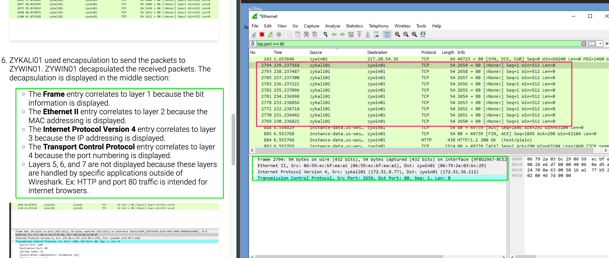
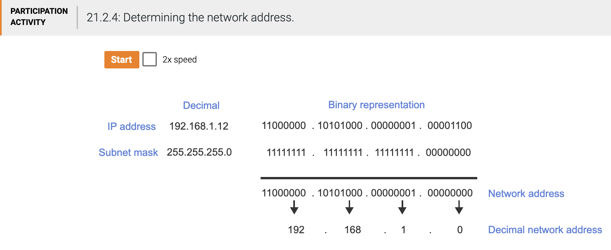
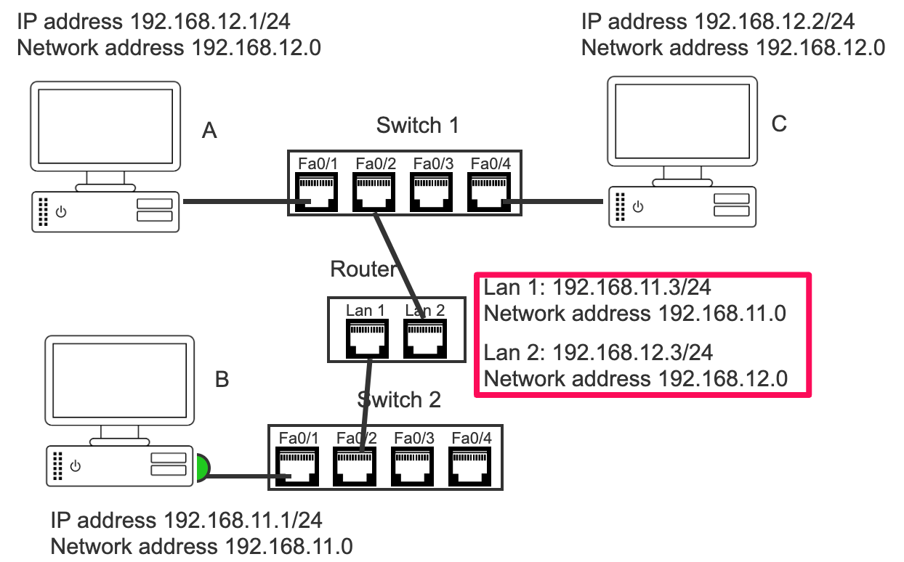

---
tags:
  - EET-100D
  - Zybook
title: Zybook Networking Study Guide
created: 2026-08-13
updated: 2026-08-13 10:27:59
---
# Housekeeping

## Dates

September 26, 2025; August 6, 2025; August 3, 2025; June 30, 2025; June 19, 2025; June 17, 2025

## About This Study Guide

* This study guide is meant to provide guidance to "smooth out" the "congestion points" in your reading and performing activities in the textbook;
* It is not meant to replace textbook reading or activities;
* It is not meant to complement the textbook:
	* Materials beyond textbook scope may be introduced, but only for reference for ease of understanding the textbook coverage;
	* Materials beyond textbook scope are not "required" and will not be in any exam.
* It is a live document, constantly being updated: even sections that you "have read" may contain updated information, much like a bucket, you keep putting stuff in and sorting, making it more perfect.

# Chapter 17 Network Types, Topologies and Characteristics

* This chapter starts the networking coverage;
* Introduces some basic concepts;
* Provides training on zyLabs that feature this portion of the course.

## § 17.1 Network topologies

### Computer networks

Summary:

* Computer networks are a set of interconnected "nodes": computer network = nodes/computational devices + connections thereof;
* Physical arrangements of the nodes and connections are a network's physical topology;
* Logical arrangements (how data moves) of the nodes through connections are the logical topologies of a network;
* Computer network's desired qualities are achieved by selecting and optimizing its topologies.

Computer networks:

* Node = computational devices and their connections;
* Network component = computers, routers, switches, cables.

Topology:

* "Network topology refers to the arrangement and interconnection of devices within a computer network. It defines how various network components such as computers, routers, switches, and cables are organized and connected to form a functional communication system";
* [Perplexity reference](https://www.perplexity.ai/search/what-is-topologies-in-the-comp-JDOuCuQXS2KLON5zdqbFFg#0).

### Physical topologies

Summary: description and display of various physical topologies.

### Logical topologies

Summary:

* In simple circuits or networks, how the nodes are physically configures is usually how the data moves;
* For computer networks, this is not the case because of complex and diverse movements of data, necessitating packet-switched networking (PSN);
* Data movement under PSN needs something to break data into packets, data packets will need to move through the network and all network components need to be managed. These are done by the three "planes": the control, data and management planes, respectively.

### Network mediums

Bound vs. unbounded, wired vs. wireless

## § 17.2 Network types

There are many ways to think and talk about networks, hence there are a multitude of ways to classify or categorize networks. The book's approach to this subject is but one of many and can be thought of continuing to introduce various network configurations both hardware and software senses.
It is worthwhile to understand the jargons.
From a "task" perspective:

* Server, client and peer in a network context refers to computation-related devices. Examples are computers, printers, storage devices;
* A server receives requests for and provides services;
* A client requests and receives services;
* A peer provides and receives services to and from other similar computers;
* Services: computation, storage, printing.

From a personal, location, connection (wired vs wireless), you can define many different types of networks as such those in the book.
Overlay networks are "virtual", "logic" "networks" that serve to transmit data in alternative ways to the "default" ways that are designed into the structure of networks.

## § 17.3 Service providers

Nothing special.

## § 17.4 - 17.7 zyLabs

* You're required to complete all zyLabs;
* zyLabs in this zyBook are not just "practices", but cover actual contents some of which are not found elsewhere in the texts and other activities. So you should do them;
* Each zyLab is worth much more than other activities, so it is to your advantage if you do them all;
* The instructions of these zyLabs are very detailed and clear. Follow them;
* When you work on the zyLabs, you will run into new terms but also some terms you've heard of. Don't get stuck on terms that you don't fully understand, but also pay attention to the terms rather than just follow the instructions like a robot. Try to take as much in as you can without stopping to struggle;
* When doing the labs, keep asking yourself: what is this supposed to tell me in terms of what I'm studying (networking)? This will prevent you from losing your focus to all the details about the unimportant details (e.g., how to start product software, etc.)
* zyLabs in for networking usually involve two virtual machines (2 computers): ZYLALI01, a Linux computer that is usually used to generate and send network traffic, ZYWIN01 running Windows that acts as the receiver and observer of the network traffic generated and sent by the ZYKALI01 virtual machine.

# Chapter 18 Conceptual Models and Network Devices

* This is a core chapter that Chapter 17 prepares for and following chapters expand on;
* This chapter describes computer networks;
* Computer networks are complex, diverse and involve many different devices, components, infrastructure (wires and cables), protocols, software, etc., so you would expect that a "description of computer network" would not be as straightforward. And that is true.

## § 18.1 Conceptual Models (of Networks and Networking)

* 18.1 describes two ways to look at a network or networking system;
* These ways to look at networking systems are called by the authors Conceptual models;
* 18.1 also brings up some basic concepts.

### Conceptual Models

* Networking systems are complex and diverse systems involving hardware, software, diverse products and technologies. As such there are multiple ways to look at them, none of which provides a complete picture hence a combination thereof is needed;
* A "side effect" of the complexity is that there is no "systematic", logically clean way to explain a networking system. So you have to be patient and put the pieces together yourself;
* This section introduces the OSI model and the DoD (or TCP/IP) model.

### OSI Model and DoD Model

* Read the text, take them in, be patient if you don't understand, as the book will use multiple ways to explain later.

### Important Basic Concepts

* Encapsulation: adding appropriate information to the data to be transmitted so that the transmission can take place;
* Protocol Data Unit (PDU) is encapsulated data;
* Encapsulation takes place not at a central place but in stages;
* To a large extent the OSI model layers describe such encapsulation stages;
* When all of these encapsulation is done, the "completely encapsulated data" is called the payload;
* Payload is what gets transmitted;
* When a payload reaches its destination, the encapsulation is removed to "expose" the data. This is called decapsulation.

## § 18.2 OSI Model Layers

### Layer 5-7 Upper Layers

Think about what your email client does when you click the "send" button:

* Your email client prepares your email according a network protocol: this is Layer 7 the Application Layer;
* Data is prepared for transmission: this is Layer 6 the Presentation Layer;
* When data is ready to transmit, a channel is established for the transmission: this is Layer 5 the Session Layer.

Layers 5-7 are "upper layers" of the OSI model that deal with application.

### Layer 4

Then what happens? Data to be transmitted is divided into smaller blocks suitable for fast transmission. Such division can take place in one of the following two ways, each resulting in a different PDU:

* Transmission Control Protocol (TCP) creates a guaranteed, connection-oriented PDU called a "segment" that contains a TCP header. Within the TCP header there are TCP Flags that specify connection information (hence "guaranteed" connection);
* User Datagram Protocol (UDP) creates a non-guaranteed, connectionless "datagram" that includes a UDP header but no connection information (hence the "non-guaranteed" connection).

This is Layer 4 the Transport Layer.

### Layer 3

The encapsulated data, the PDU, either a segment or a datagram, now needs two things:

* The address of the recipient; and
* The route to the recipient address.

This is done by Layer 3 the Network Layer, where the Internet Protocol (IP) is used to create a PDU called a packet that contains the IP header specifying the recipient address. A router with routing protocol is involved to route the packets through the most efficient paths.

### Layer 2

What happens next? The PDU, the packets, are further divided into frames that are actually transmitted. This is Layer 2 the Data Link Layer. Two general functionalities (two sublayer) are involved:

* Logical link control (LLC) is a layer 2 sublayer providing data flow control, error detection, and error correction.
* Media access control (MAC) is a layer 2 sublayer providing physical address and frame synchronization.

### Layer 1

Layer 1 is the Physical Layer that actually does the transmission through bounded or unbounded media.

## § 18.3 Networking Devices

Understand various networking devices in the context of layer functions in 18.2.

## § 18.4 Networked Devices

Nothing special. Read.

## § 18.5 LAB: OSI Model encapsulation and decapsulation (Walkthrough)

* Labs in this zyBook are not just "practices", but cover actual contents some of which are not in the sections. So you should do them;
* When doing the labs, keep asking yourself: what is this supposed to tell me in terms of what I'm studying (networking)? This will prevent you from losing your focus to all the details about the unimportant details (e.g., how to start product software, etc.)

This lab uses two virtual machines (2 computers): ZYLALI01 as the sender of network traffic, ZYWIN01 as the receiver and observer of the network traffic sent.

### Sending, receiving and observing HTTP/TCP traffic

Make sure:

* You see the 10 packets sent from the ZYKALI0 server (red box);
* You read under 6 and find the corresponding content in the green boxes.

### DHCP traffic

* Similar to HTTP traffic, make sure you observe the content of the traffic to identify what's covered in the text.

### ICMP traffic

* Similar to HTTP traffic, make sure you observe the content of the traffic to identify what's covered in the text.

## § 18.6 LAB: DoD Model encapsulation and decapsulation (Walkthrough)

In ZYKALI01, when the instruction says to use nmap to determine if the ZYWIN01 is listening in its certain port, nmap actually does by sending a traffic to ZYWIN01 at the specific port. That's why you can see such traffic in ZYWIN01 through Wireshark.

# Chapter 19 Bounded Media Standards and Applications

* This chapter expands on Chapter 18 and focuses on bounded media;
* The content is straightforward but disjointed and "dispersed";
* This is typical for surveys of a wide-ranging topic in limited space (would you have a better way to do it?)
* A lot of knowledge points are only found in the activities. So read the text and do all activities.

# Chapter 20 Address Types

* This chapter expands on Chapter 18 and focuses on various addresses in the network;
* The content is straightforward but disjointed and "dispersed";
* This is typical for surveys of a wide-ranging topic in limited space (would you have a better way to do it?)
* A lot of knowledge points are only found in the activities. So read the text and do all activities.

# Chapter 21 Segmentation

## § 21.1 Binary Decimal Conversion

We will use the following slides in classroom to learn about binary and hexadecimal number systems that appear in several places in the text. These are foundational if you'll do anything in electronics.

[Decimal, Binary and Hexadecimal Number Systems](<https://wlara.github.io/pcc/eet100d/resources/Zybook_Networking_Study_Guide.resources/Decimal, Binary and Hexadecimal Number Systems.pdf>)

## § 21.2 Network Address

### Network Address (or Network ID)

* Each device has an IP address;
* If such IP address is given through IPv4, then it combines with the device's "subnet mask" to produce the address of the network the device is in. The network the device is in is also called the network segment or subnet, and its address is also called network ID;
* How to product network ID from IPv4 and subnet mask? By ANDing each binary digit of IPv4 and subnet mask, using
	* Binary operation AND rule: 1 • A = A; 0 • A = 0.

### Network and Gateway Addresses

* Two devices on the same network can communicate directly;
* Two devices on different networks must communicate through a router;
* A router has different addresses in different networks (see figure).

# Chapter 22 Protocols

|     |     |     |     |     |     |
| --- | --- | --- | --- | --- | --- |
| OSI Layer # | OSI Layer Name | Function | Protocols | Devices | Software |
| 7   | Application | Provides network services directly to end-users or applications | HTTP, FTP, SMTP, DNS, SNMP, Telnet, SSH, IMAP, POP3, DHCP, SOAP | Gateways, Application Servers | Web browsers, Email clients, FTP clients, DNS servers |
| 6   | Presentation | Translates, encrypts, and compresses data | SSL, TLS, JPEG, MPEG, ASCII | Gateways | Encryption/decryption software, Data compression tools |
| 5   | Session | Establishes, manages, and terminates sessions between applications | NetBIOS, RPC, PPTP, SDP, SAP | Gateways | Session management libraries, NetBIOS software |
| 4   | Transport | Ensures reliable data transfer, segmentation, flow control, and error correction | TCP, UDP, SCTP, DCCP | Firewalls, Load Balancers | TCP/IP stack, Socket programming libraries |
| 3   | Network | Handles logical addressing, routing, and traffic control | IP (IPv4, IPv6), ICMP, OSPF, RIP, ARP, MPLS | Routers, Layer 3 Switches | Routing software, Network address translation (NAT) software |
| 2   | Data Link | Organizes bits into frames and provides hop-to-hop delivery | Ethernet, PPP, Frame Relay, ATM, HDLC | Switches, Bridges, Network Interface Cards (NICs) | NIC drivers, Switch operating systems |
| 1   | Physical | Transmits raw bit streams over physical medium | RS-232, 100BaseTX, ISDN | Hubs, Repeaters, Cables, Connectors | Physical layer transceiver software |

# Chapter 23 Switches and Routers

## §23.1 Network Transmission

### Summary

Basic forms of network transmission, basic concepts and important issues during network transmission.

### Basic Forms Transmission: Uni-, Multi- and Broad-Cast

* Basic forms of network transmission:
	* One-to-one: unicast;
	* One-to-(fixed) many: multicast;
	* Oe-to-all (within a network): broadcast.
* Broadcast domain: domain of network that receives a broadcast.

### Frame Size of Transmission

* MTU;
* Jumble frame.

### Collision

* Phenomenon: at least two frame transmissions collide and require retransmission;
* Collision domain: domain of network where collision can occur.

### Collision Reduction

* Carrier Sense Multiple Access (CSMA);
* Carrier Sense Multiple Access (CSMA)/CD and Carrier Sense Multiple Access (CSMA)/CA.

## §23.2 Network Traffic

### Summary

Various technologies/solutions to deal with various phenomena/problems in network traffic.

### Traffic Shaping

Text is clear.

### VPN Traffic

Full vs split tunneling

### Network Loop

* Basic phenomenon: during broadcast and multicast, each switch forwards frames to all switch ports, thereby creating the possibility of "looping" where traffic "circulates";
* Broadcast/network storm and control;
* Bridge protocol data unit: "test" packet to detect network loop.

### Network Looping Prevention

* Way to prevent looping: "cut part of the routes";
* Use STP/RSTP to monitor/configure/reconfigure network to do this.

## §23.3 Switch Features

### Summary

Various configurations of switch _at the port level_. Plus one subsection on packet analysis (switch mirroring).

## §23.4 Switch Configuration

### Summary

Various configurations of switch _at the switch level_, including:

* Power;
* Combining capabilities of multiple ports for higher throughput (link aggregation and related);
* Maintaining customer VLAN configurations at the service provider side.

## §23.5 Security Zones and IP Support/Router Features

### Summary

Various issues related to routers:

* Trust zones;
* How to translate internal IP (those 192.168.x.x IPs) to outside IP;
* Dealing with IPv4/6 simultaneously.

## §23.6 Routers

Introduces routers.

# Chapter 24 Network Security

## §24.1 Authentication and Authorization

### Summary

Authentication, authorization, accounting, audit (AAA/AAAA).

### Authentication vs Authorization

* Authentication is asking and judging stuff from the requester (user, app, devices, etc.);
* Authorization is giving requester stuff for it to use.

## §24.2 Multi-Factors and Policies

### Summary

* Expand on the AAA from the previous section: more details about authentication;
* Single- and multi-factor and knowledge-based authentications are about ways of authentication;
* Account policies is about technical requirements for authentication.

### Summary

Endpoint and endpoint security; firewall types and what it does.

## §24.3 Types of Authentication

### Summary

This section is about authentication processes. Introduces 3 types architecture, protocol and system for AAA: Kerberos, RADIUS and TACACS+.

## §24.4 Security Attacks

### Summary

Introduces and categorizes various types of security attacks. See [[here]].

## §24.5 Endpoint Security Measures

### Summary

Anti-malware; disk hardening (encryption); software updates; patching management; windows registry protection.

## §24.6 Other Security Measures

### Summary

Group policy; content filtering; TCP/UDP port security; network device port security (different types of ports); management of security-related information.

## §24.7 VPN and Remote Access

### Summary

Remote access intro; VPN types and protocols.

# Chapter 25 Wireless Networks

## §25.1 Wireless Characteristics

### Summary

Introduces (crude) concepts, along with involved parameters, in wireless signals used in wireless networking.

### Radio Frequency Electromagnetic Waves

* Wireless networking utilizes the electromagnetic waves, which is time-and space-varying electromagnetic field;
* Visible light, infrared, ultraviolet, alpha waves are all electromagnetic waves but with different frequencies;
* Radio wave frequency (RF) is the frequency of electromagnetic wave with frequency falling in the same range as radio.

### Frequency, Wavelength and Speed

Electromagnetic waves (signals) are periodic signals of electric and magnetic fields. Frequency of such is the number of changes in these field strengths per unit time. Period is the time it per repetition. Wavelength is the distance the wave travels per period:

c = f\\lambda

where:
c  is the speed of light (in a vacuum, approximately  3 \\times 10^8  m/s),
f  is the frequency (oscillations per second),
lambda is the wavelength (distance over which the wave repeats).

### Attenuation, Loss and Gain

As the electromagnetic radiation travels through the air:

* It encounters particles in space and loses strengths due to reflection and refraction, etc.;
* It gets mixed with signals of similar (interference) and dissimilar (noise) frequencies so when attempts to distinguish are made, the recovered signal becomes smaller;
* When it encounters obstacles, it interacts with the particles within an obstacle and loses strengths (absorption).

All these cause losses in signal strength.
When signal is received and re-transmitted by a radio tower, it gains strengths. Both loss and gain are measured by the ratio of the after loss (gain) to the before loss (gain) strengths. The **decibel (dB)** is a logarithmic unit used to express the ratio of two quantities, often power or intensity. It is defined as:

\\text{dB} = 10 \\log\_{10} \\left(\\frac{P\_2}{P\_1}\\right)

where P2 and P1 are the power levels being compared.

### Antennas

Antennas are devices that turn (transmit, radiate) local electromagnetic signals into traveling electromagnetic waves and turn (receive) EM waves into local signals.

## §25.2 WLAN Standards

Straightforward to read.

## §25.3Wireless Network Design

Straightforward to read.

## §25.4 WLAN Attacks

Straightforward to read.

## §25.5 WLAN Security

Straightforward to read.

# Chapter 26 Network Service

## §26.1 DNS

Straightforward to read.

## §26.2 DHCP

Straightforward to read.

## §26.3 NTP

Straightforward to read through.
