# Housekeeping

## Dates

August 27, 2025; August 26, 2025; August 20, 2025; August 19, 2025; August 13, 2025; August 12, 2025; August 9, 2025; August 5, 2025; July 23, 2025; July 15, 2025; June 24, 2025; June 22, 2025

## About This Study Guide

* This study guide is meant to provide some "buckets" that can hold your knowledge as you read along the textbook;
* It is not meant to replace textbook reading or activities;
* It is not meant to a textbook "add-on":
	* Materials beyond textbook scope may be introduced, but only for reference for ease of understanding the textbook coverage;
	* Materials beyond textbook scope are not "required" and will not be in any exam.
* It is a live document, constantly being updated: even sections that you "have read" may contain updated information, much like a bucket, you keep putting stuff in and sorting, making it more perfect.

## IDEs

If you install Anaconda, you install both Spyder and Jupyter Notebook, along with a host of other Python IDEs:

* [Installing Python through Anaconda](<Installing Python through Anaconda.md>)

### Spyder

* Popular Python IDE, especially among the scientific and data science communities;
* Somewhat traditional (compared to Jupyter Notebook) IDE, with facilities for code, a console and various debugging tools;
* [Download and installation guide](https://www.perplexity.ai/search/where-and-how-do-i-download-an-Ro_H8VB3T0.wWY7cSIyWHw);

### Jupyter Notebook

* Runs a server that you can access in a web browser;
* The server is local, so no need for internet connection, not a web app;
* Allows you to "interleave" code, which can be run "in place", and text note, which you can use to take notes while studying, or document your code design.

## Resources Running List

* <https://pythontutor.com/>: allows you to paste in code pieces, and walk you through the pasted code.

# About Python

## Python Program Structure

### Constructing and Running a Python Program

* Type directly in interactive interpreter from within an IDE (e.g., Spyder, Jupyter) and hit "return" to run: this is called the interactive mode;
* Create a program.py file, a text file with proper indentation, using a text editor or an IDE and:
	* Run through the "Run" button in IDE;
	* Run through "python program.py" command at terminal prompt.
* A python program can be run "as itself", and if so is called a "script";
* A python program can also be "imported" into and run as part of another program, and if so is called a "module".

### Module vs Script

A piece of Python code run as script or as module behaves differently through special (reserved) variable \_\_name\_\_ and special reserved string "\_\_main\_\_". For a piece of code in a file: program2.py:

* File name: program2.py;
* \_\_name\_\_ variable is:
	* "program2" string if it's run as a module;
	* the "\_\_main\_\_" string if it's run as a script.

Because of this, a piece of Python code can contain (and frequently does) statements like:
```
if __name__ == "__main__":
    # code executed only when the File is being executed as a script
```

* This allows a piece of code to behave differently when it's run as a script and as a module.

## The Python Interpreter

Code ("source code" or program) produced by all programming languages eventually will need to run on a computer:

* This means eventually they will be turned into "machine code", a series of 0s and 1s that present to the computer (CPU, memory, peripheral devices) as electronic pulses that drive the digital circuits within the computer to produce pulses of 0s and 1s that are output.

Different programming languages have different ways to carry out this process. For Python, this process is carried out by a set of programs (that is written in C or Java) collectively call the Python interpreter.

### The Python Interpreter

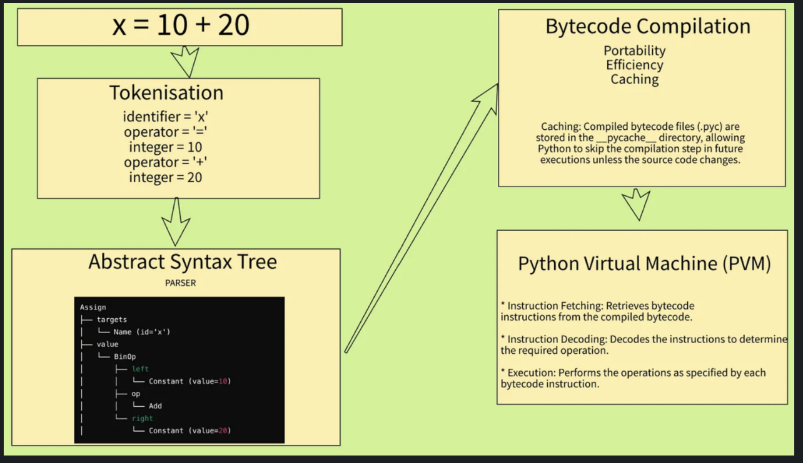
For a piece of source code x = 10 + 20:

* Tokenization breaks it into tokens: direct "read", no "judgments";
* Parsing builds a logic tree of the logic (the "Abstract Syntax Tree, AST) and examines the syntax: syntax errors will be reported;
* Bytecode Compilation turns AST into "bytecode" that is platform independent (can run on any OS or environment where the Python Virtual Machine, the PVM, is installed);
* Bytecode is "interpreted" by the Python Virtual Machine, a virtualization layer on top of the hardware, "line-by-line": "runtime errors" will be reported from this stage.

### Interpreted vs Compiled

* Compile: turn the entire piece of source code (along with whatever it imports or utilizes) into a target compiled code, then run the target code;
* Interpret: no complete piece of target code, one line of source code -> target code -> run -> next line of source code.

Python is said to be an interpreted language, but it's not completely so:

* AST to bytecode is a compilation process;
* PVM does an interpretation operation.

Java is similar to Python as a hybrid. C is a typical and complete compiled language:

* Its target code is direct machine code;
* Not suitable (and extremely difficult and limited) for interactive running mode.

## Module Import, Dependency Management, Environment

### Module Types

There are different "levels" of modules in Python:

* Built-in modules:
	* Most built-in modules are written in C and precompiled into executables when Python is installed. They are part of the Python basic functionality;
	* You still need to import them in order to use them;
	* When you import a built-in module, Python loads the pre-compiled built-in module at runtime into its memory and does not need to locate the modules.
* Programmer-written modules;
* Python standard library modules;
* Third-party modules as part of installed packages.

### Python sys Built-In Module

One of the built-in modules is called the sys module, wherein:

* There is a dictionary called sys.modules that keeps track of all **loaded** modules;
* There is also a list called sys.path that stores the directories of locations where the modules to be imported can be located;
* The sys.paths list is in the following order:
	* The directory of the running script;
	* The value of an OS level environment variable called PYTHONPATH;
	* Directories of python standard libraries;
	* Directories of site-packages of installed packages.

### Module Import Process

When a script that contains imported module runs, it tries to execute the imported modules first. When it does this, the interpreter must first locate the imported module, and it does so in the following order:

1. Check to see if the module is already loaded by checking the sys.modules dictionary in sys built-in module;
2. Read the sys.path list and check the items in the list, which contains items in the order above.

The interpreter will use the first found module, stop search and:

1. Load the module (except for the built-in modules which are already loaded);
2. Update the sys.modules dictionary;
3. Execute the module code.

### Import Part of Module

In addition to importing the entire module, you can import a name (variable, function, etc.) from a module
```
from module import name #importing only the name from module
```
Unlike
```
import module #import the entire module
```
wherein the name variable/function has to be accessed as module.name, the from module import name will lead to name being able to be used directly:

* even overriding the name in the importing program if there is one.

Therefore, one must be careful not to use the imported name, or use a specific name for the imported name:
```
from module import name as name_to_use
```

### Dependency Management

When a script imports a module, it depends on that module to function properly. The importing module can also import other modules, and thus a import chain of complex topology will quickly form. For medium to large projects, it is important to document these dependencies and there are standard formats to do so.

### Environment

Dependencies of different projects can be conflicting with each other. This is when people introduce environment:

* Each environment is an isolated Python installation with its own interpreter and libraries;
* You use one environment for one project to prevent conflicts.

Anaconda is an environment manager.

# Important Concepts (Theories)

## Python Object

* In Python, everything is an object, which has a value, a type and an (internal) identity;
* Because everything is an object, sometimes an object may feel like a "hidden ghost".

### Name Binding

* Name binding is the process of associating names (identifiers) with interpreter objects;
* Dynamic Name Binding:
	* Python uses dynamic name binding, meaning names are resolved (bound to objects) at runtime;
	* A name in Python doesn’t store the object itself but acts as a reference (or pointer) to the object in memory.

```
x = 10  # The name 'x' is bound to the object 10
x = "Hello"  # Now 'x' is bound to the string "Hello"
```

* The type of object affects how name binding behaves:
	* Immutable objects (e.g., int, str, tuple): Binding to a new value creates a new object.
	* Mutable objects (e.g., list, dict): Binding to a new value can modify the existing object.
* Participation Activity 13.2.2

### Mutability

* A mutable object can be changed or "modified":
	* Examples are list, dictionary;
	* When a mutable object is bound to a name, and the name is assigned a different "value", the object remains but is modified.
* An immutable object cannot be modified:
	* Examples: int, str, tuple;
	* When an immutable object is bound to a name, and the name is assigned a different "value", a new object is created and the old object may be garbage collected (if not being used or bound to another name).

### Functions as Objects

* Python functions are objects created when the interpreter evaluates the function definition: a function object is created when the function is defined;
* A variable object within a function, on the other hand, is created when the function is called and executed;
* A Python function object binds to one or more names, has a value (part of the value is bytecode) and an identity;
* You can bind another name to a function:

```
def print_face():                # function definition creates object, binds name
  # print face statements...

print_face()                    # function call

func = print_face                # binds print_face object to func: note syntax
func()                           
# calls function func(), which is the same object as print_face()
```

* Functions also support adding attributes with the attribute reference "." operator,

## Python Data Type

### "Types" of Data Type

"Types" of data types, not data types themselves, capturing commonalities among multiple data types:

* Numeric data types: support arithmetic computation;
* Sequence data types:
	* Specify an _ordered_ collection of objects from left to right;
	* Include string, list and tuple;
	* Has a length that can be accessed through the len() function;
	* Each element has an index associated with it, that can be accessed through \[\].
* Container data types:
	* A collection of objects, ordered or unordered;
	* Each element of the container is a _reference_ to other objects, rather than an object;
	* String, list, tuple, set and dict can all be considered a container.
* Mapping data types: dictionary.

### Data Types

Native Python data types:

* Int;
* float;
* string;
* list;
* tuple;
* set;
* dict.

### Type Conversion (Type Cast)

Implicit conversion made by the Python interpreter:
"Cast" by int(), str(), float():

* float to int will truncate the fractions: int(4.9) produces 4.

## Python Loops

### Two Types of Loops in Python

"Condition-controlled" loop: "while-type" of loop:

* Keep running iterations while one or more conditions are met;
* Used when you don't know when the conditions are met but do know the conditions;
* "Entry-controlled": the checking of the conditions takes place at the beginning of the loop;
* "Exit-controlled": check conditions at the end of the loop iteration.

"Count-controlled" loop: "for-type" of loop:

* Iterate a specific number of times;
* Used when you know how many times to loop or what finish list you need to go through, which is standard for two sub-categories of for loops:
	* Iterate a fixed number of times;
	* Iterate through a sequence.

### Other Loops Types Outside of Python

Examples only (not systematic):

* Do-while loops: do the loop at least once, then check conditions to decide whether to loop more:
	* This is an example of "exit-controlled loop" where the conditions are check at the end of the loop.
* Event-Controlled Loops: Used in event-driven programming, these loops continue until a specific event occurs;
* Iterator and Generator-based Loops: These use special objects that define iteration behavior.

## Program Development Process and Best Practices

Typical process of developing a program:

### Program Development Step 1: Requirement Analysis (Understanding the Function of the Program)

Clearly define what the program is supposed to do by gathering and analyzing requirements from stakeholders, end-users, or business needs. The goal is to identify the inputs, expected outputs, constraints, and goals of the program. **Key activities:**

* Identify the problem the program aims to solve.
* Define functional and non-functional requirements.
* Establish input and output specifications.
* Consider user needs, performance expectations, and any constraints.

**Example: Name Checking and Suggestion Program**
Understand the background: the country of Denmark allows parents to pick from around 7,000 names for newborn infants. Names not on the list must receive special approval from the Names Investigation Department of Copenhagen University.
Goals:

* Check a user entered name, to see if it is an appropriate Danish name (see if it matches a given list of legal names);
* If the name is not found in the list of legal names, then a suggestion is made to a close match. A close match is an acceptable name starting with the same letter:
	* If there are multiple names with the same letter, the first in the list is used.
* If no close matches are found, inform the user (to seek special approval).

In developing a name checking and suggestion program, the requirements include:

* Input: an intended baby name.
* Output:
	* Whether the name is acceptable or not;
	* If the name is not acceptable, then suggest a name with the same first letter as the user-input intended name;
	* If no suggestion is found, then inform the user to seek special approval.

### Program Development Step2: Program Structure (Designing the Architecture)

Once the function of the program is well understood, the next step is to determine the structure of the program. This involves designing how different parts of the program will interact and be organized to achieve the desired functionality. **Key activities:**

* Define the main components/modules of the program.
* Choose an appropriate architectural pattern (e.g., layered architecture, MVC).
* Establish data flow and relationships between different parts of the system.
* Decide on programming paradigms (e.g., procedural, object-oriented, functional).

**Example: Name Checking and Suggestion Program**

* Design it as a simple program.

### Program Development Step 3: Algorithm Design (Determining the Logic and Steps)

With the program structure in place, the next step is to design the algorithms that will solve the problem effectively. An algorithm is a step-by-step set of instructions to perform a specific task. **Key activities:**

* Identify suitable algorithms based on efficiency and correctness.
* Optimize the algorithm for performance and scalability.
* Implement pseudocode or flowcharts to outline logic before coding.
* Consider edge cases and error handling.

**Example: Name Checking and Suggestion Program:**

* Provide the list of legal names;
* Read user-input intended name;
* Check to see if the user input is in the list of legal names;
* If it is, inform user and end program;
* If not, iterate through the list of legal names, and check to see if the first letter of these legal names match the user input;
* If a match is found, then suggest and end the program;
* If no match is found, then inform user and end program.

**Algorithm example in pseudocode:**
```
list of legal names assigned to legal_names
read user input into user_name
if user_name in legal_names
    inform user: name acceptable
else
    inform user: name not acceptable
    for each element in legal_names
        if legal_names[0] == user_name[0]
            inform user legal_names as suggested name
            stop checking (stop looping) (break)
    if legal_names list is exhausted (loop else)
        inform user no suggested name
final goodbye message
```

### Program Development Step 4: Implementation and Testing (Building and Validating the Program)

After structuring and designing the algorithms, the program is implemented using a programming language. The implemented solution is then tested to ensure it meets the requirements. **Key activities:**

* Writing the actual code based on the designed structure and algorithms.
* Unit testing, integration testing, and user acceptance testing.
* Debugging and performance tuning.
* Deployment to production.

### Incremental Development

Incremental development: a small amount of code is written and tested, then a small amount more (an incremental amount) is written and tested, and so on.
Function stubs: empty, placeholder functions:

* Using pass statement;
* Using print to signal;
* Using raise raise NotImplementedError.

## Python Functions

### Python Function Overview

A set of fixed statements pre-defined "in the abstract" to carry out one or more operations, that depends on its calling for implementation, analogous to mathematical functions. For example, when you define the math function:

f\\relax(x)=\\sin(x)+\\cos(x)

You're defining the sine plus cosine calculations of an abstract variable x, to arrive at a value for f(x). You evaluate f(π) by assigning the actual value π to x.
In Python, the mathematical variable is called the parameter, and the x = π value used to evaluate the math function is called the argument. When you call the f(x) function with the argument π, you make x = π. The f(x) function will undergo its computation and return the value of f(π).
A Python function does not have to have a parameter, but can have more than one parameters. A Python function does not have to return anything to complete a series of tasks, but when it does, can only return one "value", although that one "value" can be that of a list or tuple.

### [[Concept Functions as Objects]]

### Function Argument Pass-By-Assignment

When a function defined, an object is created for the function with the name of the function bound to the object;
However, parameters of a function do not yet have objects created for them;
When a function is called with arguments:

* Arguments pass to the parameters by reference;
* Objects are created within the function namespace, each bound to the corresponding argument.

A function does not change the argument if it is immutable, but could if it is, which could be a side effect (see Participation Activity 33.12.1).

## Python Scopes

### Scope of Variables

The part of the program where a variable is "visible" is the scope of the variable:

* A variable within a function is not created as an object until the function is called and executed. Therefore its scope is from the point it is created to the end of the function: variables defined inside a function is called local variables;
* A global variable is one defined outside of the function. Its scope is from its definition to end of file;
* One can use the global statement to turn a local variable into a global one, but should refrain from doing so to avoid potential side effect.

### Scope of Functions

Function also have their scope: from its definition to EOF.

### Name Spaces

A name space is a Python dictionary that maps names to their corresponding objects (Participation 3.11.1);
Each scope has its own name space. At least three nested scopes are active at any point in a program's execution:

* Built-in scope – Contains all of the built-in names of Python, such as int(), str(), list(), range(), etc.
* Global scope – Contains all globally defined names outside of any functions.
* Local scope – Refers to scope within the currently executing function but is the same as global scope if no function is executing:
	* Inner function scope;
	* Outer function scope.

### Scope Resolution

When a name is referenced in code, the local scope's namespace is the first checked, followed by the global scope, and finally the built-in scope. If the name cannot be found in any namespace, the interpreter generates a NameError. The process of searching for a name in the available namespaces is called scope resolution. (Participation Activity 3.11.2 is very good. Go through it)

## Python Class and User-Defined Objects

### Physical Objects vs Programming Objects

A physical object (such as a car):

* Is made up of one or more materials;
* Has a structure of different parts;
* Different parts work together to perform certain tasks;
* When tasks are performed, such as when a car is being driven, the driver (user) does not need to know how different car parts work together, but only needs to know how to operate the car (object).

A programming (such as Python) object is similar:

* It is made up of pieces information (data);
* Different pieces of information work together to perform certain tasks (methods);
* When tasks are performed, user does not have to know how different pieces of information work together, but just needs to know how to complete the task at hand.

### All Python Variables are Objects

They are Python's built-in objects:

* mystr = 'Hello!' creates a string objects. Its value (data) is 'Hello!', it can perform taskss such as str.lower();
* Each variable has a type, called their [[PCC Winter 2025/data type]].

### Python Allows User-Defined Objects

Each user defined object:

* Contains data;
* Contains tasks performed on the data, both belonging to the object and not;
* Has a type of the name of a class, which is defined by a group of data and methods.

### Class Defines User-Defined Objects

* Class is a set of data and methods (tasks) grouped together;
* Class defines a user-defined object's type, whose name is that of the class;
* Python built-in objects are defined by their data type: my\_str = 'Hello!' is an object, its data type is string, string is defined by Python in the string class;
* Using a car analogy, a car is an object. It's an example of a class called automobile, sedan, white car, etc.

### Class Itself Is an Object (of class type)

We have just learned that class is the "type" of the objects belonging to, or instantiated from, it. But what is class itself? It is an object!
```
A program with user-defined classes contains two additional types of objects: class objects and instance objects. A class object acts as a factory that creates instance objects.
```
What creates the class object?
```
class Seat:
    pass

print(type(Seat))
```

```
<class 'type'>
```
Seat class object is a class type object. The type object is a "metaclass". A metaclass is a class that defines how other classes are created. In Python:

* Normal classes (like Seat) create instance objects.
* Metaclasses (like type) create class objects.

You can think of type as:

* The class of all classes.
* The factory that makes class objects.

```
print(type(int))      # <class 'type'>
print(type(str))      # <class 'type'>
print(type(object))  # <class 'type'>
```
In python, all classes are instances, or objects, of a metaclass type!
```
type → MyClass (instance of type) → obj (instance of MyClass)
type → int (instance of type) → 42 (instance of int)
```

```
print(isinstance(MyClass, type))  # True
print(isinstance(int, type))      # True
print(isinstance(str, type))      # True
```

### Class Interfaces and Internal Methods

A class contains methods:

* Methods for use by the user are called interfaces;
* Methods meant for "internal use" are not considered the class's interfaces, and are conventionally prepended with an underscore;
* Python lack enforcement of interfaces and non-interfaces.

The reason class and object exist is for the user to only care about interfaces, just like you only do a certain number of things with your car, without having to deal with its internal operations.

* This is information hiding that is one of the justifications of the class/object constructs;
* This also facilitates "packagrability", readability and reusability of codes. 

### Python Inheritance Class

The concept of derived class inheritance is similar to human or animal offspring:

* You inherit genetics from your parents;
* But you also have your own unique genetics.

It is different from human inheritance in that:

* An derived class has access to all the attributes of its base class;
* An class can be derived from any number of base classes.

```
class Item:                    # base class
    def __init__(self):        # "self" here refers to the base class object
        self.name = ''
        self.quantity = 0 

    def set_name(self, nm):
        self.name = nm

    def set_quantity(self, qnty):
        self.quantity = qnty

    def display(self):
        print(self.name, self.quantity)

class Produce(Item):          # Derived from Item
    def __init__(self):        # "self" here refers to a derived class object
        Item.__init__(self)    # Call base class constructor with derived class object
        self.expiration = ''    # Addition attribute to the base class

    def set_expiration(self, expir): # Additional methods of the derived class
        self.expiration = expir

    def get_expiration(self):
        return self.expiration

item1 = Item()                # Instantiate a base class object: item1
item1.set_name('Smith Cereal')
item1.set_quantity(9)
item1.display()

item2 = Produce()           
# Instantiate a derived class to create item2
# Runs Produce.__init__(item2)
# Runs item2.__init__(item2)
item2.set_name('Apples')   
item2.set_quantity(40)
item2.set_expiration('May 5, 2012')
item2.display()
print(f'  (Expires:({item2.get_expiration()}))')
```
Multiple Inheritance:

* A class can be a derived class of more than one class
* Any class can be the base class of more than one derived class

Accessing Base Class Attributes: done through the dot operator:

* An object.attribute call will cause a check up the inheritance tree until the first attribute is located'
* Therefore the object's own class's attribute will be used if it exists. If not, then all its base classes will be searched one inheritance level at a time until the first one is located.

## Python Exceptions

### Errors in Execution

When you run a program, the interpreter finds something wrong and prints something like the following to the screen and then exits:
```
Traceback (most recent call last):
  File "test.py", line 3, in <module>
    weight = int(input("Enter weight (in pounds): "))
ValueError: invalid literal for int() with base 10: 'One-hundred fifty'   
```
What's happening:

* The interpreter "tries" to run your code;
* Finds an "error" (something it does not know how to do);
* Takes an "exception" with the error; and
* "Handles" the error by sending you a message and then stopping and exiting execution.

### Error Handling

This is Python's "default" exception handing. There are two types of errors:

* Some errors you can't anticipate. For example, you made a typo or an error in syntax. These errors are usually not "user exposed" as they'd be caught well before being pushed out to the user;
* Some errors you can and should anticipate. For example, "non-standard" user input that your code is not designed to handle. These are user exposed.

### Define Your Own "Errors" and/or Handling

You could design your own exception handling of the 2nd type of errors yourself to fit your particular application:

* You need to "try" to execute the code;
* You could design your own ways to handle the errors or exception discovered by Python;
* You could design ways to find behaviors that \*you\* don't like (but may be acceptable to Python). In other words, you could dictate your own exceptions with your disliked behavior, and then:
	* Let Python handle it as an exception; or
	* You could design your own way to handle it as an exception.

# Documentables

## Summary Tables

### Common Error and Exception Types

* Table 12.6.1

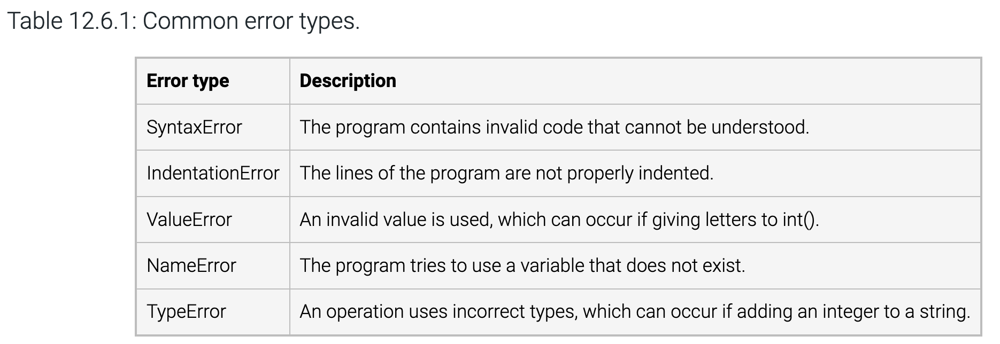

* Table 37.1.1: the way to handle SyntaxError is you go beat yourself up!

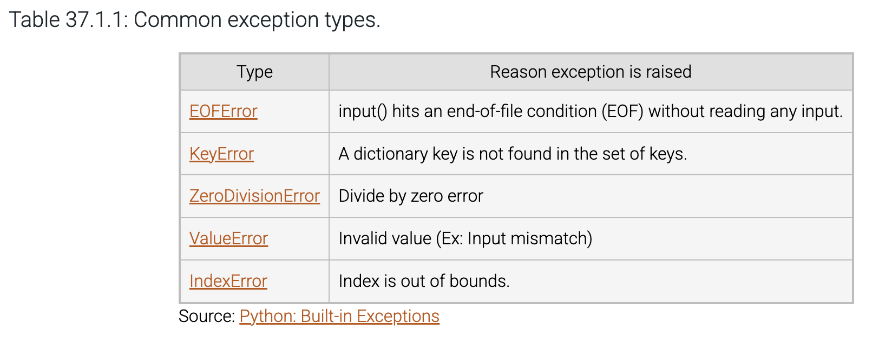

### Reserved Keywords

* Table 13.2.2

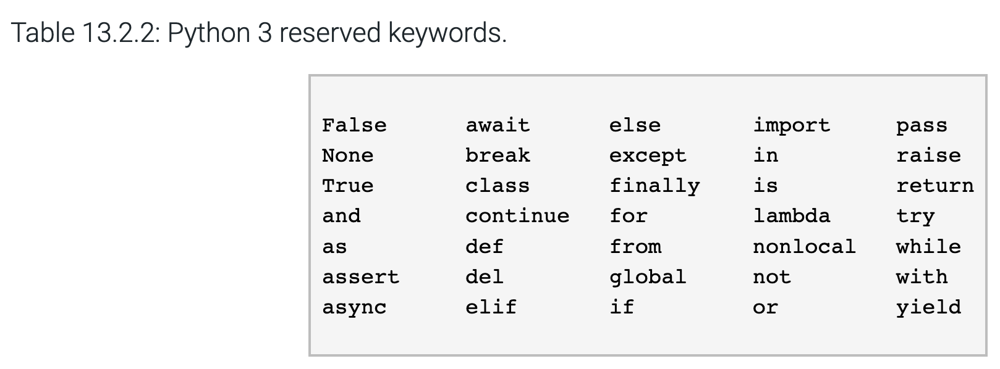

### Python Operators

* Table 13.5.1 arithmetic operators:

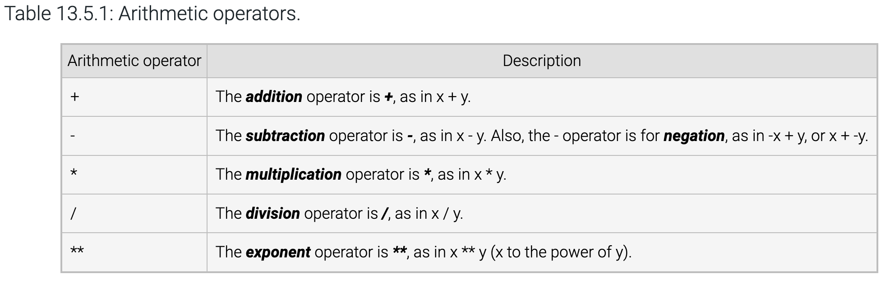

* Table 13.5.2: arithmetic operator precedence

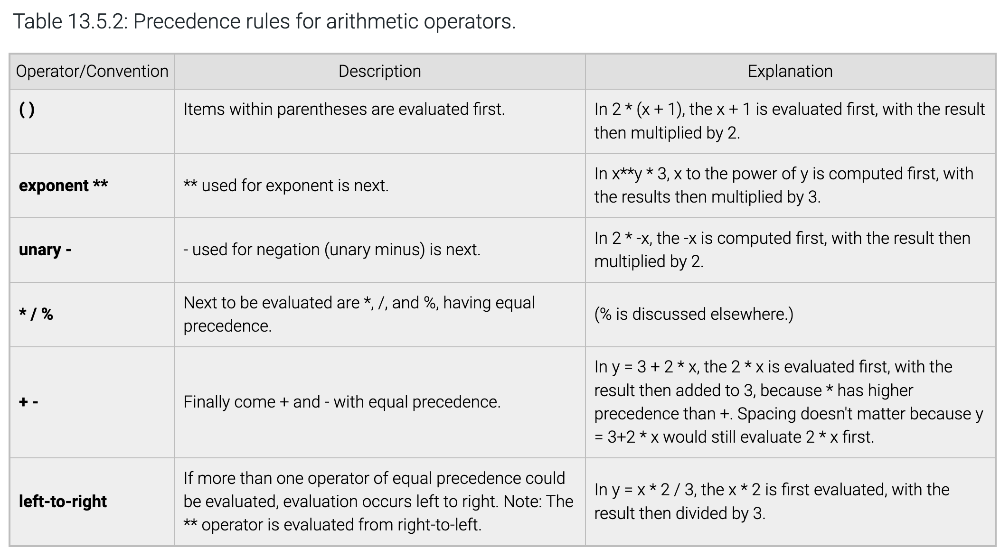

* Table 13.6.1 compound operators:

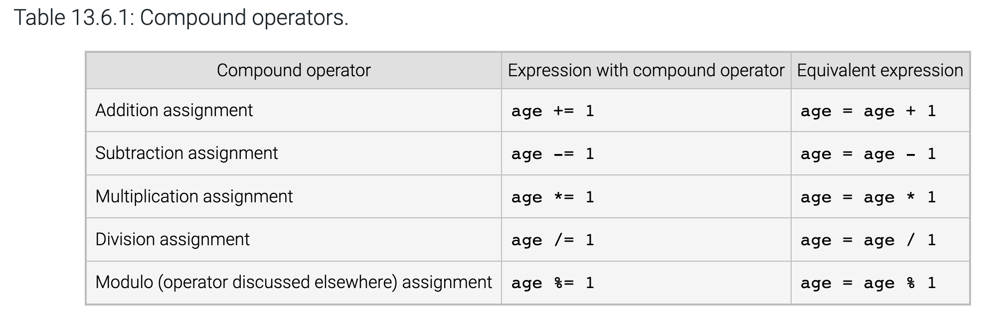

### Common Escape Sequences

* Table 13.11.2

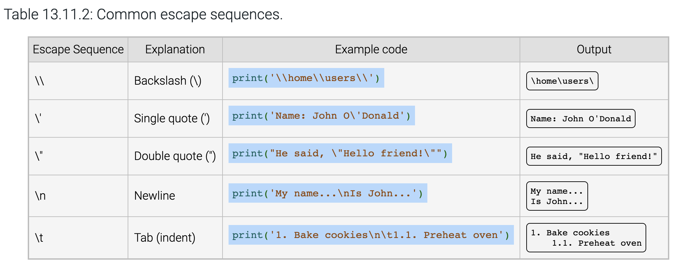

### 

## Modules

### Built-in Modules

* **System-related:** sys, os, time, platform, shutil
* **Mathematical:** math, random, cmath, statistics
* **Data structures:** collections, heapq, array
* **File handling:** io, os.path, pathlib
* **Threading & Multiprocessing:** threading, multiprocessing
* **Networking:** socket, select
* **Compression:** zlib, bz2, gzip, zipfile
* **Error handling & debugging:** traceback, warnings
* **Cryptography:** hashlib, hmac
* **Regular expressions:** re
* **JSON handling:** json
* **Built-in exceptions & utilities:** builtins

### math Module

* Functions in the math module:
	* Table 13.9.1: functions in standard math Module:

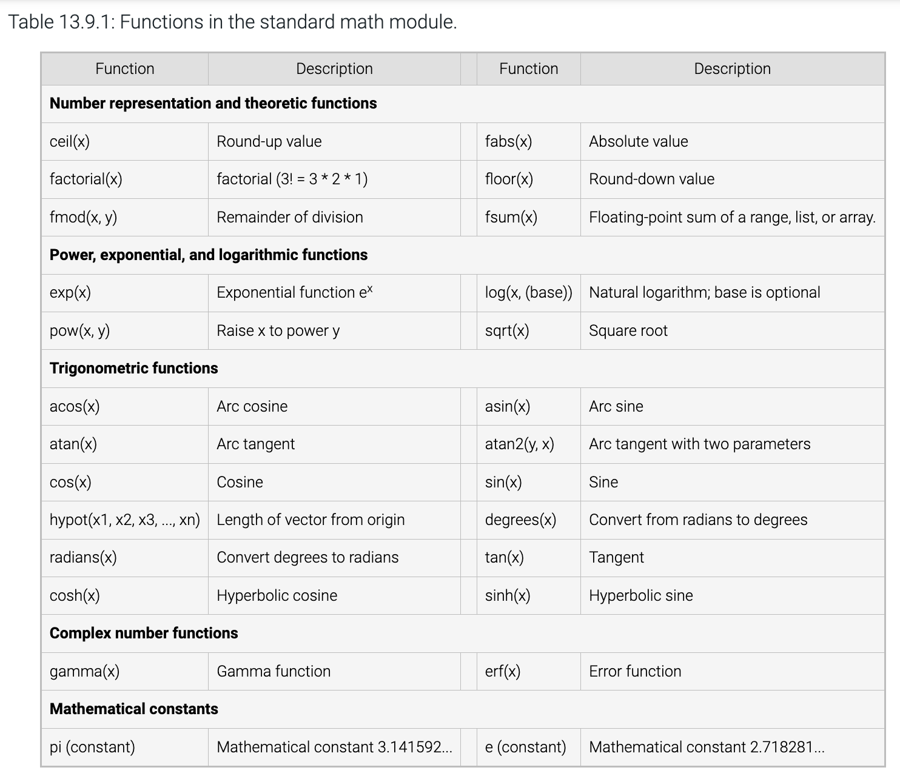

* Official Python documentation on mathematical functions: [math — Mathematical functions — Python 3.13.1 documentation](https://docs.python.org/3/library/math.html).

### random Module

* Generate (pseudo) random numbers

## Methods Tables

### List Methods

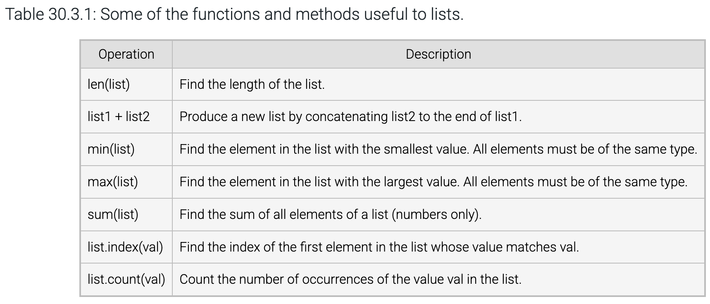

### range()

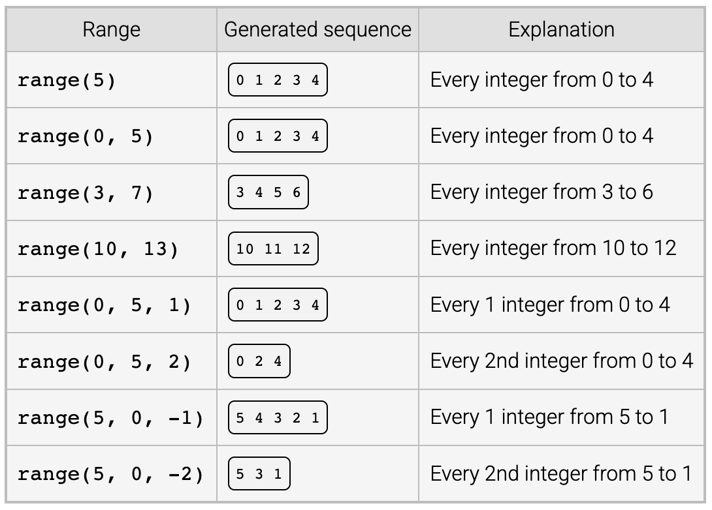

# Algorithms

## Subtractive Form of the Euclidean Algorithm

```
Steps in the Algorithm:
1. Take two positive integers as input, num_a and num_b.
2. Continue looping until the two numbers are equal:
• If num_a > num_b, subtract num_b from num_a.
• Otherwise, subtract num_a from num_b.
3. Once the loop ends, the two numbers are equal, and that value is the GCD.
```

## 

# Individual Chapters: Syntax, Constructs and Codes

## Chapter 12 Introduction to Python

```
wage = 20
# assignment # variable

hours = 40
weeks = 52
salary = wage * hours * weeks
# arithmetic computation

print('Salary is:', salary)
# print(): direct value, variable # string

hours = 35
# the variable hours is assigned a different value

salary = wage * hours * weeks
print('New salary is:', salary)
```

```
Salary is: 41600
New salary is: 36400
```

```
wage = 400

print('Your daily wage is 
, wage)

weekly_wage = 2000

print('
, wage, 'per day is 
, weekly_wage, 'per week')
# print() multiple variables, multiple values

print('Name\tJob\n------------------') # escape sequence: \n, \t, \\

print('Ann\tDeveloper\nJoe\tInfluencer')


```

```
Your daily wage is $ 400
$ 400 per day is $ 2000 per week
Name Job
------------------
Ann Developer
Joe Influencer
```

```
print('Enter name of best friend:', end=' ')
# Normally, print() adds a newline character (\n) after the output, causing the cursor to move to the next line.
#When you specify end=' ', it replaces the default newline with a single space (' '), so the cursor stays on the same line, leaving a space after the output instead of moving to the next line.

best_friend = input() # basic input # assignment
print('My best friend is', best_friend)
```

```
hours = 40
weeks = 52
hourly_wage = int(input('Enter hourly wage: '))
# input prompt
# int(): cast input object type as int

print('Salary is', hourly_wage * hours * weeks)
```

```
hourly_wage = 20

print('Annual salary is: ')
print(hourly_wage * 40 * 50) # computation within print()
print() #new line
```

## Chapter 13 Variables and Expressions

```
x = x + 1
# = means assign; left hand side must not contain expression;
```

```
birthday_year = 1986
birthday_month = 'April'
birthday_day = 22

print('birthday_year -->')
print(' value:', birthday_year)
print(' type:', type(birthday_year)) #type() of an object
print(' id:', id(birthday_year)) #id() of an object

print('\nbirthday_month -->')
print(' value:', birthday_month)
print(' type:', type(birthday_month))
print(' id:', id(birthday_month))

print('\nbirthday_day -->')
print(' value:', birthday_day)
print(' type:', type(birthday_day))
print(' id:', id(birthday_day))
```

```
miles = float(input('Enter a distance in miles: '))
# cast input as float by float()

hours_to_fly = miles / 500.0
hours_to_drive = miles / 60.0

print(miles, 'miles would take:')
print(hours_to_fly, 'hours to fly')
print(hours_to_drive, 'hours to drive')
```

```
import math # import other modules

print('Default output of Pi:',  math.pi)

print('Pi reduced to 4 digits after the decimal:', end=' ')

print(f'{math.pi:.4f}') # output format


```

```
# The pet_names.py module

print ('Initializing pet variables...')
pet_name1 = 'Ryder'
pet_name2 = 'Jess'
pet_weight1 = 5.1
pet_weight2 = 8.5

# Executes only if file run as a script (e.g., python pet_names.py)
if __name__ == '__main__':
    print('Pet 1:', pet_name1, 'was born', pet_weight1, 'lbs')
    print('Pet 2:', pet_name2, 'was born', pet_weight2, 'lbs')
# A script favorite_pet.py that imports and uses the pet_names module.

import pet_names  # Importing the module executes the module contents 

print('My favorite pet is', pet_names.pet_name1, '-') #access module variable through the "." notation
print('I remember when he weighed only', pet_names.pet_weight1, 'pounds.')
print('I love', pet_names.pet_name2, 'too, of course.')
```

```
import random
# Generates random float numbers
print(random.random())
print(random.random())

# Generates random integers with 3 possible values
print(random.randrange(3)) # generate random integers among 0, 1, 2
print(random.randrange(3))
print(random.randrange(3))
print(random.randrange(3))
print(random.randrange(3))
# Generate random integers between 12 inclusive and 20 inclusive
print(random.randint(12, 20))
# Generate random integers between 12 inclusive and 20 exclusive (19 inclusive)
print(random.randrange(12, 20))
```

```
# regular strings with escape sequences
my_string = 'This is a \n \'normal\' string\n'
my_raw_string = r'This is a \n \'raw\' string'
# raw strings

print(my_string)
print(my_raw_string)
```

## Chapter 14 More Python

This chapter contains some very shallow introductions to a few things, all of which we will cover in detail later in the course. Read through them. We'll skip them in class coverage.

## Chapter 30 Types

### § 30.1 String Basics

```
#A 'Mad Libs' style game where user enters nouns,
#verbs, etc., and then a story using those words is output.

#Get user's words
relative = input('Enter a type of relative: ')

# 'Enter a type of relative: ' is a string literal ("value");
# input() expect a input device input that, when received, is treated as a sring;
# Such string is assigned to a variable relative
print()

food = input('Enter a type of food: ')
print()

adjective = input('Enter an adjective: ')
print()

period = input('Enter a time period: ')
print()

# Tell the story
print('My', relative, 'says eating', food)
print('will make me more', adjective)
print('so now I eat them every', period)
```

```
george_v = "His Majesty George V, by the Grace of God, " \
          "of the United Kingdom of Great Britain and " \
          "Ireland and of the British Dominions beyond " \
          "the Seas, King, Defender of the Faith, Emperor of India"
gandhi = 'Mohandas Karamchand Gandhi'
john_f_kennedy = 'JFK'

print(len(george_v), 'characters is much too long of a name!')

# len() returns the length of a string

print(len(gandhi), 'characters is better...')
print(len(john_f_kennedy), 'characters is short enough.')
```

```
alphabet = 'ABCDEFGHIJKLMNOPQRSTUVWXYZ'
print(alphabet[0], alphabet[1], alphabet[25])

# Accessing individual elements of a string
```

```
alphabet = 'abcdefghijklmnopqrstuvwxyz'

# string is bound to a variable alphabet

# If I want to change to upper case, I cannot do the following:

alphabet[0] = 'A'  # Invalid: Cannot change character
alphabet[1] = 'B'  # Invalid: Cannot change character

# because string is immutable

print('Alphabet:', alphabet)

alphabet = 'abcdefghijklmnopqrstuvwxyz'

# If you assign a different string literal, Python creates a new object and bind it to the alphabet variable;
# The original 'abcdefghijklmnopqrstuvwxyz' object may be garbage collected if not used elsewhere
alphabet = 'ABCDEFGHIJKLMNOPQRSTUVWXYZ'

print('Alphabet:', alphabet)
```

```
string_1 = 'abc'
string_2 = '123'
concatenated_string = string_1 + string_2

# concatenation: glue together

print('Easy as ' + concatenated_string)
```

### § 30.2 String Formatting

Formatting string - f-string allows "in-line" formatting and replacement inside a string:

* Syntax: f"These words are displayed as is, while variable in certain format are dropped in {variables in certain format}";
* Not just applicable to the print() function: f-string directly construct/manipulate the string itself.

Replacement of variable:
```
number = 6
amount = 32
# assign variables

print(f'{number} burritos cost ${amount}')
# f'' or f"" format;
# {} holds variables to be replaced with the values thereof
# f'{} exact text {}'
```

```
6 burritos cost $32
```
Format: keywords "=" and {{}}
```
print(f'{2**2=}')
# literal = within replacement field: LHS = evaluated value of the LHS

two_power_two = 2**2
print(f'{two_power_two=}')
# variable = within replacement field: LHS = evaluated value of variable

print(f'{2**2=},{2**4=}')
# more than 1 =

print(f'{{2**2}}')
# {{}}: copy inner {}

print(f'{{{2**2=}}}')
# combo
```

```
2**2=4
two_power_two=4
2**2=4,2**4=16
{2**2}
{2**2=4}
```
Numerical formats:
```
name = "Aiden"
print(f"{name:s}")
# f"variable: s"

# integer format
number = 4
print(f"{number:d}")
# default

number = 7600
print(f"{number:,d}")
# comma notation

number = 4
print(f"{number:03d}")
# leading 0

# binary
number = 4
print(f"{number:b}")

# hexadecimal
number = 31
print(f"{number:x}")

# scientific notation
number = 44
print(f"{number:e}")

# floating point
number = 4
print(f"{number:f}")
# default is 6 place precision

number = 4
print(f"{number:.2f}")
# user defined 2 place precision

number = 7600.1
print(f"{number:,.2f}")
# combo
```

```
Aiden
4
7,600
004
100
1f
4.400000e+01
4.000000
4.00
7,600.10
```
Outside of print(): direct construction/manipulation of strings:
```
model_name_for_file = model_name.replace("-latest", "").replace(".", "-")
source_job_filename = os.path.basename(job_file).replace("split_", "")
analysis_filename = f"analysis_{model_name_for_file}_sync_{source_job_filename}"
analysis_save_path = os.path.join(analysis_output_dir, analysis_filename)
```

### § 30.3 List Basics

```
# List elements can be different types
prices = ['$20', 14.99, 5]

my_nums = [5, 12, 20]
print(my_nums)

# Accessing list element
print(my_nums[0], my_nums[1], my_nums[2])

# Update a list element
my_nums[1] = -28
print(my_nums)
```

```
[5, 12, 20]
5 12 20
[5, -28, 20]
```

```
my_list = [10, 'bw']
print(my_list)

# .append appends to the end of a list
my_list.append('abc')
print(f'After append: {my_list}')

# "pop out" the indexed element
my_list.pop(1)
print(f'After pop: {my_list}')

# remove an element (not by its index)
my_list.remove('abc')
print(f'After remove: {my_list}')
```

```
[10, 'bw']
After append: [10, 'bw', 'abc']
After pop: [10, 'abc']
After remove: [10]
```

### § 30.4 Tuple Basics

* Code:

```
white_house_coordinates = (38.8977, 77.0366)
# tuple assigned to a variable of type tuple

print(f'Coordinates: {white_house_coordinates}')
# print tuple

print(f'Tuple length: {len(white_house_coordinates)}')
# len() for length of this container

# Access tuples via index
print(f'\nLatitude: {white_house_coordinates[0]} north')
print(f'Longitude: {white_house_coordinates[1]} west\n')

# Error. Tuples are immutable
white_house_coordinates[1] = 50
```

* Result:

```
Coordinates: (38.8977, 77.0366)
Tuple length: 2

Latitude: 38.8977 north
Longitude: 77.0366 west

---------------------------------------------------------------------------
TypeError                                Traceback (most recent call last)
Cell In[3], line 15
    12 print(f'Longitude: {white_house_coordinates[1]} west\n')
    14 # Error. Tuples are immutable
---> 15 white_house_coordinates[1] = 50

TypeError: 'tuple' object does not support item assignment
```

* Named Tuples code

Additional libraries exist (and can be developed) to give "native" types more features. The only way to use them is to read their documentation
```
from collections import namedtuple
# from library import module

Car = namedtuple('Car', ['make','model','price','horsepower','seats']) 
# Create the named tuple

chevy_blazer = Car('Chevrolet', 'Blazer', 32000, 275, 8)  # Use the named tuple to describe a car
chevy_impala = Car('Chevrolet', 'Impala', 37495, 305, 5)  # Use the named tuple to describe a different car

print(chevy_blazer)
print(chevy_impala)
```

* Result

```
Car(make='Chevrolet', model='Blazer', price=32000, horsepower=275, seats=8)
Car(make='Chevrolet', model='Impala', price=37495, horsepower=305, seats=5)
```

### § 30.5 Set Basics

* An un-ordered collection of unique elements
* Set creation:
	* Code:

```
# Create a set using the set() function.
# even if set() is created with a list, the set() will create a set that contains the elements of the list
nums1 = set([1, 2, 3])

# Create a set using a set literal.
nums2 = { 7, 8, 9 }

# and get rid of the duplicates
nums3 = set([1, 2, 3, 3, 2, 1])
nums4 = {7, 8, 9, 9, 8, 7}

# Print the contents of the sets.
print(nums1)
print(nums2)
print(nums3)
print(nums4)
```

* Result:

```
{1, 2, 3}
{8, 9, 7}
{1, 2, 3}
{8, 9, 7}
```

* Set methods
	* Code:

```
# Create sets
names1 = {'Pedro', 'Khan', 'Dean'}
names2 = {'Emilia', 'Kara', 'Tia'}
print(names1)
print(names2)

# Add element to set
names1.add('Hyungu')
print(names1)

# Add names2 to names1
names1.update(names2)
print(names1)
print(names2)

# Remove element from set
names1.remove('Dean')
print(names1)
print(names2)

# Clear all elements from set
names2.clear()
print(names1)
print(names2)
```

* Results:

```
{'Dean', 'Pedro', 'Khan'}
{'Emilia', 'Tia', 'Kara'}
{'Dean', 'Pedro', 'Hyungu', 'Khan'}
{'Pedro', 'Kara', 'Emilia', 'Khan', 'Dean', 'Tia', 'Hyungu'}
{'Emilia', 'Tia', 'Kara'}
{'Pedro', 'Kara', 'Emilia', 'Khan', 'Tia', 'Hyungu'}
{'Emilia', 'Tia', 'Kara'}
{'Pedro', 'Kara', 'Emilia', 'Khan', 'Tia', 'Hyungu'}
set()
```

* Set operations

Code:
```
# Create sets
names1 = {'Corrin', 'Pedro', 'Khan', 'Dean'}
names2 = {'Emilia', 'Kara', 'Corrin', 'Tia'}
names3 = {'Karat', 'Kara', 'Karah', 'Khan'}
names4 = {'Khan', 'Dean', 'Pascale'}

# Union names1 and names2
result_set = names1.union(names2)
print('union: ', result_set)

# Intersection btwn result_set and names3
result_set = result_set.intersection(names3)
print('intersection: ', result_set)

# Difference btwn result_set and names4
result_set = result_set.difference(names4)
print('difference: ', result_set)
```
Results
```
union:  {'Pedro', 'Kara', 'Dean', 'Tia', 'Khan', 'Emilia', 'Corrin'}
intersection:  {'Kara', 'Khan'}
difference:  {'Kara'}
```

### § 30.6 Dictionary Basics

* Creating dictionary:

Code:
```
# Create a dictionary that maps keys to values:
caffeine_content_mg = {
    'Mr. Goodbar chocolate': 122,
    'Red Bull': 33,
    'Monster Hitman Sniper energy drink': 270,
    'Lipton Brisk iced tea - lemon flavor': 2,
    'dark chocolate coated coffee beans': 869,
    'Regular drip or percolated coffee': 60,
    'Buzz Bites Chocolate Chews': 1639
}

print(caffeine_content_mg)
```
Results:
```
{'Mr. Goodbar chocolate': 122, 'Red Bull': 33, 'Monster Hitman Sniper energy drink': 270, 'Lipton Brisk iced tea - lemon flavor': 2, 'dark chocolate coated coffee beans': 869, 'Regular drip or percolated coffee': 60, 'Buzz Bites Chocolate Chews': 1639}
```

* Addressing values

Code:
```
prices = {'apples': 1.99, 'oranges': 1.49}

print(f'The price of apples is {prices["apples"]}')
# addressing value through its key

print(f'\nThe price of lemons is {prices["lemons"]}')
# key doesn't exist
```
Result
```
The price of apples is 1.99
---------------------------------------------------------------------------
KeyError                                  Traceback (most recent call last)
Cell In[15], line 6
      3 print(f'The price of apples is {prices["apples"]}')
      4 # addressing value through its key
----> 6 print(f'\nThe price of lemons is {prices["lemons"]}')

KeyError: 'lemons'
```

* Add, modify and remove entry:

Code:
```
prices = {}  # Create empty dictionary
prices['banana'] = 1.49  # Add new entry
print(prices)

prices['banana'] = 1.69  # Modify entry
print(prices)

del prices['banana']  # Remove entry
print(prices)
```
Results:
```
{'banana': 1.49}
{'banana': 1.69}
{}
```

### § 30.9 Type Conversions

Implicit conversion and type cast

## Chapter 31 Branching

### § 31.2 Detecting Equal Values

Code:
```
hotel_rate = 150

num_years = int(input('Enter years married: '))

if num_years == 50: # ==
  print('Congratulations on 50 years of marriage!') # pay attention to indentation
  hotel_rate = hotel_rate / 2

print(f'Your hotel rate: ${hotel_rate:.2f}') # logic bug: if num_years is 51, then no half prices!
```

Code:
```
user_num = int(input('Enter a number: '))

div_remainder = user_num % 2

if div_remainder == 0:
    print(f'{user_num} is even.')
else:
    print(f'{user_num} is odd.')
```

Code: if...elif..else:
```
num_years = int(input('Enter number years married: '))

if num_years == 1:
    print('Your first year -- great!')
elif num_years == 10:
    print('A whole decade -- impressive.')
elif num_years == 25:
    print('Your silver anniversary -- enjoy.')
elif num_years == 50:
    print('Your golden anniversary -- amazing.')
else:
    print('Nothing special.')
```
Result: 51 years...nothing special?
```
Enter number years married:  51
Nothing special.
```

### § 31.9 Membership and Identity Operators

Code: in and not in:
```
# Use the "in" operator
barcelona_fc_roster = ['Alves', 'Messi', 'Fabregas']

name = input('Enter name to check: ')

if name in barcelona_fc_roster:
    print(f'Found {name} on the roster by "in" check.')
else:
    print(f'Could not find {name} on the roster by "in" check.')

# Use the "not in" operator
if name not in barcelona_fc_roster:
    print(f'Could not find {name} on the roster by "not in" check.')
else:
    print(f'Found {name} on the roster by "not in" check.')
```
Result:
```
Enter name to check:  Alves
Found Alves on the roster by "in" check.
Found Alves on the roster by "not in" check.

Enter name to check:  Pei
Could not find Pei on the roster by "in" check.
Could not find Pei on the roster by "not in" check.
```
Code: membership for dictionary:
```
my_dict = {'A': 1, 'B': 2, 'C': 3}

if 'B' in my_dict:
  print("Found 'B'")
else:
  print("'B' not found")

# Membership operator does not check values
if 3 in my_dict:
    print('Found 3')
else:
    print('3 not found')
```
Result:
```
Found 'B'
3 not found
```

is and is not compare and determine whether two _objects_ are the same.
Code:
```
w = 500
x = 500 + 500  # Create a new object with value 1000
y = w + w      # Create a second object with value 1000
z = x          # Bind z to the same object as x

if z is x:
    print('z and x are bound to the same object')
    print('because z is bound to object with identity: ', id(z), ', and x bound to: ', id(x))

if z is not y:
    print('z and y are NOT bound to the same object')
    print('because z is bound to object with identity: ', id(z), ', and y bound to: ', id(y))
```
Results:
```
z and x are bound to the same object
because z is bound to object with identity:  5084657360 , and x bound to:  5084657360
z and y are NOT bound to the same object
because z is bound to object with identity:  5084657360 , and y bound to:  5084654512
```

## Chapter 32 Loops

### § 32.2 While loops

```
nose = '0'  # Looks a little like a nose

# Get first character for eyes and mouth
user_input = input("Enter a character ('q' for quit): ")
user_value = user_input[0]

# Loop until user enters sentinel value
while user_value != 'q':
    print(f' {user_value} {user_value} ')  # Print eyes   
    print(f'  {nose}  ')  # Print nose   
    print(user_value*5)  # Print mouth
    print('\n')

    # Get new character for eyes and mouth
    user_input = input("Enter a character ('q' for quit): ")
    user_value = user_input[0]

print('Goodbye.\n')
```

```
Enter a character ('q' for quit):  x
x x
  0 
xxxxx

Enter a character ('q' for quit):  y
y y
  0 
yyyyy

Enter a character ('q' for quit):  0
0 0
  0 
00000

Enter a character ('q' for quit):  8
8 8
  0 
88888

Enter a character ('q' for quit):  q
Goodbye.
```

### § 32.3 More while loop examples

```
num_a = int(input('Enter first positive integer: '))
print()

num_b = int(input('Enter second positive integer: '))
print()

while num_a != num_b:
    if num_a > num_b:
        num_a = num_a - num_b
    else:
        num_b = num_b - num_a

print(f'GCD is {num_a}')
```

```
Enter first positive integer:  100

Enter second positive integer:  25

GCD is 25
```

```
'''
Program that has a conversation with the user.
Uses elif branching and a random number to mix up the program's responses.
'''
import random  # Import a library to generate random numbers

print('Tell me something about yourself.')
print('You can type \'Goodbye\' at anytime to quit.\n')

user_text = input()

while user_text != 'Goodbye':
    random_num = random.randint(0, 2)  # Gives a random integer between 0 and 2, inclusive of 2
    if random_num == 0:
        print('\nPlease explain further.\n')
    elif random_num == 1:
        print(f'\nWhy do you say: "{user_text}"?\n')
    elif random_num == 2:
        print('\nWhat else can you share?\n')
    else:
        print('\nUh-oh, something went wrong. Try again.\n')

    user_text = input()

print('It was nice talking with you. Goodbye.\n')
```

```
Tell me something about yourself.
You can type 'Goodbye' at anytime to quit.

Hi

Please explain further.

My name is Pei

Please explain further.

Goodbye
It was nice talking with you. Goodbye.
```

```
'''
Program that has a conversation with the user.
Uses elif branching and a random number to mix up the program's responses.
'''
import random  # Import a library to generate random numbers

print('Tell me something about yourself.')
print('You can type \'Goodbye\' at anytime to quit.\n')

user_text = input()

while user_text != 'Goodbye':
    random_num = random.randint(0, 2)  # Gives a random integer between 0 and 2, inclusive of 2
    if random_num == 0:
        print('\nPlease explain further.\n')
    elif random_num == 1:
        print(f'\nWhy do you say: "{user_text}"?\n')
    elif random_num == 2:
        print('\nWhat else can you share?\n')
    else:
        print('\nUh-oh, something went wrong. Try again.\n')

    #user_text = input()

print('It was nice talking with you. Goodbye.\n')
```

* While loop critical: do not forget to update the conditions from within the loop, usually towards the end of the iteration body. Otherwise you'd get into an infinite loop that will eventually crash the program.

```
Tell me something about yourself.
You can type 'Goodbye' at anytime to quit.

Hi
IOPub data rate exceeded.
The Jupyter server will temporarily stop sending output
to the client in order to avoid crashing it.
To change this limit, set the config variable
`--ServerApp.iopub_data_rate_limit`.

Current values:
ServerApp.iopub_data_rate_limit=1000000.0 (bytes/sec)
ServerApp.rate_limit_window=3.0 (secs)
```

### § 32.4 Counting

```
N = int(input())  # Read user-entered number
total = N
i = N  # Initialize the loop variable

while i > 1:
    #print('i = ', i)
    total = total * (i - 1) # Set total to total * (i)
    i = i - 1
    #i -= 1          # Decrement i
    #print('i = ', i)

print(total)
```

```
5
120
```

```
N = int(input())  # Read user-entered number
total = N
i = N  # Initialize the loop variable

while i > 1:
    #print('i = ', i)
    total = total * (i - 1) # Set total to total * (i)
    #i = i - 1
    i -= 1          # Decrement i: i -= 1 means: i = i - 1
    #print('i = ', i)

print(total)
```

```
5
120
```

```
N = int(input())  # Read user-entered number
total = N
i = N  # Initialize the loop variable

while i > 1:
    print('Beginning loop @ i = ', i)
    total = total * (i - 1) # Set total to total * (i)
    #i = i - 1
    i -= 1          # Decrement i
    print('Ending loop @ i = ', i)

print(total)
```

```
5
Beginning loop @ i =  5
Ending loop @ i =  4
Beginning loop @ i =  4
Ending loop @ i =  3
Beginning loop @ i =  3
Ending loop @ i =  2
Beginning loop @ i =  2
Ending loop @ i =  1
120
```

### § 32.5 For Loops

```
daily_revenues = [
    2356.23,  # Monday
    1800.12,  # Tuesday
    1792.50,  # Wednesday
    2058.10,  # Thursday
    1988.00,  # Friday
    2002.99,  # Saturday
    1890.75  # Sunday
]

total = 0                                # to use a veriable to accumulate, don't forget to initiate the variable
for day in daily_revenues:                # for variable in sequence
    total += day                        # accumulate revenue

average = total / len(daily_revenues)

print(f'Weekly revenue: ${total:.2f}')
print(f'Daily average revenue: ${average:.2f}')
```

```
Weekly revenue: $13888.69
Daily average revenue: $1984.10
```

```
my_str = ''                                #initiate the accumulators
for character in "Take me to the moon.":    # a string is also a sequence subject to the in iteration
    my_str += character + '_'                # accumulate but a _ in between
print(my_str)
```

```
T_a_k_e_ _m_e_ _t_o_ _t_h_e_ _m_o_o_n_._   

# The two consecutive _ _ are for the space in the string, which is also a member of the string
```

### § 32.6 Counting Using the range() Function

* range() allows turning iterating over a sequence into iterating over a fixed number of times;
* Frequently used with the len() function: range(len(sequence))

```
'''Program that calculates savings and interest'''

initial_savings = 10000
interest_rate = 0.05

years = int(input('Enter years: '))
print()

savings_for = initial_savings                # compute using for loop
for i in range(years):
    print(f' Savings in year (for loop) {i}: ${savings_for:.2f}')
    savings_for = savings_for + (savings_for*interest_rate)

print('\n')

savings_while = initial_savings                # compute using while loop
j = 0                                            # initiate loop variable
while j < years:
    print (f' Savings in year (while loop) {j}: ${savings_while:.2f}')
    savings_while = savings_while + (savings_while*interest_rate)
    j += 1                                        #increment loop variable

print('\n')
```

```
Enter years:  8

Savings in year (for loop) 0: $10000.00
Savings in year (for loop) 1: $10500.00
Savings in year (for loop) 2: $11025.00
Savings in year (for loop) 3: $11576.25
Savings in year (for loop) 4: $12155.06
Savings in year (for loop) 5: $12762.82
Savings in year (for loop) 6: $13400.96
Savings in year (for loop) 7: $14071.00

Savings in year (while loop) 0: $10000.00
Savings in year (while loop) 1: $10500.00
Savings in year (while loop) 2: $11025.00
Savings in year (while loop) 3: $11576.25
Savings in year (while loop) 4: $12155.06
Savings in year (while loop) 5: $12762.82
Savings in year (while loop) 6: $13400.96
Savings in year (while loop) 7: $14071.00
```

### § 32.7 while vs for

See the last code piece.

### § 32.10 break and continue

Before starting writing code, figure out exactly what it is being asked of, and figure out how to do it. This is the architecture and the algorithm part. For the code below, the tasks are:

* User has some amount of money;
* Need to come up with a combination of empanadas and tacos the user money can buy without having change left over;
* With the cost of empanada and taco fixed, and the user can have all kinds of amount of money, this is not always possible:
	* If the user money can achieve this, display the option with the numbers of empanadas and tacos;
	* If not, display a message stating the fact.

How do we do this:

* By trying each possible combination of empanadas and tacos;
* But what does it mean by "each possible combination"?
	* If all the money is used to buy empanadas, how many can it buy? If only some of the money is used to buy empanadas, then the number of empanadas cannot exceed the number if we spend all the money on empanadas. Therefore, this "number if all money is spent on this" is the maximum number of empanadas the money can buy in our combination: call it max\_empanadas;
	* If all the money is used to buy tacos, how many can it buy? This will give the maximum number of tacos we can possibly buy in our combination: call it max\_tacos;
	* "Each possible combination": # tacos: 0 to max\_tacos; # empanadas: 0 to max\_empanadas.
* How do we "try each possible combination": cycle through each combo, calculate the total cost and compare with the user money;

For this program, the break statement ensures that if the first combo is discovered, the program stops calculating. Therefore for $20, the option of buying 5 tacos and 0 empanadas is not uncovered.
```
empanada_cost = 3
taco_cost = 4

user_money = int(input('Enter money for meal: '))

max_empanadas = user_money // empanada_cost # If all this money is spent on empanads, how many can it buy?
max_tacos = user_money // taco_cost        # # If all this money is spent on tacos, how many can it buy?

meal_cost = 0
for num_tacos in range(max_tacos + 1):
    for num_empanadas in range(max_empanadas + 1):            # Note the range() function does not include the argument number itself
        meal_cost = (num_empanadas * empanada_cost) + (num_tacos * taco_cost)

        # Find first meal option that exactly matches user money
        if meal_cost == user_money:
            break

    # Find first meal option that exactly matches user money
    if meal_cost == user_money:
        break

if meal_cost == user_money:
    print(f'${meal_cost} buys {num_empanadas} empanadas and {num_tacos} tacos without change.')
else:
    print('You cannot buy a meal without having change left over.')
```

```
Enter money for meal:  20
$20 buys 4 empanadas and 2 tacos without change.
```

To improve and make all options available:
```
empanada_cost = 3
taco_cost = 4

user_money = int(input('Enter money for meal: '))

max_empanadas = user_money // empanada_cost
max_tacos = user_money // taco_cost

meal_cost = 0
num_options = 0                            #accumulate number of options
for num_tacos in range(max_tacos + 1):
    for num_empanadas in range(max_empanadas + 1):

        meal_cost = (num_empanadas * empanada_cost) + (num_tacos * taco_cost)

        # whenever an option is computed available, don't break, display, and add to accumulator
        if meal_cost == user_money:
            print(f'${meal_cost} buys {num_empanadas} empanadas and {num_tacos} tacos without change.')
            num_options += 1
# utilize accumulator to tell whether there is any option
if num_options == 0:
    print('You cannot buy a meal without having change left over.')
```

```
Enter money for meal:  20
$20 buys 4 empanadas and 2 tacos without change.
$20 buys 0 empanadas and 5 tacos without change.
```
Use the continue statement to bypass the rest of the iteration and enter the next:
```
empanada_cost = 3
taco_cost = 4

user_money = int(input('Enter money for meal: '))

num_diners = int(input('How many people are eating: '))    #There are now more than 1 diners

max_empanadas = user_money // empanada_cost
max_tacos = user_money // taco_cost

meal_cost = 0
num_options = 0
for num_tacos in range(max_tacos + 1):
    for num_empanadas in range(max_empanadas + 1):

        #Total items purchased must be equally divisible by number of diners
        if (num_tacos + num_empanadas) % num_diners != 0:    #If the food is not equally divisible among diners
        continue                            # Then this current option is not viable, move on to the next

        meal_cost = (num_empanadas * empanada_cost) + (num_tacos * taco_cost)

        if meal_cost == user_money:
            print(f'${meal_cost} buys {num_empanadas} empanadas and {num_tacos} tacos without change.')
            num_options += 1

if num_options == 0:
    print('You cannot buy a meal without having change left over.')
```

```
Enter money for meal:  20
How many people are eating:  3
$20 buys 4 empanadas and 2 tacos without change.
```

### § 32.11 Loop else

zyDE 32.11.1: Loop else example: Finding a legal baby name: [[PCC Winter 2025/Program Development Process]]

```
#A few legal, acceptable Danish names
legal_names = ['Thor', 'Bjork', 'Bailey', 'Anders', 'Bent', 'Bjarne', 'Bjorn',
    'Claus', 'Emil', 'Finn', 'Jakob', 'Karen', 'Julie', 'Johanne', 'Anna', 'Anne',
    'Bente', 'Eva', 'Helene', 'Ida', 'Inge', 'Susanne', 'Sofie', 'Rikkie', 'Pia',
    'Torben', 'Soren', 'Rune', 'Rasmus', 'Per', 'Michael', 'Mads', 'Hanne',
    'Dorte'
]

user_name = input('Enter desired name:\n')
if user_name in legal_names:
    print(f'{user_name} is an acceptable Danish name. Congratulations.')
else:
    print(f'{user_name} is not acceptable.')
    for name in legal_names:
        if user_name[0] == name[0]:
            print(f'You might consider: {name},', end=' ')
            break
    else:                                    #Use loop else to drive action when for loop is exhausted without a mtch
        print('No close matches were found.')
print('Goodbye.')
```

```
Enter desired name:
Bjork
Bjork is an acceptable Danish name. Congratulations.
Goodbye.
```

```
Enter desired name:
Zou
Zou is not acceptable.
No close matches were found.
Goodbye.
```

```
Enter desired name:
July
July is not acceptable.
You might consider: Jakob, Goodbye.
```

### § 32.12 enumerate() and unpacking

```
origins = [4, 8, 10]
# enumerate() returns an object pointing to a series of tuples of (index,value)
for (index, value) in enumerate(origins): #unpacking: making more than 1 assignment at once
    print(f'Element {index}: {value}')
```

## Chapter 33 Functions

### § 33.1 User Defined Functions Basics

See [[Function Overview]].

### § 33.2 Print Functions

Repeatedly doing the same set of things:
```
def print_menu():
    print("Today's Menu:")
    print('  1) Gumbo')
    print('  2) Jambalaya')
    print('  3) Quit\n')

quit_program = False

while not quit_program :
    print_menu()
    choice = int(input('Enter choice: '))
    if choice == 3 :
        print('Goodbye')
        quit_program = True
    else :
        print('Order: ', end='')
        if choice == 1 :
            print('Gumbo')
        elif choice == 2 :
            print('Jambalaya')
        print()
```

```
Today's Menu:
  1) Gumbo
  2) Jambalaya
  3) Quit

Enter choice:  1
Order: Gumbo

Today's Menu:
  1) Gumbo
  2) Jambalaya
  3) Quit

Enter choice:  2
Order: Jambalaya

Today's Menu:
  1) Gumbo
  2) Jambalaya
  3) Quit

Enter choice:  3
Goodbye
```

### § 33.3 Dynamic Typing

Python is much more lenient in typing:

* You don't need to declare a variable with its type;
* As long as types can work, the interpret will make it work.

### § 33.4 Reasons for Defining Functions

Read Zybook.

### § 33.5 Writing Mathematical Functions

```
import math

def calc_circular_base_area(radius):
  return math.pi * radius * radius

def calc_cylinder_volume(baseRadius, height):
  return calc_circular_base_area(baseRadius) * height

def calc_cylinder_surface_area(baseRadius, height):
  return (2 * math.pi * baseRadius * height) + (2 * calc_circular_base_area(baseRadius))

radius = float(input('Enter base radius: '))
height = float(input('Enter height: '))

print(f'Cylinder volume: {calc_cylinder_volume(radius, height):.3f}')
print(f'Cylinder surface area: {calc_cylinder_surface_area(radius, height):.3f}')
```
Looks intimidating, but really because of all the wordiness. If you write math formulas out, its really simple:

A\_b=\\pi\\cdot r^2\\\\

V\_c=A\_b\\cdot h

A\_s=2\\pi\\cdot r\\cdot h+2A\_b

### § 33.6 Function Stubs

See [[incremental development]].

### § 33.7 Functions with Branches/Loops

Nothing special

### § 33.8 Function Are Objects

[[Concept Functions as Objects]];
```
def print_human_head():
    print('  ||||| ')
    print('  o  o')
    print('    >' )
    print('  ooooo')
    return

def print_monkey_head():
    print('  .-"-.')
    print(' _/.-.-.\\_')
    print('( ( o o ) )')
    print(' |/  "  \\|')
    print('  \\ .-. /')
    print('  /`"""`\\')
    return

def print_figure(face):  #The parameter of this function is a function
    face()  # Print the face
    print('    |')
    print('  --|--')
    print('  /  |  \\')
    print('@    |    @')
    print('    |')
    print('    /|\\')
    print('  @  @')
    return

choice = int(input('Enter "1" to draw monkey, "2" for human: '))

if choice == 1:
    print_figure(print_monkey_head)    # print_monkey_head is a function and is the argument used to call the print_figure function
elif choice == 2:
    print_figure(print_human_head)    #print_human_head is a function and is the argument used to call the print_figure function
```

```
Enter "1" to draw monkey, "2" for human:  1
  .-"-.
_/.-.-.\_
( ( o o ) )
|/  "  \|
  \ .-. /
  /`"""`\
    |
  --|--
  /  |  \
@    |    @
    |
    /|\
  @  @
```

### § 33.9 Function Common Errors

Read.

### § 33.10 Scope of Variables and Functions

[[PCC Winter 2025/See here Python Scopes]].

### § 33.11 Name Spaces and Scope Resolution

See [[PCC Winter 2025/Name Spaces]] and [[PCC Winter 2025/Scope Resolution]]

### § 33.12 Function Arguments

See [[Function Argument Pass-By-Assignment]].
```
def modify(num_list):
    num_list[1] = 99

my_list = [10, 20, 30]
print('my_list before modify function call: ', my_list) # my_list is initially [10, 20, 30]

modify(my_list)
print('my_list after modify function call: ', my_list)  # my_list still contains 99!
```

```
my_list before modify function call:  [10, 20, 30]
my_list after modify function call:  [10, 99, 30]
```

```
def modify(num_list):
    num_list[1] = 99
    print('my_list within modify function: ', my_list)
    print('my_list copy with modify function: ', my_list[:])
    print('num_list within modify function: ', num_list)

my_list = [10, 20, 30]
print('my_list before modify function call: ', my_list) # my_list is initially [10, 20, 30]

modify(my_list[:])
print('my_list after modify function call: ', my_list)  # my_list integrity is preserved
```

```
my_list before modify function call:  [10, 20, 30]
my_list within modify function:  [10, 20, 30]
my_list copy with modify function:  [10, 20, 30]
num_list within modify function:  [10, 99, 30]
my_list after modify function call:  [10, 20, 30]
```

### § 33.13 Keyword Arguments and Default Parameter Values

Relatively easy to understand.

### § 33.14 Arbitrary Argument Lists

\*args creates an arbitrary argument list at the time of a function call;
\*\*kwargs creates a dictionary whose keys are argument keywords and whose values are argument values:

* All methods available to the dict type are ready to be used.

### § 33.15 Multiple Function Outputs

### § 33.16

### § 33.17

## Chapter 34 Strings

### § 34.1 String Slicing

Nothing special. Text is clear.
```
my_str = "The cat jumped the brown cow"
animal = my_str[4:7]
print(f"The animal is a {animal}")

my_str = "The fox jumped the brown llama"
print(f"The animal is still a {animal}")# animal variable remains unchanged.
```

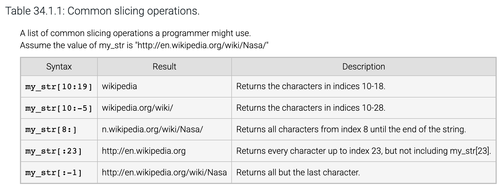

### § 34.2 Advanced String Formatting

Continuation of [[PCC Winter 2025/§30.2 String Formatting]]:

* Field width;
* Alignment;
* Fill;
* Precision (covered in 30.2).

```
names = ["Sadio Mane", "Gabriel Jesus"]
goals = [22, 7]

print(f"{'Player Name':<16}{'Goals':<8}")   
print("-" * 24)
for i in range(2):
    print(f"{names[i]:<16}{goals[i]:<8}")
```
Best approach when needed:

* Determine (design) exactly what you need;
* Look up the formatting literals.

### § 34.3 String Methods

```
word = 'onomatopoeia' #Word to be guessed
num_guesses = 10      # Number of times of guesses allowed

hidden_word = '-' * len(word) # Initially display the word to be guessed as a bunch of -'s

guess = 1                    # Start the counting of the number of guesses

while guess <= num_guesses and '-' in hidden_word: 
# as long as you still have guesses to do and there is "-" in the hidden word, keep guessing

    print(hidden_word)
    user_input = input(f'Enter a character (guess #{guess}): ')

    if len(user_input) == 1:
        # Count the number of times the character occurs in the word
        num_occurrences = word.count(user_input)

        # Replace the appropriate position(s) in hidden_word with the actual character.
        position = -1
        for occurrence in range(num_occurrences):
            position = word.find(user_input, position+1)  # Find the position of the next occurrence
            hidden_word = hidden_word[:position] + user_input + hidden_word[position+1:]  # Rebuild the hidden word string

        guess += 1

if not '-' in hidden_word:
    print('Winner!', end=' ')       
else:
    print('Loser!', end=' ')

print(f'The word was {word}.')
```

```
menu_prompt = ('Available commands:\n'
              '  (add) Add passenger\n'
              '  (del) Delete passenger\n'
              '  (print) Print passenger list\n'
              '  (exit) Exit the program\n'
              'Enter command:\n')

destinations = ['PHX', 'AUS', 'LAS']

destination_prompt = ('Available destinations:\n'
                      '(PHX) Phoenix\n'
                      '(AUS) Austin\n'
                      '(LAS) Las Vegas\n'
                      'Enter destination:\n')

passengers = {}

print('Welcome to Mohawk Airlines!\n')
user_input = input(menu_prompt).strip().lower()

while user_input != 'exit':
    if user_input == 'add':
        name = input('Enter passenger name:\n').strip().upper()
        destination = input(destination_prompt).strip().upper()
        if destination not in destinations:
            print('Unknown destination.\n')
        else:
            passengers[name] = destination

    elif user_input == 'del':
        name = input('Enter passenger name:\n').strip().upper()
        if name in passengers:
            del passengers[name]

    elif user_input == 'print':
        for passenger in passengers:
            print(f'{passenger.title()} --> {passengers[passenger]}')
    else:
        print('Unrecognized command.')

    user_input = input('Enter command:\n').strip().lower()
```

### § 34.4 Splitting and Joining Strings

Two tricky behavior to pay attention to:

* If the split string starts or ends with the separator, or if two consecutive separators exist, then the resulting list will contain an empty string for each such occurrence:
	* zyDE 34.4.1: More string splitting.
* The join() method belongs to separator string:

## Chapter 35 Lists and Dictionaries

### § 35.1 Lists

Good review of what a list is:

* The list object type is one of the most important and often-used types in Python;
* Container: an object that groups related objects together;
* Mutable: the size of the list can grow or shrink and elements within the list can change;
* Sequence: the contained objects maintain a left-to-right positional order;
* Elements of the list can be accessed via indexing operations that specify the position of the desired element in the list;
	* Elements start at index 0.
* Each element in a list can be a different object type such as strings, integers, floats, or even other lists: this is a powerful feature.

Tricky: in-place modification (modifying the object itself) vs modification of a copy (modifying an object that is a copy of the object): the my\_team, your\_team example.

### § 35.2 List Methods

zyDE 35.2.1: Amusement Park Riding System
riders\_per\_ride = 3  # Num riders per ride to dispatch
```

line = []  # The line of riders
num_vips = 0  # Track number of VIPs at front of line

menu = ('(1) Reserve place in line.\n'  # Add rider to line
        '(2) Reserve place in VIP line.\n'  # Add VIP
        '(3) Dispatch riders.\n'  # Dispatch next ride car
        '(4) Print riders.\n'
        '(5) Exit.\n\n')

user_input = input(menu).strip().lower()

while user_input ! =  '5':
    if user_input = = '1':  # Add rider
        name = input('Enter name:').strip().lower()
        print(name)
        line.append(name)

    elif user_input = = '2':  # Add VIP
        print('FIXME: Add new VIP')
        # Add new rider behind last VIP in line
        # Hint: Insert the VIP into the line at position num_vips.
        # Don't forget to increment num_vips.

    elif user_input = = '3':  # Dispatch ride
        print('FIXME: Remove riders from the front of the line.')
        # Remove last riders_per_ride from front of line.
        # Don't forget to decrease num_vips, if necessary.

    elif user_input = = '4':  # Print riders waiting in line
        print(f'{len(line)} person(s) waiting: {line}')

    else:
        print('Unknown menu option')

    user_input = input('Enter command: ').strip().lower()
    print(user_input)
```
Refer to [[Program Development Process]]:
Understand how the "system" works (nothing to do with programming):

* The Riding "System" maintains and manages a "line" or a "queue" that holds the names of people waiting to get on the ride;
* There are two "sub-lines": one holds names for VIPs and the other holds names of regular riders;
* Within each "sub-line", the names are in the order of time at which they "get in" the sub-line;
* The VIP sub-line is ahead of the regular sub-line;
* The line looks like: \[VIP1, VIP2... Regular1, Regular2, ...\];
* Each ride can take 3 people: when a ride opens up, the first 3 people in the line are "dispatched" to the ride and removed from the line:
	* If there are 3 or more VIPs, then only VIPs get on the next ride;
	* Otherwise all VIPs get on the ride, and then the regulars.

Program functionalities:

* The line is really a "line" of rider's names, or a set of rider names in order:
	* Order of VIPs is the order in which they are added to line;
	* Order of regulars is the oder in which they are added to line;
	* VIPs are ahead of regulars.
* The program must allow the formation of the line or its 2 sub-lines, on demand;
* The program must allow addition to the line, on demand:
	* The addition must specify which sub-line to add to.
* The program must handle a dispatch on demand. In a dispatch situation (for the current version, only #4 below needs to be implemented):
	1. Determine who gets on the next ride;
	2. Print the names of next riders;
	3. If a rider is a no show, determine who the next rider is;
	4. After the 3 riders are determined, update the line by removing the rider's names from it.
* The program must print the up-to-date line on demand;
* The program must exit on demand.

Program inputs and outputs: from the above function:

* Inputs:
	* "On demands": line formation, addition (specify VIP or regular), dispatch, print and exit;
	* Name of rider.
* Outputs:
	* Currently only when printing of line is requested by user;
	* Think: what else could be implemented to make this a better program _that serves the user better_.

So far we have not thought of coding or Python. Now think about but don't yet start programming:

* We're going to implement this with Python.

On the line or queue:

* A "line" or "queue" containing multiple names in order, that changes or updates, seems like a good fit for a python list;
* Should we use 1 list to hold both VIPs and regulars or should we use two lists:
	* If we use 1 list:
		* How do we allow a VIP to be added to "cut in front of" all regulars but behind the other VIPs?
		* This line-cutting has to work after each dispatch.
	* If we use 2 lists:
		* How do we handle the "print line" function?
		* Dispatch becomes more complicated as we have to pick riders from 2 lists rather than 1.
* Should we structure the program into a main program and a set of functions that handle each of the above functions to be called by the main program?
* In this example, it has been decided for us that:
	* We'll use 1 list;
	* We're not doing functions and function calls.
* With 1 list, how do we distinguish between a VIP and regular?
	* You might think we need some kind of "label";
	* But looking back at the requirements (which is very important: do not "over program" - it costs more and could get you into trouble), we only need to know where to "cut in line". In a python list context, that means we only need to know the index of a VIP addition in the list;
	* We could use a single integer for this purpose: a variable that holds the number of VIP: starts with 0, gets incremented whenever a VIP is added, decremented when a VIP gets on a ride:
		* In Python list, if there are n VIPs in the list, then the last VIP in the list is line\[n-1\]. So a newly added VIP goes to line\[n\].
* Adding a VIP therefore involves taking the VIP name and insert it as line\[n\];
* Adding a regular is easy: append the name to the end of the line;
* Therefore adding VIP and regular involves different operations.

On getting the program running:

* We have a set of "on-demands";
* That can be implemented by presenting the user with a menu to select from, take the user selection and handle the add, dispatch, print and exit based on user input:
	* Adding to a line and "forming" a line can be done together if we start with an empty line;
	* User also has to tell the program explicitly whether he's adding a VIP or a regular, as the program, as its functions are currently defined, has no way to tell.

Pseudo code:

* Variables involved: the line list, the num\_vips integer.

```
User menu 1. Add regular rider; 2. Add VIP; 3. Dispatch; 4. Print line; 5. Exit

Take user input

Setups:
set line list to empty
set num_vips to 0
set riders per rider to 3

if user menu input5: exit program
if user menu input: 1
    ask user for rider name
    append user input rider name to the end of the line list
    go to menu presentation for next task
if user menu input: 2
    ask user for VIP name
    insert VIP name at line[num_vips]
    num_vips + 1
    go to menu presentation for next task
if user menu input: 3
    remove first 3 items from the line list
    update num_vips:
        if num_vips before removal is less than 3, then set num_vips to 0
        otherwise reduce num_vips by 3
    go to menu presentation for next task
if user menu input: 4
    print the line list
    go to menu presentation for next task
```

Notice that unless user menu input is 5, every other scenario requires "go to menu presentation for next task". This type of structure can be easily implemented with a while loop.
```
while user_input ! =  '5':
    if user_input = = '1':
```

Implement one piece at a time and test often. Add VIP (how to insert, how to increment):
```
elif user_input == '2':  # Add VIP
        print('FIXME: Add new VIP')

        # Add new rider behind last VIP in line
        # Hint: Insert the VIP into the line at position num_vips.
        #Don't forget to increment num_vips.

        name = input('Enter name:').strip().lower()
        print(name)
        line.insert(num_vips, name)
        num_vips += 1
        print('FIXED: Add new VIP')
```

Dispatch (how to remove first 3 items from a list):
```
elif user_input == '3':  # Dispatch ride

        print('FIXME: Remove riders from the front of the line.')
        # Remove last riders_per_ride from front of line.
        # Don't forget to decrease num_vips, if necessary.

        if num_vips < = 3:
            num_vips = 0
        else:
            num_vips = num_vips - 3

        #Before dispatch
        print(f'{len(line)} person(s) waiting: {line}')
        #Dispatch
        line = line[3:]
        #After dispatch
        print(f'{len(line)} person(s) waiting: {line}')
```

### § 35.3 Iterating Over a List

```
user_input = input("Enter numbers:")

tokens = user_input.split()  # Split into separate strings

# Convert strings to integers
nums = []
for token in tokens:
    nums.append(int(token))

# Print each position and number
print()  # Print a single newline
for index in range(len(nums)):
    value = nums[index]

    print(f"{index}: {value}")

# Determine maximum even number
max_num = None
for num in nums:
    if (max_num == None) and (num % 2 == 0):
        # First even number found
        max_num = num
    elif (max_num != None) and (num > max_num ) and (num % 2 == 0):
        # Larger even number found
        max_num = num

print(f"Max even #: {max_num}")
```

```
# User inputs string w/ numbers: '203 12 5 800 -10'
user_input = input("Enter numbers: ")

tokens = user_input.split()  # Split into separate strings

# Convert strings to integers
print()
nums = []
for pos, token in enumerate(tokens):
    nums.append(int(token))
    print(f"{pos}: {token}")

sum = 0
for num in nums:
    sum += num
    # FIXME: Print each number that is greater than 21.

# FIXME: Modify the print statement below to print sum and average.
print(f"Sum: {sum}")
```

### § 35.4 List Games

Nothing special. Read.

### § 35.5 List Nesting

We're starting on data structure of higher dimensions.

### § 35.6 List Slicing

Nothing special. Read.

### § 35.7 Loops Modifying Lists

Note: iteration variables are temporary and has a scope within the for loop.

### § 35.8 List Comprehension

List comprehension is very "Pythonic" allowing you to show off. It is also very elegant, after you get familiar with it.
```
my_list = [10, 20, 30]
list_plus_5 = [(i + 5) for i in my_list]

print(f"New list contains: {list_plus_5}")
```

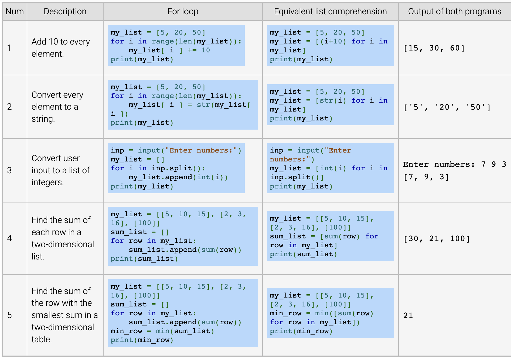

```
# Get a list of integers from the user
numbers = [int(i) for i in input("Enter numbers:").split()]

# Return a list of only even numbers
even_numbers = [i for i in numbers if (i % 2) == 0]
print(f"Even numbers only: {even_numbers}")
```

### § 35.9 Sorting Lists

Pay attention to the difference between list.sort() and sorted(list): the formal sorts the original list, the latter creates a new list that is sorted from the list argument.
```
numbers = [int(i) for i in input("Enter numbers: ").split()]

sorted_numbers = sorted(numbers)

print(f"\nOriginal numbers: {numbers}")
print(f"Sorted numbers: {sorted_numbers}")

# Using list.sort() function
numbers.sort()
print(f"\nOriginal numbers after sorting: {numbers}")
```

### § 35.10 Command Line Arguments

Diversion. Read.

### § 35.11 Engineering Examples

Nothing unusual for you to read.

### § 35.12 Dictionaries

Review of dictionary:

* A container;
* Different from sequences such as strings, tuples, and lists: there is no index;
* References are through key-value pairs: the "index" is key in the dictionary;

"As of Python 3.7, dictionary elements maintain their insertion order":
The newest version of Python is 3.13, with the latest maintenance release being Python 3.13.2, released on February 4, 2025.
In this version, dictionary elements do maintain their insertion order. This feature was officially introduced in Python 3.7 and has been maintained in subsequent versions. Specifically:

1. Dictionaries are ordered, but not sorted.
2. They maintain the insertion order of their keys.
3. When adding a new key to a dictionary, it is always added at the end.
4. Updating the value of an existing key does not change its position in the order.

This ordering behavior is now a guaranteed language feature, not just an implementation detail. It allows developers to rely on the order of dictionary elements in their code, which can be useful for various applications and algorithms.

### § 35.13 Dictionary Methods

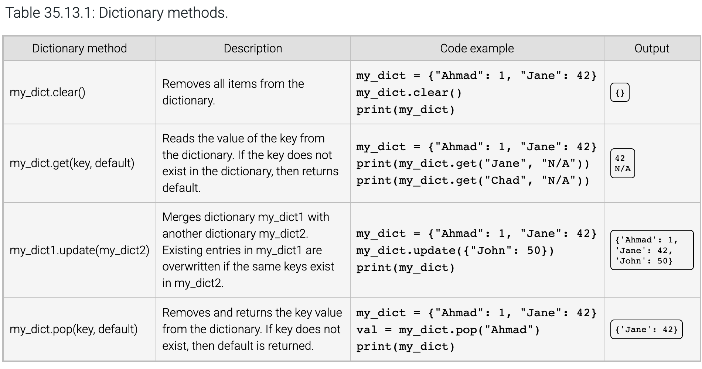

### § 35.14 Iterating Over a Dictionary

```
for key in dictionary:  # Loop expression
    # Statements to execute in the loop

#Statements to execute after the loop
```

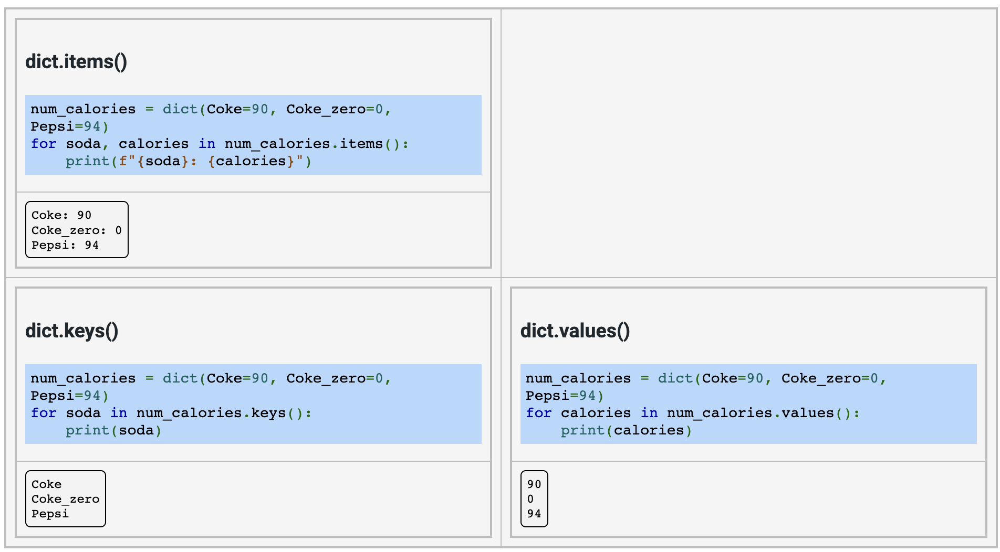

### § 35.15 Dictionary Nesting

```
grades = {
    "John Ponting": {
        "Homeworks": [79, 80, 74],
        "Midterm": 85,
        "Final": 92
    },
    "Jacques Kallis": {
        "Homeworks": [90, 92, 65],
        "Midterm": 87,
        "Final": 75
    },
    "Ricky Bobby": {
        "Homeworks": [50, 52, 78],
        "Midterm": 40,
        "Final": 65
    },
}

user_input = input("Enter student name: ")

while user_input != "exit":
    if user_input in grades:
        # Get values from nested dict
        homeworks = grades[user_input]["Homeworks"]
        midterm = grades[user_input]["Midterm"]
        final = grades[user_input]["Final"]

        # print info
        for hw, score in enumerate(homeworks):

            print(f"Homework {hw}: {score}")

        print(f"Midterm: {midterm}")

        print(f"Final: {final}")

        # Compute student total score
        total_points = sum([i for i in homeworks]) + midterm + final

        print(f"Final percentage: {100*(total_points / 500.0):.1f}%")

    user_input = input("Enter student name: ")
```

## Chapter 36 Class

### § 36.1 Class: Introduction

See [[here]].

### § 36.2 Classes: Group Data

See [[here]].

### § 36.3 Instance Methods

The meaning of "self":

* Definition of a method within a class is for an object instance of it to use the method;
* self in the "self.my\_method()" means the object instance (itself).

The \_\_init\_\_(self) special method:

* Initiate an object at instantiation;
* Runs at instantiation.

### § 36.4 Class and Instance Object Types

See [[here]].

### § 36.5 Class Example: Seat Reservation System

Once again we need to know what a program does.

```
class Seat:
    def __init__(self): # Runs when an object of this class is instantiated
        self.first_name = ''
        self.last_name = ''
        self.paid = 0.0
        # When an object is instantiated, it contains, or possesses three pieces of data, or attributes:
        # - strings firs_name and last_name, and
        # float paid

    def reserve(self, f_name, l_name, amt_paid):
        # Method to reserve this seat: Reserving *this* Seat object amounts to assigning the object's firs_name, last_name and paid attributes with its parameters
        self.first_name = f_name
        self.last_name = l_name
        self.paid = amt_paid

    def make_empty(self):
        # Method to make the Seat empty: amounts to clearing its attributes
        self.first_name = ''
        self.last_name = ''
        self.paid = 0.0

    def is_empty(self):
        # if the object's first_name is empty, then the Seat object is empty
        return self.first_name = = ''

    def print_seat(self):
        # print information of *this* seat (this object of class Seat): print its attributes
        print(f'{self.first_name} {self.last_name}, Paid: {self.paid:.2f}')

def make_seats_empty(seats):
    for s in seats:
        s.make_empty()

def print_seats(seats): # print_seats(seats) function takes list seats as it parameter
    for i in range(len(seats)): #iterate through the seats list
        print(f'{i}:', end=' ') #print each item number
        seats[i].print_seat()  # calls the print_seat() method of the ith element of the seats list, which is a Seat object

num_seats = 5 #Release a number of num_seats seats

available_seats = [] # The released seats are initially not reserved/available and are put in a list called available_seats
for i in range(num_seats):
    available_seats.append(Seat())
    # Each available_seats item is filled with an object of Seat type
    # Each Seat() instantiates a Seat object
    # The for loop instantiates num_seats number (5) of Seat object
    # the available_seats list now contains num_seats number (5) of Seat objects

command = input('Enter command (p/r/q):\n')
while command ! = 'q':
    if command = = 'p':  # Print seats
        print_seats(available_seats) # Calls print_seats function with available_seats list of Seat objects to print available seats
    elif command = = 'r':  # Reserve a seat
        seat_num = int(input('Enter seat num:\n'))
        # Enter the seat number (position in the available_seats list
        # Making a request to reserve available_seats[seat_num] seat
        if not available_seats[seat_num].is_empty(): # available_seats[num_seats] is a Seat object. Call its is_empty method
            print('Seat not empty')
        else:
            fname = input('Enter first name:\n')
            lname = input('Enter last name:\n')
            paid = float(input('Enter amount paid:\n'))
            available_seats[seat_num].reserve(fname, lname, paid)
            # Call available_seats[seat_num] object's .reserve method
    else:
        print('Invalid command.')

    command = input('Enter command (p/r/q):\n')
```
Looking at indentation, this code is composed of:

* 1 class;
* 2 functions;
* 1 "main program"

```
num_seats = 5

available_seats = []
for i in range(num_seats):
    available_seats.append(Seat())
```

* num\_seats = 5: Defines the number of seats.
* available\_seats = \[\]: Initializes an empty list to store seat objects.
* for i in range(num\_seats):: Loops five times (i = 0, 1, 2, 3, 4).
* available\_seats.append(Seat()):
	* Creates a new Seat object (Seat() calls **init**).
	* Appends this newly created Seat object to available\_seats.
* After this, we have a list called available\_seats that contains 5 objects of class Seat

### § 36.6 Class Constructors

Additional parameters in \_\_init()\_\_ constructor method:

* If the instructor has parameters beyond self, then instantiation must include those.

```
class RaceTime:

    def __init__(self, start_hrs, start_mins, end_hrs, end_mins, dist):
        self.start_hrs = start_hrs
        self.start_mins = start_mins
        self.end_hrs = end_hrs
        self.end_mins = end_mins
        self.distance = dist

    def print_time(self):
        if self.end_mins >= self.start_mins:
            minutes = self.end_mins - self.start_mins
            hours = self.end_hrs - self.start_hrs
        else:
            minutes = 60 - self.start_mins + self.end_mins
            hours = self.end_hrs - self.start_hrs - 1

        print(f"Time to complete race: {hours}:{minutes}")

    def print_pace(self):
        if self.end_mins >= self.start_mins:
            minutes = self.end_mins - self.start_mins
            hours = self.end_hrs - self.start_hrs
        else:
            minutes = 60 - self.start_mins + self.end_mins
            hours = self.end_hrs - self.start_hrs - 1

        total_minutes = hours*60 + minutes
        print(f"Avg pace (mins/mile): {total_minutes / self.distance:.2f}")

distance = 5.0

start_hrs = int(input("Enter starting time hours: "))
start_mins = int(input("Enter starting time minutes: "))
end_hrs = int(input("Enter ending time hours: "))
end_mins = int(input("Enter ending time minutes: "))

race_time = RaceTime(start_hrs, start_mins, end_hrs, end_mins, distance)

race_time.print_time()
race_time.print_pace()
```

* Unless the constructor non-self parameters have default values:
	* The default value parameter applied to "regular" functions as well.

```
class Employee:
    def __init__(self, name, wage=8.25, hours=20):
        """
        Default employee is part time (20 hours/week)
        and earns minimum wage
        """
        self.name = name
        self.wage = wage
        self.hours = hours

    # ...

todd = Employee("Todd")  # Typical part-time employee
jason = Employee("Jason")  # Typical part-time employee
tricia = Employee("Tricia", wage=12.50, hours=40)  # Manager employee

employees = [todd, jason, tricia]

for e in employees:
    print (f"{e.name} earns {e.wage*e.hours:.2f} per week")
```

### § 36.7 Class Interfaces

A class contains methods:

* Methods for use by the user are called interfaces;
* Methods meant for "internal use" are not considered the class's interfaces, and are conventionally prepended with an underscore;
* Python lack enforcement of interfaces and non-interfaces.

The reason class and object exist is for the user to only care about interfaces, just like you only do a certain number of things with your car, without having to deal with its internal operations.

### § 36.8 Class Customization

Common operations such as print, etc. can be enhanced or even redefined from within a class definition, by using Python _recognized special method names_. When customization is applied to operators, it is referred to as operator overloading.
zyDE 36.8.2: Rich comparisons for a quarterback class: note the \_\_lt\_\_ and \_\_gt\_\_ operator overloading can be used directly in script as < and >.

```
class Quarterback:
    def __init__(self, yrds, tds, cmps, atts, ints, wins):
        self.wins = wins

        # Calculate quarterback passer rating (NCAA)
        self.rating = ((8.4*yrds) + (330*tds) + (100*cmps) - (200 * ints))/atts

    def __lt__(self, other):
        if (self.rating < other.rating) or (self.wins < other.wins):
            return True
        return False

    def __gt__(self, other):
        if (self.rating > other.rating) or (self.wins > other.wins):
            return True
        return False
        # Completed method

peyton = Quarterback(yrds=4700, atts=679, cmps=450, tds=33, ints=17, wins=10)
eli = Quarterback(yrds=4002, atts=539, cmps=339, tds=31, ints=25, wins=9)
tom = Quarterback(yrds=4806, atts=578, cmps=398, tds=50, ints=8, wins=16)

if peyton > eli:
    print('Peyton is the better QB than eli')
    if tom > peyton:
        print('But Tom is better than peyton')
elif peyton < eli:
    print('Eli is the better QB')
    if tom > eli:
        print('But Tom is better than Eli')
else:
    print('It is not clear who the better QB is...')
```
Comparison Overloading
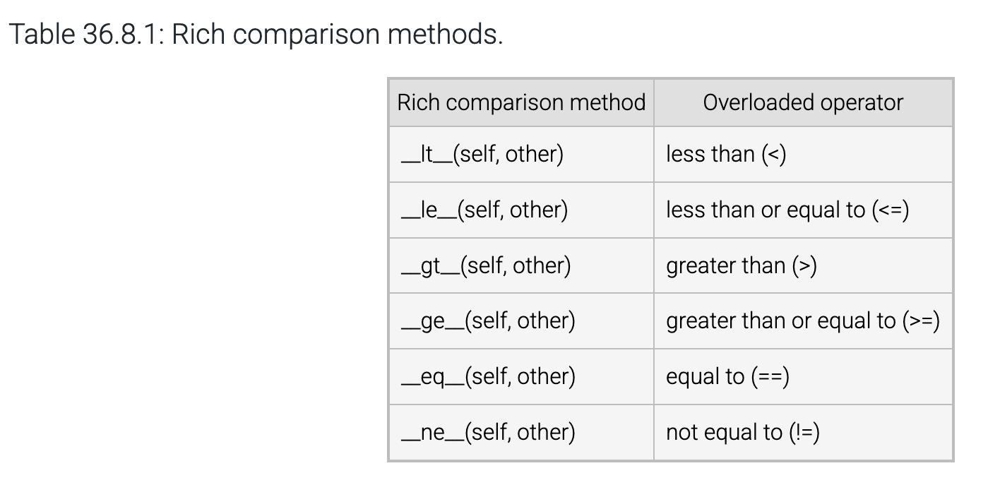

### § 36.9 More Operator Overloading

Operators that normally are applied in numeric computations involving numeric types can be overloaded so that other object types can perform "numeric-like computations".
```
class Time24:
    def __init__(self, hours, minutes):
        self.hours = hours
        self.minutes = minutes

    def __str__(self):
        return f"{self.hours:02d}:{self.minutes:02d}"

    def __gt__(self, other):
        if self.hours > other.hours:
            return True
        else:
            if self.hours == other.hours:
                if self.minutes > other.minutes:
                    return True
        return False

    def __sub__(self, other):
        """ Calculate absolute distance between two times """
        if self > other:
            larger = self
            smaller = other
        else:
            larger = other
            smaller = self

        hrs = larger.hours - smaller.hours
        mins = larger.minutes - smaller.minutes
        if mins < 0:
            mins += 60
            hrs -=1

        # Check if times wrap to new day
        if hrs > 12:
            hrs = 24 - (hrs + 1)
            mins = 60 - mins
            if mins >= 60:
                mins -= 60
                hrs += 1

        # Return new Time24 instance
        return Time24(hrs, mins)

t1 = input("Enter time1 (hours:minutes): ")
tokens = t1.split(":")
time1 = Time24(int(tokens[0]), int(tokens[1]))

t2 = input("Enter time2 (hours:minutes): ")
tokens = t2.split(":")
time2 = Time24(int(tokens[0]), int(tokens[1]))

print(f"Time difference: {time1 - time2}")
```

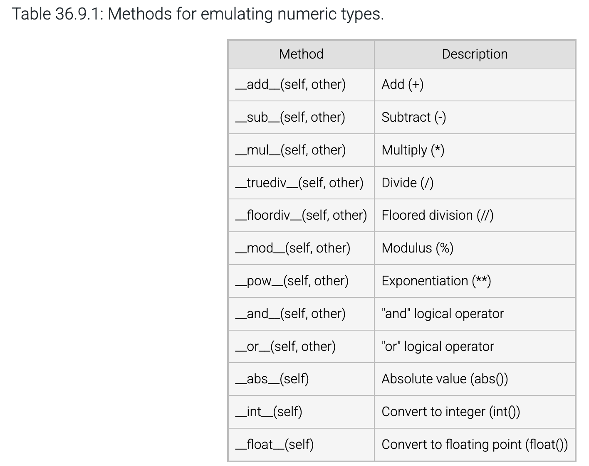

### § 36.10 Memory Allocation and Garbage Collection

No need to worry about these in Python.

## Chapter 37 Exceptions

### § 37.1 Handling Exceptions Using try and except

Here is the [[concept of Exceptions and exception handling]].
try and except is you try a piece of code, let Python discover errors, and you handle it.

### § 37.2Multiple Exception Handlers

Still you try, let Python discover errors, but you handle different types of errors differently. This requires that you know what the usual types of errors are.

### § 37.3 Raising Exception

You determine what's unacceptable by raising exception, but the exceptions you raise are still Python built-in exceptions. Note in the following code, ValueError is raised with an argument, and handled with
```
except ValueError as excpt:
```

excpt is an instantiation of the class ValueError, which is a Python class. Instantiate a ValueError allows the ValueError argument to pass to the object:

```
user_input = ''
while user_input ! = 'q':
    try:
        weight = int(input('Enter weight (in pounds): '))
        if weight < 0:
            raise ValueError('Invalid weight.')

        height = int(input('Enter height (in inches): '))
        if height <= 0:
            raise ValueError('Invalid height.')

        bmi = (float(weight) * 703) / (float(height * height))
        print(f'BMI: {bmi}')
        print('(CDC: 18.6-24.9 normal)\n')
        # Source www.cdc.gov

    except ValueError as excpt:
        print(excpt)
        print('Could not calculate health info.\n')

    user_input = input("Enter any key ('q' to quit): ")
```

```
Enter weight (in pounds):  -2
Invalid weight.
Could not calculate health info.

Enter any key ('q' to quit):  k
Enter weight (in pounds):  120
Enter height (in inches):  0
Invalid height.
Could not calculate health info.

Enter any key ('q' to quit):  120
Enter weight (in pounds):  80
Enter height (in inches):  60
BMI: 15.622222222222222
(CDC: 18.6-24.9 normal)

Enter any key ('q' to quit):  q
```

### § 37.4 Exceptions within Functions

Still same scenario as in § 37.3 but within functions.

### § 37.5 Using finally to Clean Up

Easy to understand, but pay attention to the rules. The finally clause is always the last code executed before the try block finishes.

* If no exception occurs, then execution continues in the finally clause and proceeds with the program.
* If a handled exception occurs, an exception handler executes and then the finally clause.
* If an unhandled exception occurs, then the finally clause executes and the exception is re-raised.
* The finally clause also executes if any break, continue, or return statement causes the try block to be exited.

### § 37.6 Custom Exception Types

You not only define what's not acceptable, you also define your own exceptions. You do so by defining a class that is a subclass of the Python class Exception or one of its subclasses such as ValueError.

## Chapter 38 Modules

For concepts, see [[Python program structure]] and [[Python Modules]].

### § 38.3 Import Specific Names from a Module

Apart from syntax, this section includes an example of **message integrity verification using cryptographic hash functions**. Here’s how it works step by step:

1. **Sender computes a hash**
	* The sender takes the plain text of the email message.
	* They run it through a **secure hash function** (like SHA-256).
	* The output is a fixed-length string (the hash/digest) that uniquely represents the content.
2. **Sender transmits the message and hash**
	* The sender sends both the original message and its hash to the recipient.
3. **Recipient recomputes the hash**
	* Upon receiving the message, the recipient independently computes the hash of the received message using the same secure hash function.
4. **Comparison**
	* If the recomputed hash matches the sender’s hash, the message is **unchanged**.
	* If the hashes differ, then the message was **altered in transit**.

A **secure hash function** (SHA-256, SHA-3, etc.) has two important properties:

* **Collision resistance**: It’s infeasible to find two different inputs that give the same hash.
* **Avalanche effect**: Even a single character change in the message changes the hash completely.

This setup ensures **integrity**, but **not authenticity**:

* Problem: An attacker could intercept the email, modify both the message and the hash, and forward them together.
* Solution: Use a **Message Authentication Code (MAC)** (requires a shared secret) or **digital signatures** (public/private key cryptography) so the recipient can also verify the **authenticity** of the sender, not just integrity.

### § 38.4 Executing Module as Scripts

```
# WebSearch.py
import googlesearch as gs

def searchTerm(term):
    print('Searching for "', term, '" ...', sep="")
    domains = gs.search(term, verify_ssl=False, stop=10)
    return domains

def stringifyResult(term, domains, domainString):
    i = 0
    while True:
        try:
            domain = next(domains)
        except StopIteration:
            break
        domainSplit = domain.rsplit("//")
        domain = domainSplit[1]
        domainSplit = domain.rsplit("/")
        domain = domainSplit[0]
        if domainString.find(domain) == -1:
            domainString = domainString + "\n" + domain
            i = i + 1
    if i == 0:
        print("No domains", end="")
    elif i == 1:
        print("One domain", end="")
    elif i == 10:
        print("Search stopped after ten domains", end="")
    else:
        print(i, "domains", end="")
    print(' found for search term "', term, '".', sep="")
    return domainString

print("Welcome to Web Search")
term  = input("Enter search term: ")
result = searchTerm(term)
resultString = ""
resultString = stringifyResult(term, result, resultString)
print(resultString)
print("\nEnd of Web Search")
```

```
# MultipleWebSearch.py
import WebSearch as ws  # Causes unintended search

print("Welcome to Multiple Web Search")
term = input('Enter search term ("q" to quit): ')
terms = 0
resultString = ""
while term != "q":
    terms = terms + 1
    result = ws.searchTerm(term)
    resultString = ws.stringifyResult(term, result, resultString)
    term  = input('Enter search term ("q" to quit): ')
if terms == 0:
    print("No search terms entered.")
else:
    if terms == 1:
        print("Results for the one search term entered:")
    else:
        print("Results for the", terms, "search terms entered:")
    print(resultString)
print("\nEnd of Multiple Web Search")
```

```
# WebSearch.py modified
import googlesearch as gs

def searchTerm(term):
    print('Searching for "', term, '" ...', sep="")
    domains = gs.search(term, verify_ssl=False, stop=10)
    return domains

def stringifyResult(term, domains, domainString):
    i = 0
    while True:
        try:
            domain = next(domains)
        except StopIteration:
            break
        domainSplit = domain.rsplit("//")
        domain = domainSplit[1]
        domainSplit = domain.rsplit("/")
        domain = domainSplit[0]
        if domainString.find(domain) == -1:
            domainString = domainString + "\n" + domain
            i = i + 1
    if i == 0:
        print("No domains", end="")
    elif i == 1:
        print("One domain", end="")
    elif i == 10:
        print("Search stopped after ten domains", end="")
    else:
        print(i, "domains", end="")
    print(' found for search term "', term, '".', sep="")
    return domainString

if __name__ == "__main__":
    print("Welcome to Web Search")
    term  = input("Enter search term: ")
    result = searchTerm(term)
    resultString = ""
    resultString = stringifyResult(term, result, resultString)
    print(resultString)
    print("\nEnd of Web Search")
```

## Chapter 39 Files

### § 39.1 Reading Files

File Object:

* The open("filename\_string") function creates a file object;
* File object has various methods;
* "Close" the file object when done.

```
print("Opening file myfile.txt.")
f = open("myfile.txt")  # create file object

print("Reading file myfile.txt.")
contents = f.read()  # read file text into a string

print("Closing file myfile.txt.")
f.close()  # close the file

print("\nContents of myfile.txt:")
print(contents)
```
Processing Data Read from File:

* Open->read->list of strings->close file->do thing on the list: iterate and calculate

```
# Read file contents
print ("Reading in data....")
f = open("mydata.txt")
lines = f.readlines()
f.close()

# Iterate over each line
print("\nCalculating average....")
total = 0
for ln in lines:
    total += int(ln)

# Compute result
avg = total/len(lines)
print(f"Average value: {avg}")
```
File Object is itself an iterator:
```
"""Echo the contents of a file."""
f = open("myfile.txt")

for line in f:
    print(line, end="")

f.close()
```
General pattern:

* Open->get things from file into memory->close file->do things to info in the memory.

### § 39.2 Writing Files

Open method with "w" mode returns a file object with write-related methods:

* write() method takes only string parameters.

```
f = open("myfile.txt", "w")  # Open file
f.write("Example string:\n  test....")  # Write string
f.close()  # Close the file
```
open() modes:
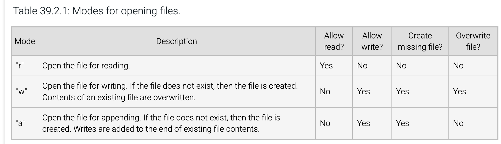
Output Buffer: f = open("myfile.txt", "w", buffering=100)

* f = open("myfile.txt", "w", buffering= 0) disables buffering (valid only for binary files;
* f = open("myfile.txt", "w", buffering=1) enables the default line-buffering;
* f = open("myfile.txt", "w", buffering=100): a value > 1 sets a specific buffer size in bytes.

flush() flushes out python buffering;
os.fsync(f.fileno()):

* os.fsync() flushes out os buffering;
* f.fileno(): get stream id.

```
import os

# Open a file with default line-buffering.
f = open("myfile.txt", "w")

# No newline character, so not written to disk immediately
f.write("Write me to a file, please!")

# Force output buffer to be written to disk
f.flush()
os.fsync(f.fileno())
```

### § 39.3 Interacting with File Systems (OS)

Operating on Files through os:
```
import os

# ....

my_file = open("myfile.txt", "r")
# ....
file_info = os.stat("myfile.txt")
# ....
os.remove("myfile.txt")
```
os.path.join()
```
import os
import datetime

curr_day = datetime.date(1997, 8, 29)

num_days = 30
for i in range(num_days):
    year = str(curr_day.year)
    month = str(curr_day.month)
    day = str(curr_day.day)

    # Build path string using current OS path separator
    file_path = os.path.join("logs", year, month, day, "log.txt")

    f = open(file_path, "r")

    print(f"{file_path}: {f.read()}")
    f.close()

    curr_day = curr_day + datetime.timedelta(days=1)
```
Path vs Directory:

* Path can be to a file or to a directory;
* Directory is folder containing files;
* You can say directory, path to directory or path to file.

Other os.path functions:
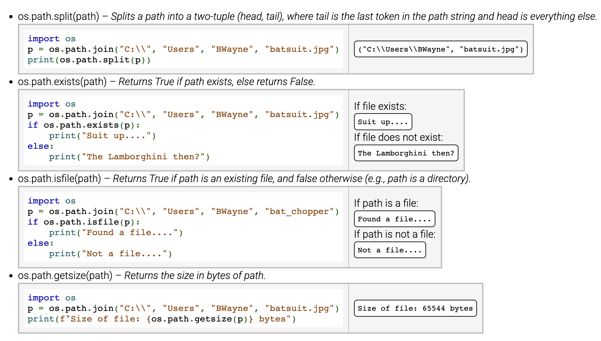

### § 39.4 Binary Data

Bytes object:

* A sequence;
* A sequence of single byte values;
* Immutable.

open() with "rb" returns a file object whose methods create bytes object:
```
f = open("ball.bmp", "rb")  # Open in binary mode using "b"

# Read image binary data
contents = f.read() # contents is bytes object

print("Contents of ball.bmp:\n")
print(contents)

f.close()

"""
Contents of ball.bmp:

b"BMb\xe6\x00\x00\x00\x00\x00\x006\x04\x00\x00(\x00\x00\x00,\x01\x00\x00
\xc1\x00\x00\x00\x01\x00\x08\x00\x00\x00\x00\x00,\xe2\x00\x00\xc4"
"""
```

### § 39.5 Command Line Arguments and Files

```
import sys
import os

if len(sys.argv) != 2:

    print(f"Usage: {sys.argv[0]} input_file")
    sys.exit(1)  # 1 indicates error

print(f"Opening file {sys.argv[1]}.")

if not os.path.exists(sys.argv[1]):  # Make sure file exists
    print("File does not exist.")
    sys.exit(1)  # 1 indicates error

f = open(sys.argv[1], "r")

# Input files should contain two integers on separate lines

print("Reading two integers.")
num1 = int(f.readline())
num2 = int(f.readline())

print(f"Closing file {sys.argv[1]}")
f.close()  # Done with the file, so close it

print(f"\nnum1: {num1}")

print(f"num2: {num2}")

print(f"num1 + num2: {num1 + num2}")/cod
```

* argv\[0\] == my\_script.py;
* argv\[1\] == myfile.txt.

```
>python my_script.py myfile1.txt
Opening file myfile1.txt.
Reading two integers.
Closing file myfile1.txt

num1: 5
num2: 10
num1 + num2: 15

>python my_script.py myfile2.txt
Opening file myfile2.txt.
Reading two integers.
Closing file myfile2.txt

num1: -34
num2: 7
num1 + num2: -27

>python my_script.py myfile3.txt
Opening file myfile3.txt.
File does not exist.
```

### § 39.6 The with Statement

Used much more often than open():

* General pattern:

```
with open("myfile.txt", "r") as myfile:
    # Statement-1
    # Statement-2
    # ....
    # Statement-N
```

* No need to close();

```
print("Opening myfile.txt")

# Open a file for reading and writing
with open("myfile.txt", "r+") as f:
    # Read in two integers
    num1 = int(f.readline())
    num2 = int(f.readline())

    product = num1 * num2

    # Write back result on own line
    f.write("\n")
    f.write(str(product))

# No need to call f.close() - f closed automatically
print("Closed myfile.txt")
```

* Creates a context manager that does more than just open() but also close when the with block exits.

### § 39.7 Comma-Separated Values Files (CSV Files)

CSV file format, row, columns/fields:
```
name,hw1,hw2,midterm,final
Petr Little,9,8,85,78
Sam Tarley,10,10,99,100
Joff King,4,2,55,61
```

```
import csv

with open("grades.csv", "r") as csvfile:
    grades_reader = csv.reader(csvfile, delimiter=",")

    row_num = 1
    for row in grades_reader:
        print(f"Row #{row_num}: {row}")
        row_num += 1

"""
commas here are part of a list, not part of the csv - commas in csv have been used as delimiter:

Row #1: ["name", "hw1", "hw2", "midterm", "final"]
Row #2: ["Petr Little", "9", "8", "85", "78"]
Row #3: ["Sam Tarley", "10", "10", "99", "100"]
Row #4: ["Joff King", "4", "2", "55", "61"]
"""
```

* Calculation with data from reader object:

```
import csv

# Dictionary that maps student names to a list of scores
grades = {}

# Use with statement to guarantee file closure
with open("grades.csv", "r") as csvfile:
    grades_reader = csv.reader(csvfile, delimiter=",")

    first_row = True
    for row in grades_reader:
        # Skip the first row with column names
        if first_row:
            first_row = False
            continue

        ## Calculate final student grade ##

        name = row[0]

        # Convert score strings into floats
        scores = [float(cell) for cell in row[1:]]

        hw1_weighted = scores[0]/10 * 0.05
        hw2_weighted = scores[1]/10 * 0.05
        mid_weighted = scores[2]/100 * 0.40
        fin_weighted = scores[3]/100 * 0.50

        grades[name] = (hw1_weighted + hw2_weighted +
                        mid_weighted + fin_weighted) * 100

for student, score in grades.items():
    print(f"{student} earned {score:.1f}%")

"""
Petr Little earned 81.5%
Sam Tarley earned 99.6%
Joff King earned 55.5%
"""
```
Writing rows to csv files:
```
import csv

# 2 lists
row1 = ["100", "50", "29"]
row2 = ["76", "32", "330"]

with open("gradeswr.csv", "w", newline="") as csvfile:
    grades_writer = csv.writer(csvfile)

    grades_writer.writerow(row1)
    grades_writer.writerow(row2)

    grades_writer.writerows([row1, row2])

"""
100,50,29
76,32,330
100,50,29
76,32,330
"""
```

## Chapter 40 Inheritance

### § 40.1 Derived Classes

See [[here]].

### § 40.2 Accessing Base Class Attributes

Through the dot operator:

* Search through inheritance tree from "offspring" to "ancestor" and use the first found.

```
class TransportMode:
    def __init__(self, name, speed):
        self.name = name
        self.speed = speed

    def info(self):
        print(f"{self.name} can go {self.speed} mph.")

class MotorVehicle(TransportMode):
    def __init__(self, name, speed, mpg):
        TransportMode.__init__(self, name, speed)
        self.mpg = mpg
        self.fuel_gal = 0

    def add_fuel(self, amount):
        self.fuel_gal += amount

    def drive(self, distance):
        required_fuel = distance / self.mpg
        if self.fuel_gal < required_fuel:
            print("Not enough gas.")
        else:
            self.fuel_gal -= required_fuel
            print(f"{self.fuel_gal:f} gallons remaining.")

class MotorCycle(MotorVehicle):
    def __init__(self, name, speed, mpg):
        MotorVehicle.__init__(self, name, speed, mpg)

    def wheelie(self):
        print("That is too dangerous.")

scooter = MotorCycle("Vespa", 55, 40)
dirtbike = MotorCycle("KX450F", 80, 25)

scooter.info()
dirtbike.info()
choice = input("Select scooter (s) or dirtbike (d): ")
bike = scooter if (choice == "s") else dirtbike

menu = "\nSelect add fuel(f), go(g), wheelie(w), quit(q): "
command = input(menu)
while command != "q":
    if command == "f":
        fuel = int(input("Enter amount: "))
        bike.add_fuel(fuel)
    elif command == "g":
        distance = int(input("Enter distance: "))
        bike.drive(distance)
    elif command == "w":
        bike.wheelie()
    elif command == "q":
        break
    else:
        print("Invalid command.")

    command = input(menu)
```

### § 40.3 Overriding Class Methods

A consequence of how methods are resolved:
```
class Item:
  def __init__(self):
      self.name = ""
      self.quantity = 0

  def set_name(self, nm):
      self.name = nm

  def set_quantity(self, qnty):
      self.quantity = qnty

  def display(self):
      print(self.name, self.quantity)

class Produce(Item):  # Derived from Item
  def __init__(self):
      Item.__init__(self)  # Call base class constructor
      self.expiration = ""

  def set_expiration(self, expir):
      self.expiration = expir

  def get_expiration(self):
      return self.expiration

  def display(self):
      print(self.name, self.quantity, end=" ")
      print(f"  (Expires: {self.expiration})")

item1 = Item()
item1.set_name("Smith Cereal")
item1.set_quantity(9)
item1.display()  # Will call Item's display()

item2 = Produce()
item2.set_name("Apples")
item2.set_quantity(40)
item2.set_expiration("May 5, 2012")
item2.display()  # Will call Produce's display()
```

### § 40.4 Is-A Vs. Has-A Relationship

Straightforward to read.

### § 40.5 Mixin Classes and Multiple Inheritance

Multiple inheritance:
```
class VampireBat(WingedAnimal, Mammal):  # Inherit from WingedAnimal, Mammal classes
    # ...
```
Mixin: class definitions to provide more methods
```
class DrivingMixin:
    def drive(self, distance):
        # ...

    def change_tire(self):
        # ...

    def check_oil(self):
        # ...

class FlyingMixin:
    def fly(self, distance, altitude):
        # ...

    def roll(self):
        # ...

    def eject(self):
        # ...

class TransportMode:
    def __init__(self, name, speed):
        self.name = name
        self.speed = speed

    def display(self):
        print(f"{self.name} can go {self.speed} mph")

class SemiTruck(TransportMode, DrivingMixin):
    def __init__(self, name, speed, cargo):
        TransportMode.__init__(self, name, speed)
        self.cargo = cargo

    def go(self, distance):
        self.drive(distance)
        # ...

class FlyingCar(TransportMode, FlyingMixin, DrivingMixin):
    def __init__(self, name, speed, max_altitude):
        TransportMode.__init__(self, name, speed)
        self.max_altitude = max_altitude

    def go(self, distance):
        self.fly(distance / 2, self.max_altitude)
        # ...
        self.drive(distance / 2)

s = SemiTruck("MacTruck", 85, "Frozen beans")
f = FlyingCar("Jetson35K", 325, 15000)

s.go(100)
f.go(100)
```

### § 40.6 Testing Your Code: The unittest Module

Testing is critical in software development:

* "Develop to Test" movement.

Inherit from unittest.TestCase class:
```
import unittest

# User-defined class
class Circle:
    def __init__(self, radius):
        self.radius = radius

    def compute_area(self):
        return 3.14 * self.radius**2

# Class to test Circle
class TestCircle(unittest.TestCase):
    def test_compute_area(self):
        c = Circle(0)
        self.assertEqual(c.compute_area(), 0.0)

        c = Circle(5)
        self.assertEqual(c.compute_area(), 78.5)

    def test_will_fail(self):
        c = Circle(5)
        self.assertLess(c.compute_area(), 0)

if __name__ == "__main__":
    unittest.main()
```
Where does unittest.main() come from?

* It is defined inside the unittest module, which you imported at the very top with import unittest.
* When you call unittest.main(), it automatically:
	* Discovers all subclasses of unittest.TestCase in the current file (in this case, TestCircle).
	* Runs every method that starts with test\_ as a test.
	* Prints a summary of which tests passed or failed to the console.
